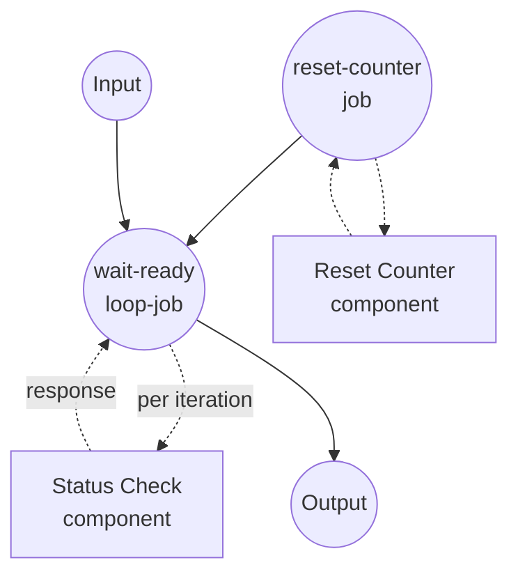

# 使用 `loop` 的轮询示例

本示例演示 `loop` 作业类型，它反复执行内联作业直到停止条件被满足。示例模拟对一个需要多次轮询才能完成的长时间运行的远程作业进行轮询。

## 概述

此工作流通过以下流程运行:

1. **重置状态**: `reset-counter` 作业清除任何遗留的计数器文件，使每次运行从 attempt 1 开始
2. **轮询直至就绪**: `wait-ready` 循环每次迭代调用 `status-check`，向每次调用传入固定的 `job_id`(来自 `${input}`)。每次迭代之后，循环根据返回的 `status` 字段评估其 `until` 谓词。
3. **返回最终响应**: 当 `status == "ready"` 时循环终止，最终响应对象被重塑为工作流输出。

迭代语义:

- 循环作用域内的 `${input}` 固定为循环被调用时的值(do-while 风格)，因此每次轮询针对同一逻辑作业。
- `${output}` 指向前一次迭代的响应。第一次迭代时未设置。
- `max_iteration_count` 将循环限制为 20 次迭代作为安全网；如果条件从未匹配，循环会抛出异常，以便由 `retry` / `on_error` 处理。

## 准备工作

### 前置条件

- 已安装 model-compose 并可在 PATH 中使用
- PATH 中有 `python3`(伪造的 `status-check` 组件使用)

### 环境配置

1. 导航到此示例目录:
   ```bash
   cd examples/job-flow/loop/polling
   ```

2. 不需要额外的环境配置 — 此示例仅使用本地 `shell` 组件。

## 如何运行

1. **启动服务:**
   ```bash
   model-compose up
   ```

2. **运行工作流:**

   **使用 API:**
   ```bash
   curl -X POST http://localhost:8080/api/workflows/runs \
     -H "Content-Type: application/json" \
     -d '{"input": {"job_id": "job-42"}}'
   ```

   **使用 Web UI:**
   - 打开 Web UI: http://localhost:8081
   - 输入 `job_id` 值
   - 点击 "Run Workflow" 按钮

   **使用 CLI:**
   ```bash
   model-compose run --input '{"job_id": "job-42"}'
   ```

## 组件详情

### Reset Counter 组件 (reset-counter)
- **类型**: Shell 组件
- **用途**: 删除磁盘上的尝试计数器，使连续运行相互独立
- **命令**: `rm -f /tmp/model-compose-loop-polling.count && echo reset`
- **输出**: 来自 stdout 的字面字符串 `reset`

### Status Check 组件 (status-check)
- **类型**: Shell 组件
- **用途**: 模拟远程作业轮询 — 前两次调用返回 `pending`，第三次返回 `ready`
- **命令**: 递增计数器文件并发出 JSON 状态行的小型 Python 脚本
- **输出**: 包含 `job_id`、`status` 和 `attempt` 的对象

## 工作流详情

### "Poll a Long-Running Job with `loop`" 工作流 (默认)

**描述**: 轮询一个假的长时间运行作业状态直到报告 "ready"。演示带有 `until` 谓词和固定 `${input}` 引用的 `loop` 作业类型，使每次轮询针对同一逻辑作业 ID。

#### 作业流程

1. **reset-counter**: 准备干净的状态
2. **wait-ready**: 驱动对 `status-check` 重复调用直到 `status == "ready"` 的 `loop` 作业



#### 输入参数

| 参数 | 类型 | 必需 | 默认 | 描述 |
|------|------|------|------|------|
| `job_id` | text | 否 | `job-42` | 每次轮询传给伪造 status 端点的标识符 |

#### 输出格式

| 字段 | 类型 | 描述 |
|------|------|------|
| `job_id` | text | 回显的作业标识符 |
| `status` | text | 被轮询端点返回的最终状态(示例中始终为 `ready`) |
| `attempts` | integer | 达到 `ready` 所需的轮询次数 |

## 示例输出

```json
{
  "job_id": "job-42",
  "status": "ready",
  "attempts": 3
}
```

## 自定义

- **改变所需轮询次数** — 编辑 `status-check` Python 片段内的 `n >= 3` 阈值。
- **轮询不同的条件** — 将 `until` 谓词替换为使用 `eq`、`neq`、`gt`、`gte`、`lt`、`lte`、`in`、`not-in`、`starts-with`、`ends-with` 或 `match` 的任意叶子，并将 `${output.status}` 更改为您关心的字段。
- **组合多个停止条件** — 用 `all` / `any` / `not` 组合器替换叶子 `until` 来表达 "ready 且 progress >= 100" 或 "ready 或 error 已设置" 等。参见同级示例 `retry-with-combinators`。
- **改用 `while`** — 将 `until` 替换为 `while` 以在条件匹配时*继续*循环(例如 `while: { input: ${output.next_cursor}, operator: neq, value: null }`)。

## 备注

- 除非 `reset-counter` 作业先清除，否则 `/tmp/model-compose-loop-polling.count` 处的计数器文件会在工作流运行之间持续存在。该作业的存在只是为了使重复运行确定性化。
- 循环至少运行 `do` 主体一次(do-while 语义): `until` 谓词在每次迭代*之后*评估，而非之前。
- 如果循环在条件未匹配的情况下达到 `max_iteration_count`，会抛出 `RuntimeError`。在循环作业上包装 `on_error: { output: ... }` 可将其转换为回退值，而不是传播失败。
