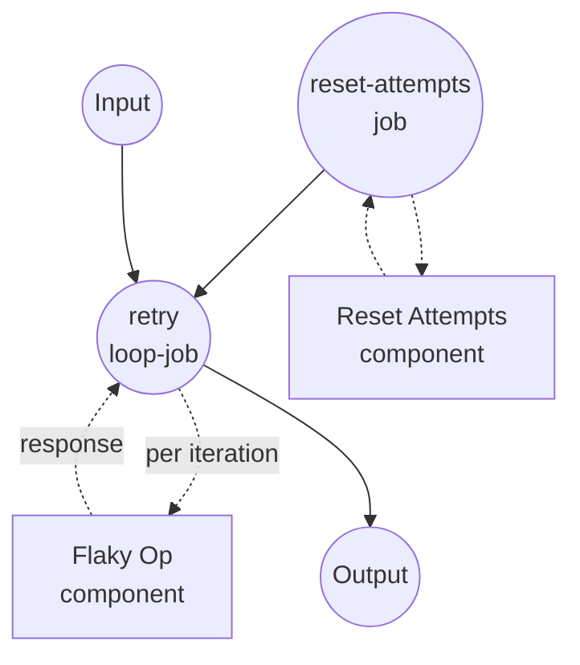

# 복합 종료 조건을 사용한 재시도 예제

이 예제는 `loop` job 타입의 복합 종료 조건 — `all`, `any`, `not` — 을 단일 `until` 절에서 조합하는 방법을 보여줍니다. 플라키한(간헐적으로 실패하는) 작업을 성공, 영구 실패, 재시도 예산 소진 중 하나가 될 때까지 재시도합니다.

## 개요

이 워크플로우는 다음 과정을 통해 동작합니다:

1. **상태 초기화**: `reset-attempts` job이 디스크상의 시도 카운터를 제거하여 각 실행이 attempt 1부터 시작하도록 합니다
2. **세 가지 종료 신호 중 하나까지 재시도**: `retry` 루프가 iteration마다 `flaky-op`를 호출합니다. `until` 조건은 `any` 조합자를 사용합니다. 다음 중 하나라도 참이 되면 루프가 즉시 종료됩니다 —
   - `status == "success"` (원하는 결과)
   - `status == "fatal"` (영구 실패 - 재시도할 이유가 없음)
   - `attempt >= max_attempts` (재시도 예산 소진)
3. **구조화된 요약 반환**: 워크플로우 출력은 최종 결과, 시도 횟수, 원본 마지막 응답을 요약합니다.

이 시뮬레이션에서는 작업이 세 번째 시도에 성공하므로, 넉넉한 예산으로는 루프가 attempt 3에서 종료됩니다. 빡빡한 예산(예: `max_attempts: 2`)이면 루프가 성공을 보지 못한 채 종료됩니다 — 워크플로우 출력은 `outcome`을 `retry`로 남겨 이를 기록합니다.

## 준비사항

### 필수 요구사항

- model-compose가 설치되어 PATH에서 사용 가능
- `python3`가 PATH에서 사용 가능(가짜 `flaky-op` 컴포넌트가 사용)

### 환경 구성

1. 이 예제 디렉토리로 이동:
   ```bash
   cd examples/job-flow/loop/retry-with-combinators
   ```

2. 추가 환경 구성 불필요 - 로컬 `shell` 컴포넌트만 사용합니다.

## 실행 방법

1. **서비스 시작:**
   ```bash
   model-compose up
   ```

2. **워크플로우 실행:**

   **API 사용:**
   ```bash
   # 성공(attempt 3)에 도달하기에 충분한 예산.
   curl -X POST http://localhost:8080/api/workflows/runs \
     -H "Content-Type: application/json" \
     -d '{"input": {"max_attempts": 5}}'

   # 빡빡한 예산 - 작업이 성공하기 전에 루프가 종료됨.
   curl -X POST http://localhost:8080/api/workflows/runs \
     -H "Content-Type: application/json" \
     -d '{"input": {"max_attempts": 2}}'
   ```

   **웹 UI 사용:**
   - 웹 UI 열기: http://localhost:8081
   - `max_attempts` 값 입력
   - "Run Workflow" 버튼 클릭

   **CLI 사용:**
   ```bash
   model-compose run --input '{"max_attempts": 5}'
   ```

## 컴포넌트 상세

### Reset Attempts 컴포넌트 (reset-attempts)
- **타입**: Shell 컴포넌트
- **목적**: 시도 카운터를 제거하여 연속 실행이 독립적으로 동작하도록 함
- **명령**: `rm -f /tmp/model-compose-loop-retry.count && echo reset`
- **출력**: 리터럴 문자열 `reset`

### Flaky Op 컴포넌트 (flaky-op)
- **타입**: Shell 컴포넌트
- **목적**: 플라키한 작업 시뮬레이션 - 처음 두 시도는 `retry` 반환, 세 번째는 `success` 반환
- **명령**: 카운터 파일을 증가시키고 JSON 상태를 출력하는 작은 Python 스크립트
- **출력**: `attempt`, `status`, `message`를 담은 객체

## 워크플로우 상세

### "Retry with Composite Stop Conditions" 워크플로우 (Default)

**설명**: 플라키한 작업을 성공, 영구 실패, 재시도 예산 소진 중 하나가 될 때까지 반복 호출합니다. `loop` job의 복합 조건을 시연합니다.

#### Job 흐름

1. **reset-attempts**: 초기 상태 준비
2. **retry**: `until` 절이 세 가지 종료 신호를 `any`로 조합한 `loop` job



#### 입력 파라미터

| 파라미터 | 타입 | 필수 | 기본값 | 설명 |
|---------|------|------|--------|------|
| `max_attempts` | integer | Yes | - | 성공 없이 루프가 종료되기 전까지의 최대 시도 횟수 |

#### 출력 형식

| 필드 | 타입 | 설명 |
|------|------|------|
| `outcome` | text | 마지막 시도가 보고한 최종 `status` (`success`, `retry`, 또는 `fatal`) |
| `attempts` | integer | 실제 시도한 횟수 |
| `detail` | object | 마지막 시도의 전체 응답 객체 |

## 예제 출력

성공에 도달하기에 충분한 예산:

```json
{
  "outcome": "success",
  "attempts": 3,
  "detail": {
    "attempt": 3,
    "status": "success",
    "message": "operation completed"
  }
}
```

성공 전에 예산 소진:

```json
{
  "outcome": "retry",
  "attempts": 2,
  "detail": {
    "attempt": 2,
    "status": "retry",
    "message": "transient failure on attempt 2"
  }
}
```

## 커스터마이징

- **어떤 실패가 종결적인지 변경** — `any` 절에 추가 `status`-equals leaf를 확장하세요(예: `unauthorized`, `not_found`).
- **여러 신호를 동시에 요구** — 중첩 절 안에서 `any`를 `all`로 교체하세요. 예: "`status == success` AND `verified == true`일 때만 종료":
  ```yaml
  until:
    all:
      - input: ${output.status}
        operator: eq
        value: success
      - input: ${output.verified}
        operator: eq
        value: true
  ```
- **`not`으로 leaf 반전** — "응답이 여전히 진행 중이 아닐 때 종료":
  ```yaml
  until:
    not:
      input: ${output.status}
      operator: eq
      value: in_progress
  ```
- **실제 엔드포인트 모델링** — `flaky-op`를 동일한 `{status, attempt, ...}` 형태의 응답을 미러링하는 `http-client` 컴포넌트로 교체하세요.

## 참고사항

- 조합자는 임의로 중첩 가능합니다. 각 leaf는 `{input, operator, value}` 트리플이고, 각 조합자는 리스트(`all`/`any`용) 또는 단일 하위 조건(`not`용)을 감쌉니다.
- 루프는 `do` 본문을 최소 한 번 실행합니다(do-while 시맨틱). "선조건이 이미 만족되면 실행하지 말라"가 필요하면 루프 밖에서 `if` job으로 필요 시에만 루프로 진입하게 표현하세요.
- `max_iteration_count`는 `until` 절과 독립적인 궁극의 안전 상한선 역할을 합니다. 복합 조건이 잘못 구성되어 결코 매치되지 않더라도 루프는 이 상한을 초과할 수 없습니다. 상한에 도달하면 `RuntimeError`가 발생하며, 루프 job의 `on_error: { output: ... }`를 통해 폴백 값으로 변환할 수 있습니다.
