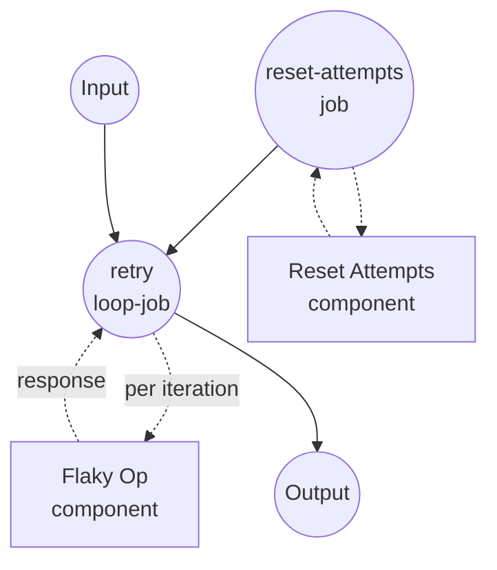

# Retry with Composite Stop Conditions Example

This example demonstrates the `loop` job type's composite stop conditions — `all`, `any`, `not` — combined in a single `until` clause. A flaky operation is retried until it either succeeds, fails permanently, or the retry budget is exhausted.

## Overview

This workflow operates through the following process:

1. **Reset State**: The `reset-attempts` job removes the on-disk attempt counter so each run starts from attempt 1
2. **Retry Until One of Three Stop Signals**: The `retry` loop calls `flaky-op` once per iteration. The `until` predicate uses an `any` combinator: the loop stops as soon as any one of the following becomes true —
   - `status == "success"` (the desired outcome)
   - `status == "fatal"` (a permanent failure — no point in retrying)
   - `attempt >= max_attempts` (the retry budget is spent)
3. **Return a Structured Summary**: The workflow output summarizes the final outcome, the number of attempts made, and the raw last response.

In this simulation the operation succeeds on the third attempt, so with a generous budget the loop exits at attempt 3. With a tight budget (e.g. `max_attempts: 2`), the loop exits without ever seeing a success — the workflow output records this by leaving `outcome` as `retry`.

## Preparation

### Prerequisites

- model-compose installed and available in your PATH
- `python3` on the PATH (used by the fake `flaky-op` component)

### Environment Configuration

1. Navigate to this example directory:
   ```bash
   cd examples/job-flow/loop/retry-with-combinators
   ```

2. No additional environment configuration is required — this example uses only local `shell` components.

## How to Run

1. **Start the service:**
   ```bash
   model-compose up
   ```

2. **Run the workflow:**

   **Using API:**
   ```bash
   # Enough budget to reach success (attempt 3).
   curl -X POST http://localhost:8080/api/workflows/runs \
     -H "Content-Type: application/json" \
     -d '{"input": {"max_attempts": 5}}'

   # Tight budget — the loop exits before the operation would have succeeded.
   curl -X POST http://localhost:8080/api/workflows/runs \
     -H "Content-Type: application/json" \
     -d '{"input": {"max_attempts": 2}}'
   ```

   **Using Web UI:**
   - Open the Web UI: http://localhost:8081
   - Enter a `max_attempts` value
   - Click the "Run Workflow" button

   **Using CLI:**
   ```bash
   model-compose run --input '{"max_attempts": 5}'
   ```

## Component Details

### Reset Attempts Component (reset-attempts)
- **Type**: Shell component
- **Purpose**: Removes the attempt counter so successive workflow runs behave independently
- **Command**: `rm -f /tmp/model-compose-loop-retry.count && echo reset`
- **Output**: The literal string `reset`

### Flaky Op Component (flaky-op)
- **Type**: Shell component
- **Purpose**: Simulates a flaky operation — returns `retry` for the first two attempts and `success` on the third
- **Command**: Small Python script that increments a counter file and emits a JSON status line
- **Output**: An object with `attempt`, `status`, and `message`

## Workflow Details

### "Retry with Composite Stop Conditions" Workflow (Default)

**Description**: Repeatedly calls a flaky operation until it either succeeds, fails permanently, or exhausts the retry budget. Demonstrates the `loop` job's composite conditions.

#### Job Flow

1. **reset-attempts**: Prepares clean state
2. **retry**: The `loop` job whose `until` clause combines three stop signals with `any`



#### Input Parameters

| Parameter | Type | Required | Default | Description |
|-----------|------|----------|---------|-------------|
| `max_attempts` | integer | Yes | - | Maximum number of attempts before the loop stops without success |

#### Output Format

| Field | Type | Description |
|-------|------|-------------|
| `outcome` | text | Final `status` reported by the last attempt (`success`, `retry`, or `fatal`) |
| `attempts` | integer | Number of attempts actually made |
| `detail` | object | The full response object from the last attempt |

## Example Output

Budget large enough to reach success:

```json
{
  "outcome": "success",
  "attempts": 3,
  "detail": {
    "attempt": 3,
    "status": "success",
    "message": "operation completed"
  }
}
```

Budget exhausted before success:

```json
{
  "outcome": "retry",
  "attempts": 2,
  "detail": {
    "attempt": 2,
    "status": "retry",
    "message": "transient failure on attempt 2"
  }
}
```

## Customization

- **Change which failures are terminal** — extend the `any` clause with additional `status`-equals leaves (e.g. `unauthorized`, `not_found`).
- **Require multiple simultaneous signals** — swap `any` for `all` inside a nested clause. For example, "stop only when both `status == success` AND `verified == true`":
  ```yaml
  until:
    all:
      - input: ${output.status}
        operator: eq
        value: success
      - input: ${output.verified}
        operator: eq
        value: true
  ```
- **Invert a leaf with `not`** — "stop when the response is NOT still in progress":
  ```yaml
  until:
    not:
      input: ${output.status}
      operator: eq
      value: in_progress
  ```
- **Model a real endpoint** — replace `flaky-op` with an `http-client` component whose response mirrors the same `{status, attempt, ...}` shape.

## Notes

- Combinators can be nested arbitrarily. Each leaf is a `{input, operator, value}` triple; each combinator wraps a list (for `all` / `any`) or a single sub-condition (for `not`).
- The loop runs the `do` body at least once (do-while semantics). If you need "do not run at all when a precondition already holds", express that outside the loop with an `if` job that skips into the loop only when needed.
- `max_iteration_count` acts as an ultimate safety cap independent of the `until` clause. Even if the composite condition is misconfigured and never matches, the loop cannot exceed this cap. Reaching it raises `RuntimeError`, which you can convert to a fallback value via `on_error: { output: ... }` on the loop job.
