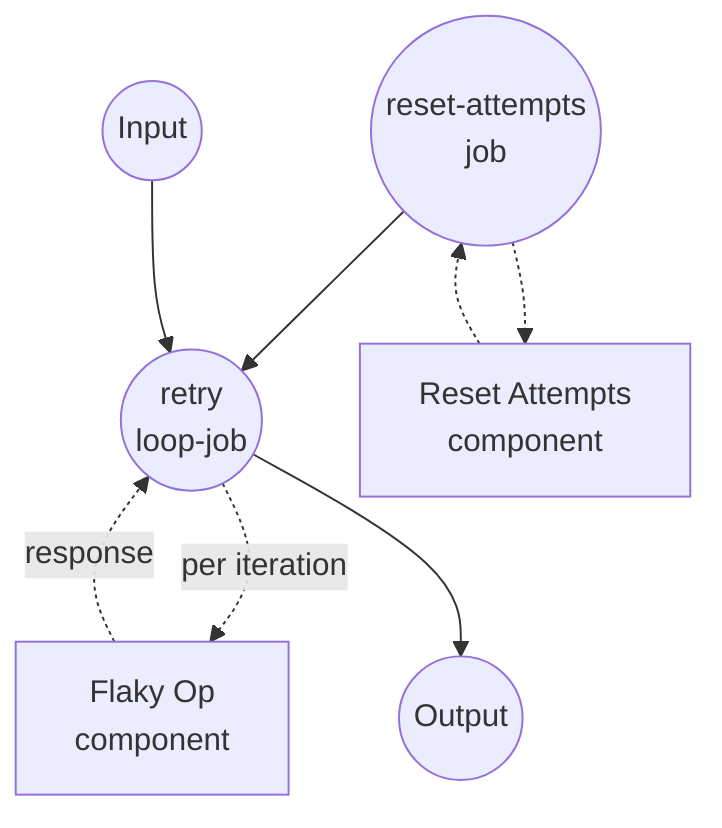

# 使用复合停止条件的重试示例

本示例演示 `loop` 作业类型的复合停止条件 — `all`、`any`、`not` — 在单个 `until` 子句中的组合。一个不稳定的操作会被重试直到成功、永久失败或重试预算耗尽。

## 概述

此工作流通过以下流程运行:

1. **重置状态**: `reset-attempts` 作业删除磁盘上的尝试计数器，使每次运行从 attempt 1 开始
2. **重试直到三个停止信号之一**: `retry` 循环每次迭代调用 `flaky-op`。`until` 谓词使用 `any` 组合器 — 只要以下任一条件为真，循环立即停止:
   - `status == "success"` (期望的结果)
   - `status == "fatal"` (永久失败 — 无重试意义)
   - `attempt >= max_attempts` (重试预算已耗尽)
3. **返回结构化摘要**: 工作流输出总结最终结果、尝试次数和原始最后响应。

在此模拟中操作在第三次尝试时成功，因此有充足预算时循环在 attempt 3 处退出。预算紧张时(例如 `max_attempts: 2`)，循环在从未看到成功的情况下退出 — 工作流输出通过将 `outcome` 保留为 `retry` 来记录这一点。

## 准备工作

### 前置条件

- 已安装 model-compose 并可在 PATH 中使用
- PATH 中有 `python3`(伪造的 `flaky-op` 组件使用)

### 环境配置

1. 导航到此示例目录:
   ```bash
   cd examples/job-flow/loop/retry-with-combinators
   ```

2. 不需要额外的环境配置 — 此示例仅使用本地 `shell` 组件。

## 如何运行

1. **启动服务:**
   ```bash
   model-compose up
   ```

2. **运行工作流:**

   **使用 API:**
   ```bash
   # 足够预算达到成功(attempt 3)。
   curl -X POST http://localhost:8080/api/workflows/runs \
     -H "Content-Type: application/json" \
     -d '{"input": {"max_attempts": 5}}'

   # 预算紧张 — 循环在操作本可成功之前退出。
   curl -X POST http://localhost:8080/api/workflows/runs \
     -H "Content-Type: application/json" \
     -d '{"input": {"max_attempts": 2}}'
   ```

   **使用 Web UI:**
   - 打开 Web UI: http://localhost:8081
   - 输入 `max_attempts` 值
   - 点击 "Run Workflow" 按钮

   **使用 CLI:**
   ```bash
   model-compose run --input '{"max_attempts": 5}'
   ```

## 组件详情

### Reset Attempts 组件 (reset-attempts)
- **类型**: Shell 组件
- **用途**: 删除尝试计数器，使连续运行相互独立
- **命令**: `rm -f /tmp/model-compose-loop-retry.count && echo reset`
- **输出**: 字面字符串 `reset`

### Flaky Op 组件 (flaky-op)
- **类型**: Shell 组件
- **用途**: 模拟不稳定操作 — 前两次尝试返回 `retry`，第三次返回 `success`
- **命令**: 递增计数器文件并发出 JSON 状态行的小型 Python 脚本
- **输出**: 包含 `attempt`、`status` 和 `message` 的对象

## 工作流详情

### "Retry with Composite Stop Conditions" 工作流 (默认)

**描述**: 反复调用不稳定操作直到成功、永久失败或耗尽重试预算。演示 `loop` 作业的复合条件。

#### 作业流程

1. **reset-attempts**: 准备干净状态
2. **retry**: `until` 子句用 `any` 组合三个停止信号的 `loop` 作业



#### 输入参数

| 参数 | 类型 | 必需 | 默认 | 描述 |
|------|------|------|------|------|
| `max_attempts` | integer | 是 | - | 循环在无成功的情况下停止之前的最大尝试次数 |

#### 输出格式

| 字段 | 类型 | 描述 |
|------|------|------|
| `outcome` | text | 最后一次尝试报告的最终 `status`(`success`、`retry` 或 `fatal`) |
| `attempts` | integer | 实际做出的尝试次数 |
| `detail` | object | 最后一次尝试的完整响应对象 |

## 示例输出

预算足够达到成功:

```json
{
  "outcome": "success",
  "attempts": 3,
  "detail": {
    "attempt": 3,
    "status": "success",
    "message": "operation completed"
  }
}
```

成功前预算耗尽:

```json
{
  "outcome": "retry",
  "attempts": 2,
  "detail": {
    "attempt": 2,
    "status": "retry",
    "message": "transient failure on attempt 2"
  }
}
```

## 自定义

- **改变哪些失败是终止性的** — 用额外的 `status` 等值叶子扩展 `any` 子句(例如 `unauthorized`、`not_found`)。
- **要求多个信号同时** — 在嵌套子句内将 `any` 换为 `all`。例如,"仅在 `status == success` 且 `verified == true` 时停止":
  ```yaml
  until:
    all:
      - input: ${output.status}
        operator: eq
        value: success
      - input: ${output.verified}
        operator: eq
        value: true
  ```
- **用 `not` 反转叶子** — "当响应不再处于进行中时停止":
  ```yaml
  until:
    not:
      input: ${output.status}
      operator: eq
      value: in_progress
  ```
- **模拟真实端点** — 将 `flaky-op` 替换为响应镜像相同 `{status, attempt, ...}` 形状的 `http-client` 组件。

## 备注

- 组合器可以任意嵌套。每个叶子是一个 `{input, operator, value}` 三元组；每个组合器包装一个列表(用于 `all` / `any`)或单个子条件(用于 `not`)。
- 循环至少运行 `do` 主体一次(do-while 语义)。如果需要 "先决条件已满足时根本不运行"，请在循环外用 `if` 作业表达，仅在需要时跳入循环。
- `max_iteration_count` 作为独立于 `until` 子句的最终安全上限。即使复合条件配置错误从未匹配，循环也不能超过此上限。达到它会抛出 `RuntimeError`，可以通过循环作业上的 `on_error: { output: ... }` 将其转换为回退值。
