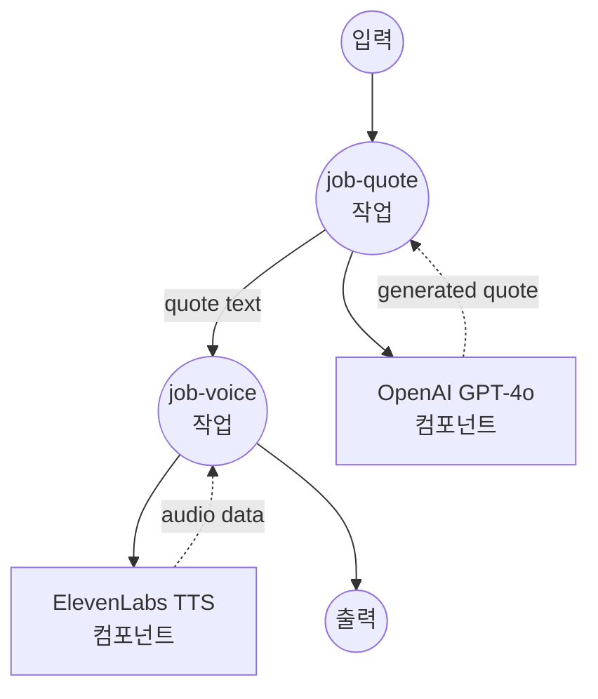

# 영감을 주는 명언 음성 생성 예제

이 예제는 텍스트 생성과 음성 합성을 결합한 복잡한 다단계 워크플로우를 보여주며, OpenAI GPT-4o와 ElevenLabs Text-to-Speech를 사용하여 영감을 주는 동기 부여 명언을 생성하고 이를 자연스러운 오디오로 변환합니다.

## 개요

이 워크플로우는 다음과 같은 엔드-투-엔드 영감 명언 생성 서비스를 제공합니다:

1. **명언 생성**: OpenAI GPT-4o를 사용하여 영감을 주는 동기 부여 명언 생성 (~30단어)
2. **음성 합성**: ElevenLabs TTS를 사용하여 생성된 명언을 자연스러운 음성으로 변환
3. **다단계 처리**: 컴포넌트 간 작업 의존성 및 데이터 흐름 시연
4. **오디오 출력**: 맞춤 가능한 음성 선택으로 고품질 MP3 오디오 제공

## 준비사항

### 필수 요구사항

- model-compose가 설치되어 PATH에서 사용 가능
- GPT-4o 접근 권한이 있는 OpenAI API 키
- text-to-speech 접근 권한이 있는 ElevenLabs API 키

### API 서비스 요구사항

**OpenAI API:**
- GPT-4o 모델 접근
- Chat completions 엔드포인트

**ElevenLabs API:**
- Text-to-Speech 접근
- 음성 라이브러리 접근
- MP3 오디오 생성 기능

### 환경 구성

1. 이 예제 디렉토리로 이동:
   ```bash
   cd examples/make-inspiring-quote-voice
   ```

2. 샘플 환경 파일 복사:
   ```bash
   cp .env.sample .env
   ```

3. `.env` 파일을 편집하여 API 키 추가:
   ```env
   OPENAI_API_KEY=your-actual-openai-api-key
   ELEVENLABS_API_KEY=your-actual-elevenlabs-api-key
   ```

## 실행 방법

1. **서비스 시작:**
   ```bash
   model-compose up
   ```

2. **워크플로우 실행:**

   **API 사용:**
   ```bash
   # 기본 음성 사용
   curl -X POST http://localhost:8080/api/workflows/runs \
     -H "Content-Type: application/json" \
     -d '{}'

   # 특정 음성 사용
   curl -X POST http://localhost:8080/api/workflows/runs \
     -H "Content-Type: application/json" \
     -d '{"input": {"voice_id": "21m00Tcm4TlvDq8ikWAM"}}'
   ```

   **웹 UI 사용:**
   - 웹 UI 열기: http://localhost:8081
   - 선택적으로 음성 ID 지정
   - "Run Workflow" 버튼 클릭

   **CLI 사용:**
   ```bash
   # 기본 음성 사용
   model-compose run

   # 특정 음성 사용
   model-compose run --input '{"voice_id": "21m00Tcm4TlvDq8ikWAM"}'
   ```

## 컴포넌트 세부사항

### OpenAI GPT-4o 컴포넌트 (write-inspiring-quote)
- **유형**: HTTP client 컴포넌트
- **목적**: 영감을 주는 동기 부여 명언 생성
- **API**: OpenAI GPT-4o Chat Completions
- **모델**: gpt-4o
- **기능**:
  - 영감을 주는 콘텐츠를 위한 특화된 프롬프트
  - 목표 30단어 명언 생성
  - 일관된 동기 부여 톤과 스타일
  - 예제 기반 프롬프트 엔지니어링

### ElevenLabs TTS 컴포넌트 (text-to-speech)
- **유형**: HTTP client 컴포넌트
- **목적**: 텍스트를 자연스러운 음성으로 변환
- **API**: ElevenLabs Text-to-Speech v1
- **모델**: eleven_multilingual_v2
- **기능**:
  - 고품질 MP3 오디오 출력 (44.1kHz, 128kbps)
  - 구성 가능한 음성 선택
  - 다국어 음성 모델 지원
  - Base64 오디오 인코딩

## 워크플로우 세부사항

### "Inspire with Voice" 워크플로우 (기본)

**설명**: GPT-4o를 사용하여 동기 부여 명언을 생성하고, ElevenLabs TTS로 자연스러운 음성으로 변환하여 생동감을 불어넣습니다.

#### 작업 흐름



#### 입력 매개변수

| 매개변수 | 유형 | 필수 | 기본값 | 설명 |
|---------|------|------|--------|------|
| `voice_id` | text | 아니오 | `JBFqnCBsd6RMkjVDRZzb` | 음성 합성을 위한 ElevenLabs 음성 ID |

#### 출력 형식

| 필드 | 유형 | 설명 |
|-----|------|------|
| `quote` | text | 생성된 영감 명언 텍스트 |
| `audio` | audio/mp3 (base64) | MP3 오디오 형식으로 변환된 명언 |

## 명언 생성 세부사항

명언 생성은 다음과 같이 신중하게 제작된 프롬프트를 사용합니다:

1. **컨텍스트 제공**: 영감을 주는 콘텐츠에 대한 명확한 지침
2. **길이 설정**: 최적의 오디오 길이를 위해 약 30단어를 목표로 함
3. **예제 제공**: 스타일과 톤을 안내하기 위한 샘플 명언 포함
4. **출력 제약**: 추가 텍스트 없이 명언만 반환되도록 보장

### 프롬프트 구조
```
Write an inspiring quote similar to the example below.
Don't say anything else—just give me the quote.
Aim for around 30 words.
Example – Never give up. If there's something you want to become, be proud of it. Give yourself a chance.
Don't think you're worthless—there's nothing to gain from that. Aim high. That's how life should be lived.
```

## ElevenLabs 음성 옵션

### 기본 음성: JBFqnCBsd6RMkjVDRZzb
- **이름**: George (프리미엄 음성)
- **특성**: 명확하고 자신감 있는 동기 부여 톤

### 인기 있는 대체 음성
- **21m00Tcm4TlvDq8ikWAM**: Rachel (여성, 따뜻하고 매력적)
- **AZnzlk1XvdvUeBnXmlld**: Domi (여성, 자신감 있고 영감을 줌)
- **EXAVITQu4vr4xnSDxMaL**: Bella (여성, 친근하고 접근하기 쉬움)
- **ErXwobaYiN019PkySvjV**: Antoni (남성, 부드럽고 전문적)

더 많은 음성을 찾으려면 ElevenLabs 대시보드를 방문하거나 API를 사용하여 사용 가능한 음성을 나열하세요.

## 맞춤화

### 명언 스타일 수정
`write-inspiring-quote` 컴포넌트에서 프롬프트 편집:

```yaml
body:
  model: gpt-4o
  messages:
    - role: user
      content: |
        Write a business-focused motivational quote.
        Keep it under 25 words and make it actionable.
        Example: Success comes to those who dare to begin and persist through challenges.
```

### 오디오 형식 옵션
ElevenLabs 출력 형식 변경:

```yaml
# 다른 품질/형식의 경우
endpoint: https://api.elevenlabs.io/v1/text-to-speech/${input.voice_id}?output_format=mp3_22050_32

# 사용 가능한 형식: mp3_44100_128, mp3_22050_32, pcm_16000, pcm_22050, pcm_24000
```

### 음성 모델 선택
다른 ElevenLabs 모델 사용:

```yaml
body:
  text: ${input.text}
  model_id: eleven_monolingual_v1    # 영어 전용, 더 빠른 처리
  # or eleven_multilingual_v2         # 다국어 지원
```

### 음성 설정 추가
음성 특성 미세 조정:

```yaml
body:
  text: ${input.text}
  model_id: eleven_multilingual_v2
  voice_settings:
    stability: 0.5        # 0-1, 높을수록 더 안정적
    similarity_boost: 0.5  # 0-1, 높을수록 원본과 더 유사
    style: 0.5            # 0-1, 과장 수준
```

## 고급 사용법

### 배치 명언 생성
다양한 음성으로 여러 명언 생성:

```yaml
workflow:
  title: Batch Quote Generation
  jobs:
    - id: generate-quotes
      component: write-inspiring-quote
      repeat_count: ${input.count | 3}
      input: {}
    - id: voice-quotes
      component: text-to-speech
      repeat_count: ${input.count | 3}
      input:
        text: ${jobs.generate-quotes.output[${index}].quote}
        voice_id: ${input.voices[${index}]}
      depends_on: [ generate-quotes ]
```

### 주제 기반 명언
주제 선택 추가:

```yaml
component:
  type: http-client
  # ... other config
  body:
    model: gpt-4o
    messages:
      - role: user
        content: |
          Write an inspiring ${input.theme | "motivational"} quote.
          Theme options: success, perseverance, leadership, creativity, growth
          Aim for around 30 words.
```
