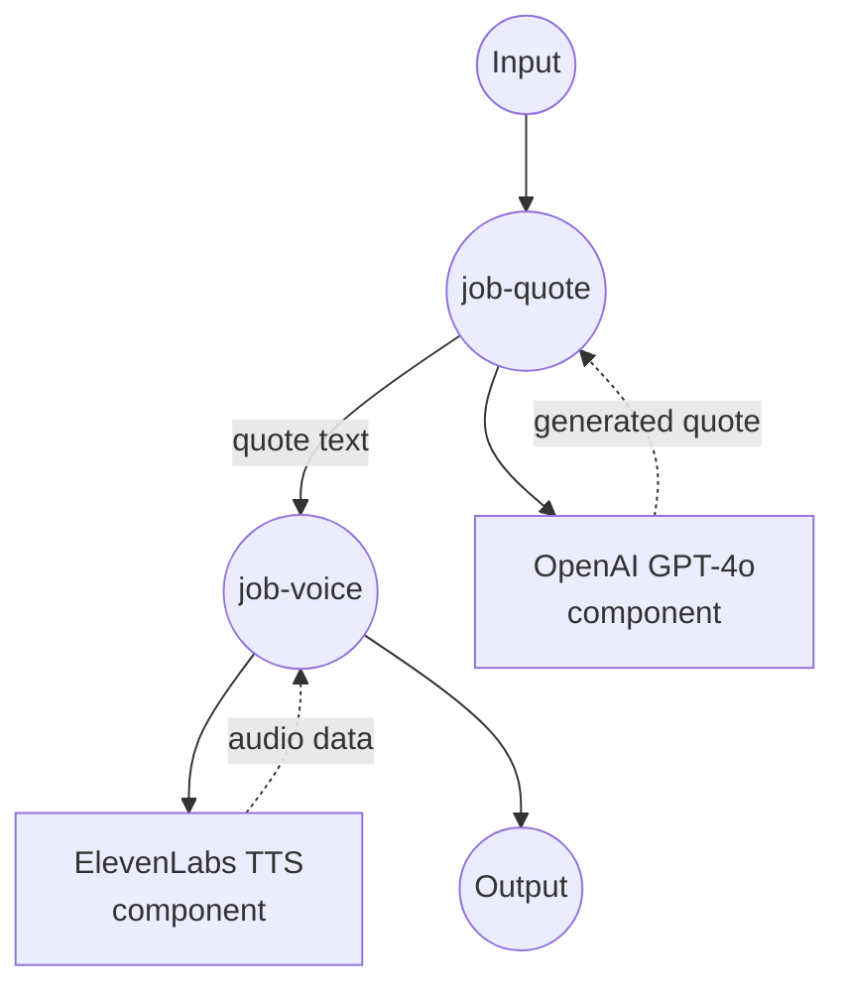

# Make Inspiring Quote Voice Example

This example demonstrates a complex multi-step workflow that combines text generation with speech synthesis, creating inspiring motivational quotes and converting them to natural-sounding audio using OpenAI GPT-4o and ElevenLabs Text-to-Speech.

## Overview

This workflow provides an end-to-end inspirational quote generation service that:

1. **Quote Generation**: Uses OpenAI GPT-4o to generate inspiring motivational quotes (~30 words)
2. **Voice Synthesis**: Converts the generated quote to natural speech using ElevenLabs TTS
3. **Multi-Step Processing**: Demonstrates job dependencies and data flow between components
4. **Audio Output**: Delivers high-quality MP3 audio with customizable voice selection

## Preparation

### Prerequisites

- model-compose installed and available in your PATH
- OpenAI API key with GPT-4o access
- ElevenLabs API key with text-to-speech access

### API Service Requirements

**OpenAI API:**
- GPT-4o model access
- Chat completions endpoint

**ElevenLabs API:**
- Text-to-Speech access
- Voice library access
- MP3 audio generation capability

### Environment Configuration

1. Navigate to this example directory:
   ```bash
   cd examples/make-inspiring-quote-voice
   ```

2. Copy the sample environment file:
   ```bash
   cp .env.sample .env
   ```

3. Edit `.env` and add your API keys:
   ```env
   OPENAI_API_KEY=your-actual-openai-api-key
   ELEVENLABS_API_KEY=your-actual-elevenlabs-api-key
   ```

## How to Run

1. **Start the service:**
   ```bash
   model-compose up
   ```

2. **Run the workflow:**

   **Using API:**
   ```bash
   # Use default voice
   curl -X POST http://localhost:8080/api/workflows/__default__/runs \
     -H "Content-Type: application/json" \
     -d '{}'
   
   # Use specific voice
   curl -X POST http://localhost:8080/api/workflows/__default__/runs \
     -H "Content-Type: application/json" \
     -d '{"input": {"voice_id": "21m00Tcm4TlvDq8ikWAM"}}'
   ```

   **Using Web UI:**
   - Open the Web UI: http://localhost:8081
   - Optionally specify a voice ID
   - Click the "Run Workflow" button

   **Using CLI:**
   ```bash
   # Use default voice
   model-compose run
   
   # Use specific voice
   model-compose run --input '{"voice_id": "21m00Tcm4TlvDq8ikWAM"}'
   ```

## Component Details

### write-inspiring-quote (OpenAI GPT-4o)
- **Type**: HTTP client component
- **Purpose**: Generate inspiring motivational quotes
- **API**: OpenAI GPT-4o Chat Completions
- **Model**: gpt-4o
- **Features**:
  - Specialized prompt for inspirational content
  - Targeted 30-word quote generation
  - Consistent motivational tone and style
  - Example-driven prompt engineering

### text-to-speech (ElevenLabs TTS)
- **Type**: HTTP client component
- **Purpose**: Convert text to natural-sounding speech
- **API**: ElevenLabs Text-to-Speech v1
- **Model**: eleven_multilingual_v2
- **Features**:
  - High-quality MP3 audio output (44.1kHz, 128kbps)
  - Configurable voice selection
  - Multilingual voice model support
  - Base64 audio encoding

## Workflow Details

### "Inspire with Voice" Workflow (Default)

**Description**: Generate a motivational quote using GPT-4o and bring it to life by converting it into natural speech with ElevenLabs TTS.

#### Job Flow



#### Input Parameters

| Parameter | Type | Required | Default | Description |
|-----------|------|----------|---------|-------------|
| `voice_id` | text | No | JBFqnCBsd6RMkjVDRZzb | ElevenLabs voice ID for speech synthesis |

#### Output Format

| Field | Type | Description |
|-------|------|-------------|
| `quote` | text | The generated inspirational quote text |
| `audio` | audio/mp3 (base64) | The quote converted to MP3 audio format |

## Quote Generation Details

The quote generation uses a carefully crafted prompt that:

1. **Provides Context**: Clear instructions for inspirational content
2. **Sets Length**: Targets approximately 30 words for optimal audio duration
3. **Gives Examples**: Includes a sample quote to guide style and tone
4. **Constrains Output**: Ensures only the quote is returned, no extra text

### Prompt Structure
```
Write an inspiring quote similar to the example below.
Don't say anything else—just give me the quote.
Aim for around 30 words.
Example – Never give up. If there's something you want to become, be proud of it. Give yourself a chance.
Don't think you're worthless—there's nothing to gain from that. Aim high. That's how life should be lived.
```

## ElevenLabs Voice Options

### Default Voice: JBFqnCBsd6RMkjVDRZzb
- **Name**: George (Premium voice)
- **Characteristics**: Clear, confident, motivational tone

### Popular Alternative Voices
- **21m00Tcm4TlvDq8ikWAM**: Rachel (Female, warm and engaging)
- **AZnzlk1XvdvUeBnXmlld**: Domi (Female, confident and inspiring)
- **EXAVITQu4vr4xnSDxMaL**: Bella (Female, friendly and approachable)
- **ErXwobaYiN019PkySvjV**: Antoni (Male, smooth and professional)

To find more voices, visit your ElevenLabs dashboard or use their API to list available voices.

## Customization

### Modify Quote Style
Edit the prompt in the `write-inspiring-quote` component:

```yaml
body:
  model: gpt-4o
  messages:
    - role: user
      content: |
        Write a business-focused motivational quote.
        Keep it under 25 words and make it actionable.
        Example: Success comes to those who dare to begin and persist through challenges.
```

### Audio Format Options
Change ElevenLabs output format:

```yaml
# For different quality/format
endpoint: https://api.elevenlabs.io/v1/text-to-speech/${input.voice_id}?output_format=mp3_22050_32

# Available formats: mp3_44100_128, mp3_22050_32, pcm_16000, pcm_22050, pcm_24000
```

### Voice Model Selection
Use different ElevenLabs models:

```yaml
body:
  text: ${input.text}
  model_id: eleven_monolingual_v1    # For English-only, faster processing
  # or eleven_multilingual_v2         # For multilingual support
```

### Add Voice Settings
Fine-tune voice characteristics:

```yaml
body:
  text: ${input.text}
  model_id: eleven_multilingual_v2
  voice_settings:
    stability: 0.5        # 0-1, higher = more stable
    similarity_boost: 0.5  # 0-1, higher = more similar to original
    style: 0.5            # 0-1, exaggeration level
```

## Advanced Usage

### Batch Quote Generation
Create multiple quotes with different voices:

```yaml
workflow:
  title: Batch Quote Generation
  jobs:
    - id: generate-quotes
      component: write-inspiring-quote
      repeat_count: ${input.count | 3}
      input: {}
    - id: voice-quotes
      component: text-to-speech
      repeat_count: ${input.count | 3}
      input:
        text: ${jobs.generate-quotes.output[${index}].quote}
        voice_id: ${input.voices[${index}]}
      depends_on: [ generate-quotes ]
```

### Theme-Based Quotes
Add theme selection:

```yaml
component:
  type: http-client
  # ... other config
  body:
    model: gpt-4o
    messages:
      - role: user
        content: |
          Write an inspiring ${input.theme | "motivational"} quote.
          Theme options: success, perseverance, leadership, creativity, growth
          Aim for around 30 words.
```
