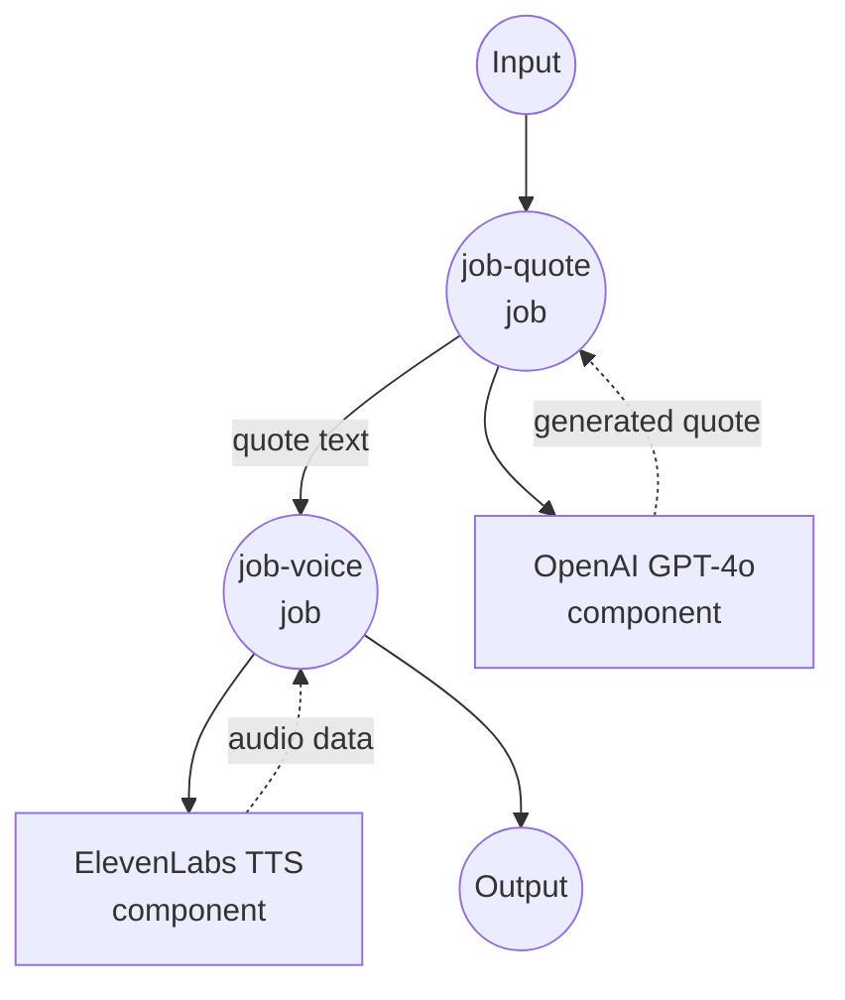

# 制作励志名言语音示例

此示例演示了一个复杂的多步骤工作流，它结合文本生成和语音合成，使用 OpenAI GPT-4o 和 ElevenLabs 文本转语音创建励志名言并将其转换为自然发音的音频。

## 概述

此工作流提供端到端的励志名言生成服务，包括：

1. **名言生成**：使用 OpenAI GPT-4o 生成励志名言（约 30 个单词）
2. **语音合成**：使用 ElevenLabs TTS 将生成的名言转换为自然语音
3. **多步骤处理**：演示组件之间的作业依赖关系和数据流
4. **音频输出**：提供具有可自定义语音选择的高质量 MP3 音频

## 准备工作

### 前置条件

- 已安装 model-compose 并在 PATH 中可用
- 具有 GPT-4o 访问权限的 OpenAI API 密钥
- 具有文本转语音访问权限的 ElevenLabs API 密钥

### API 服务要求

**OpenAI API：**
- GPT-4o 模型访问权限
- 聊天完成端点

**ElevenLabs API：**
- 文本转语音访问权限
- 语音库访问权限
- MP3 音频生成能力

### 环境配置

1. 导航到此示例目录：
   ```bash
   cd examples/make-inspiring-quote-voice
   ```

2. 复制示例环境文件：
   ```bash
   cp .env.sample .env
   ```

3. 编辑 `.env` 并添加您的 API 密钥：
   ```env
   OPENAI_API_KEY=your-actual-openai-api-key
   ELEVENLABS_API_KEY=your-actual-elevenlabs-api-key
   ```

## 运行方法

1. **启动服务：**
   ```bash
   model-compose up
   ```

2. **运行工作流：**

   **使用 API：**
   ```bash
   # 使用默认语音
   curl -X POST http://localhost:8080/api/workflows/runs \
     -H "Content-Type: application/json" \
     -d '{}'

   # 使用特定语音
   curl -X POST http://localhost:8080/api/workflows/runs \
     -H "Content-Type: application/json" \
     -d '{"input": {"voice_id": "21m00Tcm4TlvDq8ikWAM"}}'
   ```

   **使用 Web UI：**
   - 打开 Web UI：http://localhost:8081
   - 可选择指定语音 ID
   - 点击 "Run Workflow" 按钮

   **使用 CLI：**
   ```bash
   # 使用默认语音
   model-compose run

   # 使用特定语音
   model-compose run --input '{"voice_id": "21m00Tcm4TlvDq8ikWAM"}'
   ```

## 组件详情

### OpenAI GPT-4o 组件（write-inspiring-quote）
- **类型**：HTTP client 组件
- **目的**：生成励志名言
- **API**：OpenAI GPT-4o 聊天完成
- **模型**：gpt-4o
- **功能**：
  - 专门用于励志内容的提示
  - 目标 30 字名言生成
  - 一致的励志语气和风格
  - 示例驱动的提示工程

### ElevenLabs TTS 组件（text-to-speech）
- **类型**：HTTP client 组件
- **目的**：将文本转换为自然发音的语音
- **API**：ElevenLabs 文本转语音 v1
- **模型**：eleven_multilingual_v2
- **功能**：
  - 高质量 MP3 音频输出（44.1kHz，128kbps）
  - 可配置的语音选择
  - 多语言语音模型支持
  - Base64 音频编码

## 工作流详情

### "用语音启发" 工作流（默认）

**描述**：使用 GPT-4o 生成励志名言，并通过 ElevenLabs TTS 将其转换为自然语音，使其栩栩如生。

#### 作业流程



#### 输入参数

| 参数 | 类型 | 必需 | 默认值 | 描述 |
|-----------|------|----------|---------|-------------|
| `voice_id` | text | 否 | `JBFqnCBsd6RMkjVDRZzb` | 用于语音合成的 ElevenLabs 语音 ID |

#### 输出格式

| 字段 | 类型 | 描述 |
|-------|------|-------------|
| `quote` | text | 生成的励志名言文本 |
| `audio` | audio/mp3 (base64) | 转换为 MP3 音频格式的名言 |

## 名言生成详情

名言生成使用精心设计的提示，包括：

1. **提供上下文**：励志内容的明确指示
2. **设置长度**：目标约 30 个单词以获得最佳音频持续时间
3. **提供示例**：包含示例名言以指导风格和语气
4. **约束输出**：确保仅返回名言，没有额外文本

### 提示结构
```
写一条类似以下示例的励志名言。
不要说其他任何内容——只给我名言。
目标约 30 个单词。
示例 – 永不放弃。如果有你想成为的东西，为它感到自豪。给自己一个机会。
不要认为自己毫无价值——那样做没有任何好处。目标远大。这就是应该如何生活。
```

## ElevenLabs 语音选项

### 默认语音：JBFqnCBsd6RMkjVDRZzb
- **名称**：George（高级语音）
- **特征**：清晰、自信、励志的语气

### 热门替代语音
- **21m00Tcm4TlvDq8ikWAM**：Rachel（女性，温暖而引人入胜）
- **AZnzlk1XvdvUeBnXmlld**：Domi（女性，自信而鼓舞人心）
- **EXAVITQu4vr4xnSDxMaL**：Bella（女性，友好而平易近人）
- **ErXwobaYiN019PkySvjV**：Antoni（男性，流畅而专业）

要查找更多语音，请访问您的 ElevenLabs 仪表板或使用其 API 列出可用语音。

## 自定义

### 修改名言风格
编辑 `write-inspiring-quote` 组件中的提示：

```yaml
body:
  model: gpt-4o
  messages:
    - role: user
      content: |
        写一条以商业为重点的励志名言。
        保持在 25 个单词以下，并使其可操作。
        示例：成功属于那些敢于开始并坚持克服挑战的人。
```

### 音频格式选项
更改 ElevenLabs 输出格式：

```yaml
# 对于不同的质量/格式
endpoint: https://api.elevenlabs.io/v1/text-to-speech/${input.voice_id}?output_format=mp3_22050_32

# 可用格式：mp3_44100_128、mp3_22050_32、pcm_16000、pcm_22050、pcm_24000
```

### 语音模型选择
使用不同的 ElevenLabs 模型：

```yaml
body:
  text: ${input.text}
  model_id: eleven_monolingual_v1    # 仅英语，处理更快
  # 或 eleven_multilingual_v2         # 多语言支持
```

### 添加语音设置
微调语音特征：

```yaml
body:
  text: ${input.text}
  model_id: eleven_multilingual_v2
  voice_settings:
    stability: 0.5        # 0-1，越高越稳定
    similarity_boost: 0.5  # 0-1，越高越接近原始
    style: 0.5            # 0-1，夸张级别
```

## 高级用法

### 批量名言生成
使用不同语音创建多个名言：

```yaml
workflow:
  title: Batch Quote Generation
  jobs:
    - id: generate-quotes
      component: write-inspiring-quote
      repeat_count: ${input.count | 3}
      input: {}
    - id: voice-quotes
      component: text-to-speech
      repeat_count: ${input.count | 3}
      input:
        text: ${jobs.generate-quotes.output[${index}].quote}
        voice_id: ${input.voices[${index}]}
      depends_on: [ generate-quotes ]
```

### 基于主题的名言
添加主题选择：

```yaml
component:
  type: http-client
  # ... 其他配置
  body:
    model: gpt-4o
    messages:
      - role: user
        content: |
          写一条励志的 ${input.theme | "motivational"} 名言。
          主题选项：success、perseverance、leadership、creativity、growth
          目标约 30 个单词。
```
