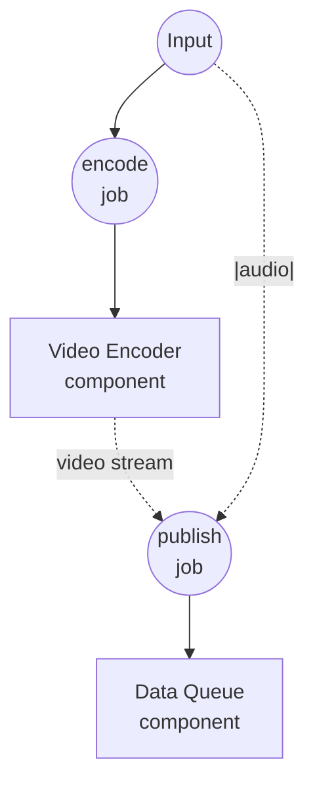

# YouTube Live 방송 예제

이 예제는 공유된 `data-queue`로 구동되는 연속 YouTube Live 방송을 보여줍니다. 한 워크플로우는 필요할 때마다 비디오+오디오 쌍을 큐에 넣고, 별도의 장기 실행 워크플로우가 큐를 소비하여 각 쌍을 RTMP로 YouTube Live에 스트리밍합니다.

## 개요

두 워크플로우가 하나의 `data-queue` 컴포넌트 인스턴스를 공유합니다:

1. **publish-video**: 호출당 하나의 `{video, audio}` 아이템을 큐에 넣습니다 — 비디오 소스(파일 경로 또는 URL)와 함께, 방송 시 비디오의 원래 오디오를 대체할 (선택적) 오디오 트랙을 함께 넣습니다. 반복 호출로 여러 아이템을 줄 세울 수 있습니다.
2. **broadcast-live**: 계속 실행됩니다 — 큐를 구독하고 `"|"` 분할 연산자로 각 dequeue된 아이템을 두 개의 병렬 필드별 스트림(`video`, `audio`)으로 팬아웃하여 `rtmp-publisher` 컴포넌트에 그대로 전달합니다. 아이템은 FIFO 순서로 방송되며, 워크플로우는 취소될 때에만 정지합니다.

`data-queue` 인스턴스가 워크플로우 호출 간에 공유되므로, 두 워크플로우는 같은 큐에서 읽고 씁니다. 각 publish는 현재 비디오의 스트리밍이 끝날 때까지 블로킹되므로 방송이 끊김 없이 이어지고, 다음 비디오가 이전 비디오가 끝나는 즉시 시작됩니다.

### 단일 큐를 쓰는 이유

비디오와 오디오가 하나의 큐 아이템으로 함께 이동하므로 쌍이 구조적으로 정렬됩니다 — 별도의 두 큐 사이에서 위치를 맞출 필요가 없습니다. 그런 다음 `"|"` 연산자가 사용 시점에 dequeue 스트림을 필드별 스트림으로 다시 나눠주므로, 별도의 중간 단계가 필요 없습니다.

## 준비사항

### 필수 요구사항

- model-compose가 설치되어 PATH에서 사용 가능
- 로컬에 `ffmpeg` 사용 가능 (`rtmp-publisher` 컴포넌트에서 사용)
- 실시간 스트리밍이 활성화된 YouTube 채널과 [YouTube Studio](https://studio.youtube.com/) → 실시간 스트리밍 시작에서 발급받은 스트림 키
- 워크플로우를 실행하는 머신에서 접근 가능한 비디오 파일 하나 이상 (`.mp4`, `.mov`, `.mkv` 등) 또는 공개 비디오 URL
- (선택) 비디오의 원래 오디오 트랙을 대체할 오디오 파일

### 환경 구성

`.env.sample`을 `.env`로 복사하고 YouTube Live 스트림 키를 입력합니다:

```bash
cp .env.sample .env
```

```
YOUTUBE_STREAM_KEY=put-your-stream-key-here
```

스트림 키는 YouTube Studio의 **실시간 스트리밍 시작 → 스트림** 에서 확인할 수 있으며, YouTube가 RTMP 세션을 인증할 때 사용합니다.

## 실행 방법

1. **서비스 시작:**
   ```bash
   model-compose up
   ```

2. **방송 시작 (계속 실행 상태로 두기):**

   터미널이나 탭 하나에서 컨슈머 워크플로우를 시작합니다. 첫 아이템이 도착할 때까지 대기합니다:

   ```bash
   model-compose run broadcast-live
   ```

   또는 http://localhost:8081 의 Web UI에서 `broadcast-live`를 실행합니다.

   첫 아이템이 큐에 들어가면 YouTube Studio 실시간 대시보드에 RTMP 피드가 들어오기 시작합니다. 공개 방송을 시작할 준비가 되면 YouTube Studio에서 **실시간 스트리밍 시작**을 클릭하세요.

3. **아이템 넣기 (반복 가능):**

   다른 터미널(또는 Web UI)에서 방송할 아이템마다 한 번씩 `publish-video`를 호출합니다:

   **API 사용:**
   ```bash
   curl -X POST http://localhost:8080/api/workflows/publish-video/runs \
     -H "Content-Type: application/json" \
     -d '{"input": {"video": "/absolute/path/to/clip.mp4"}}'
   ```

   **CLI 사용:**
   ```bash
   model-compose run publish-video --input '{"video": "/absolute/path/to/clip.mp4"}'
   ```

   비디오의 원래 오디오를 별도 트랙으로 대체하려면 `audio`를 함께 지정합니다:

   ```bash
   model-compose run publish-video --input '{"video": "/path/to/clip.mp4", "audio": "/path/to/track.mp3"}'
   ```

   각 호출은 아이템을 하나씩 추가하며, 방송기가 순서대로 소비합니다.

4. **방송 중지:**

   Web UI 또는 runs API 취소 엔드포인트로 `broadcast-live` 실행을 취소합니다. `data-queue`는 취소를 깔끔하게 전파하며 ffmpeg 프로세스도 함께 종료됩니다.

## 컴포넌트 상세

### 비디오 인코더 컴포넌트 (encoder)
- **타입**: `video-encoder` 컴포넌트
- **드라이버**: `ffmpeg`
- **목적**: 각 입력 비디오를 스트리밍 가능한 MPEG-TS 바이트 스트림으로 재인코딩하여 중간 임시 파일 없이 큐에 넣을 수 있게 함
- **주요 옵션**:
  - `streaming`: `true` — 스풀 파일 대신 라이브 바이트 스트림을 방출
  - `encoding.format`: `mpegts` — `rtmp-publisher`가 받는 스트리밍 입력 포맷 중 하나
  - `encoding.video`: `libx264` / 1080p / 30 fps / 4500 kbps
  - `encoding.audio`: `aac` / 160 kbps

### 데이터 큐 컴포넌트 (media-queue)
- **타입**: `data-queue` 컴포넌트
- **드라이버**: `memory`
- **목적**: 프로듀서와 컨슈머 워크플로우 사이의 공유 FIFO 버퍼. 각 아이템은 `{video, audio}` 쌍
- **주요 옵션**:
  - `max_size`: `100` — 큐가 가득 차면 publish가 오류로 실패 (블로킹 대신 명시적 실패로 백프레셔 처리)
- **액션**:
  - `enqueue` (method `enqueue`): 현재 입력을 큐에 추가
  - `dequeue` (method `dequeue`): 취소될 때까지 큐 아이템을 yield하는 스트림을 엽니다

### RTMP 방송기 컴포넌트 (publisher)
- **타입**: `rtmp-publisher` 컴포넌트
- **드라이버**: `ffmpeg`
- **목적**: 큐에서 꺼낸 각 비디오(및 짝지어진 오디오)를 인코딩하여 RTMP로 YouTube Live에 송출
- **주요 옵션**:
  - `url`: `rtmp://a.rtmp.youtube.com/live2/${env.YOUTUBE_STREAM_KEY}` — YouTube Live 인제스트 엔드포인트
  - `video`: 방송할 소스 — 단일 값, 리스트, 또는 스트림 허용
  - `audio`: 선택적 오디오 오버라이드 소스 — `video`와 동일한 형태 규칙
  - `encoding`: 1080p / 30 fps / H.264 4500 kbps / AAC 160 kbps — YouTube 권장값에 맞춘 안전한 기본값

## 워크플로우 상세

### "방송 큐에 비디오 넣기" 워크플로우 (publish-video)

**설명**: 비디오 소스를 스트리밍 가능한 MPEG-TS 바이트 스트림으로 재인코딩하여 (선택적) 오디오 오버라이드와 짝지어 `media-queue`에 push합니다. 반복 호출로 방송 재생목록을 쌓아 올립니다.

#### 작업 흐름

1. **encode**: 입력 비디오를 MPEG-TS 바이트 스트림으로 재인코딩
2. **publish**: 인코딩된 비디오와 (선택적) 오디오 오버라이드를 결합한 `{video, audio}` 아이템을 enqueue



#### 입력 매개변수

| 매개변수 | 타입 | 필수 | 기본값 | 설명 |
|-----------|------|----------|---------|-------------|
| `video` | video | 예 | - | 비디오 소스: 로컬 파일 경로, `file://` URL, 또는 `http(s)://` URL |
| `audio` | audio | 아니오 | - | 방송 시 비디오의 원래 오디오를 대체할 선택적 오디오 트랙 |

#### 출력 형식

`publish-video`는 `null`을 반환합니다 — publish는 fire-and-forget 연산입니다.

### "큐의 비디오를 YouTube Live로 방송" 워크플로우 (broadcast-live)

**설명**: 짝지어진 비디오+오디오 아이템을 계속 dequeue하여 각각을 RTMP로 YouTube Live에 송출합니다. 취소될 때까지 실행됩니다.

#### 작업 흐름

1. **subscribe**: `media-queue`에서 `{video, audio}` 아이템을 yield하는 consume 스트림 열기
2. **broadcast**: `"|"` 분할 연산자로 아이템 스트림을 두 개의 병렬 필드별 스트림(`video`, `audio`)으로 팬아웃하여 RTMP 방송기에 그대로 전달, 아이템 단위로 송출

```mermaid
graph TD
    J1((subscribe<br/>job))
    J2((broadcast<br/>job))

    C1[Data Queue<br/>component]
    C2[RTMP Publisher<br/>component]

    J1 --> C1
    C1 -.-> |item stream| J1
    J1 -.-> |video + audio streams via `\|`| J2
    J2 --> C2
```

#### 입력 매개변수

없음 — 워크플로우는 오직 큐에서만 읽습니다.

#### 출력 형식

취소될 때까지 실행되며, 종료 시점의 출력은 없습니다.

## 예상 출력

`broadcast-live`가 실행 중인 상태에서 다음과 같은 `publish-video` 호출을 순서대로 하면:

```bash
model-compose run publish-video --input '{"video": "./videos/intro.mp4"}'
model-compose run publish-video --input '{"video": "./videos/main.mp4", "audio": "./audio/narration.mp3"}'
model-compose run publish-video --input '{"video": "https://example.com/outro.mp4"}'
```

...세 비디오가 YouTube Live 채널로 이어서 송출됩니다 — 두 번째 비디오는 원래 오디오 대신 지정한 나레이션 트랙으로 재생됩니다. 이전 비디오가 방송 중일 때 추가로 `publish-video`를 호출하면 큐에 쌓였다가 방송기가 현재 비디오를 마치는 즉시 이어서 송출되므로, 끊김 없는 24/7 스타일의 방송을 만들 수 있습니다.

## 커스터마이징

- 백프레셔 여유 공간을 조정하려면 `media-queue.max_size`를 늘리거나 줄이세요
- 소스 자료와 업로드 대역폭에 맞춰 `publisher.action.encoding.video.bitrate`와 `resolution`을 조정하세요 (YouTube는 1080p30에 4500–9000 kbps, 1080p60에 9000–13500 kbps를 권장)
- 고프레임레이트 방송을 하려면 `publisher.action.encoding.video.fps`를 `60`으로 변경하세요
- `publisher.action.url`에 두 번째 URL을 추가하고 `batch_size`를 함께 설정하면 YouTube 외에 Twitch나 Facebook Live로도 동시 송출할 수 있습니다 — 자세한 내용은 [RTMP publisher 레퍼런스](../../../docs/reference/compose/components/rtmp-publisher.md)를 참고하세요
- `enqueue`/`dequeue`에 `session` 필드를 추가하면 채널이나 캠페인 단위로 큐를 분할할 수 있습니다 — 한 세션에 publish된 아이템은 해당 세션의 컨슈머에게만 보입니다
