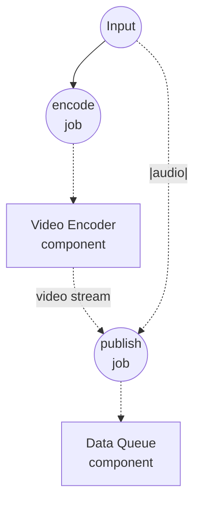

# YouTube Live Broadcast Example

This example demonstrates continuous YouTube Live broadcasting driven by a shared `data-queue`: one workflow enqueues paired video+audio sources on demand, and a separate long-running workflow drains the queue and streams each pair to YouTube Live over RTMP.

## Overview

Two workflows share a single `data-queue` component instance:

1. **publish-video**: Pushes one `{video, audio}` item into the queue per invocation — a video source (file path or URL) together with an optional override audio track that replaces the video's built-in audio at broadcast time. Call it repeatedly to line up multiple items.
2. **broadcast-live**: Runs continuously — subscribes to the queue and uses the `"|"` split operator to fan each dequeued item into two parallel per-field streams (`video`, `audio`) that feed the `rtmp-publisher` component directly. Items are broadcast in FIFO order; the workflow stops only when cancelled.

Because a `data-queue` instance is shared across workflow invocations, both workflows read and write the same queue. Each publish blocks until the current video finishes streaming, which keeps the broadcast seamless — the next queued video starts the moment the previous one ends.

### Why a single queue

Video and audio travel together in one queue item, so the pair stays aligned by construction — no positional coordination between separate queues is needed. The `"|"` operator then splits the dequeue stream back into per-field streams at the point of use, without any intermediate glue step.

## Preparation

### Prerequisites

- model-compose installed and available in your PATH
- `ffmpeg` available locally (used by the `rtmp-publisher` component)
- A YouTube channel with live streaming enabled and a stream key from [YouTube Studio](https://studio.youtube.com/) → Go Live
- One or more video files reachable from the machine running the workflow (`.mp4`, `.mov`, `.mkv`, etc.), or public video URLs
- (Optional) audio files to override the video's built-in audio track

### Environment Configuration

Copy `.env.sample` to `.env` and fill in your YouTube Live stream key:

```bash
cp .env.sample .env
```

```
YOUTUBE_STREAM_KEY=put-your-stream-key-here
```

The stream key is available in YouTube Studio under **Go Live → Stream** and is what YouTube uses to authenticate the RTMP session.

## How to Run

1. **Start the service:**
   ```bash
   model-compose up
   ```

2. **Start the broadcaster (leave it running):**

   In one terminal or tab, start the consumer workflow. It will block, waiting for the first item:

   ```bash
   model-compose run broadcast-live
   ```

   Or open the Web UI at http://localhost:8081 and run `broadcast-live`.

   Once the first item is enqueued, YouTube Studio's live dashboard will start receiving the RTMP feed. Click **Go Live** on YouTube Studio when you are ready to make it public.

3. **Enqueue items (repeatable):**

   From another terminal (or the Web UI), call `publish-video` once per item you want to broadcast:

   **Using API:**
   ```bash
   curl -X POST http://localhost:8080/api/workflows/publish-video/runs \
     -H "Content-Type: application/json" \
     -d '{"input": {"video": "/absolute/path/to/clip.mp4"}}'
   ```

   **Using CLI:**
   ```bash
   model-compose run publish-video --input '{"video": "/absolute/path/to/clip.mp4"}'
   ```

   To override the video's built-in audio with a separate track, add `audio`:

   ```bash
   model-compose run publish-video --input '{"video": "/path/to/clip.mp4", "audio": "/path/to/track.mp3"}'
   ```

   Each call appends one item; the broadcaster drains them in order.

4. **Stop the broadcast:**

   Cancel the `broadcast-live` run from the Web UI or by hitting the runs API cancel endpoint. `data-queue` propagates cancellation cleanly and ffmpeg is torn down.

## Component Details

### Video Encoder Component (encoder)
- **Type**: `video-encoder` component
- **Driver**: `ffmpeg`
- **Purpose**: Re-encodes each incoming video to a streamable MPEG-TS byte stream so it can be enqueued without an intermediate temp file
- **Key options**:
  - `streaming`: `true` — emit a live byte stream instead of a spooled file
  - `encoding.format`: `mpegts` — one of the streamable input formats accepted by `rtmp-publisher`
  - `encoding.video`: `libx264` / 1080p / 30 fps / 4500 kbps
  - `encoding.audio`: `aac` / 160 kbps

### Data Queue Component (media-queue)
- **Type**: `data-queue` component
- **Driver**: `memory`
- **Purpose**: Shared FIFO buffer between the producer and consumer workflows; each item is a `{video, audio}` pair
- **Key options**:
  - `max_size`: `100` — publish fails with an error when the queue is full (backpressure via explicit failure rather than blocking)
- **Actions**:
  - `enqueue` (method `enqueue`): appends the current input to the queue
  - `dequeue` (method `dequeue`): opens a stream that yields queued items until cancelled

### RTMP Publisher Component (publisher)
- **Type**: `rtmp-publisher` component
- **Driver**: `ffmpeg`
- **Purpose**: Encodes and pushes each queued video (with its paired audio) to YouTube Live over RTMP
- **Key options**:
  - `url`: `rtmp://a.rtmp.youtube.com/live2/${env.YOUTUBE_STREAM_KEY}` — YouTube Live ingest endpoint
  - `video`: source(s) to publish — accepts a single value, a list, or a stream
  - `audio`: optional override audio source with the same shape rules as `video`
  - `encoding`: 1080p / 30 fps / H.264 4500 kbps / AAC 160 kbps — safe defaults for YouTube's ingest recommendations

## Workflow Details

### "Enqueue a video for broadcast" Workflow (publish-video)

**Description**: Re-encode a video source into a streamable MPEG-TS byte stream and push it into `media-queue` paired with its (optional) override audio track. Invoke repeatedly to build up a broadcast playlist.

#### Job Flow

1. **encode**: Re-encodes the input video into an MPEG-TS byte stream
2. **publish**: Enqueues a `{video, audio}` item combining the encoded video and the (optional) audio override



#### Input Parameters

| Parameter | Type | Required | Default | Description |
|-----------|------|----------|---------|-------------|
| `video` | video | Yes | - | Video source: local file path, `file://` URL, or `http(s)://` URL |
| `audio` | audio | No | - | Optional audio track that overrides the video's built-in audio at broadcast time |

#### Output Format

`publish-video` returns `null` — publishing is a fire-and-forget operation.

### "Broadcast queued videos to YouTube Live" Workflow (broadcast-live)

**Description**: Continuously dequeue paired video+audio items and stream each one to YouTube Live over RTMP. Runs until cancelled.

#### Job Flow

1. **subscribe**: Opens a consume stream on `media-queue` that yields `{video, audio}` items
2. **broadcast**: Uses the `"|"` split operator to fan the item stream into two parallel per-field streams (`video`, `audio`) that feed the RTMP publisher directly, one item at a time

```mermaid
graph TD
    J1((subscribe<br/>job))
    J2((broadcast<br/>job))

    C1[Data Queue<br/>component]
    C2[RTMP Publisher<br/>component]

    J1 -.-> C1
    C1 -.-> |item stream| J1
    J1 -.-> |video + audio streams via `\|`| J2
    J2 -.-> C2
```

#### Input Parameters

None — the workflow reads exclusively from the queue.

#### Output Format

Runs until cancelled; there is no terminal output.

## Example Output

With `broadcast-live` running, a sequence of `publish-video` calls like:

```bash
model-compose run publish-video --input '{"video": "./videos/intro.mp4"}'
model-compose run publish-video --input '{"video": "./videos/main.mp4", "audio": "./audio/narration.mp3"}'
model-compose run publish-video --input '{"video": "https://example.com/outro.mp4"}'
```

...results in the three videos streaming to your YouTube Live channel back-to-back — the middle one played with the supplied narration track in place of its original audio. Additional `publish-video` invocations while the earlier videos are still broadcasting are enqueued and picked up as soon as the publisher finishes the current one, giving you a continuous 24/7-style broadcast without gaps.

## Customization

- Raise or lower `media-queue.max_size` to change backpressure headroom
- Adjust `publisher.action.encoding.video.bitrate` and `resolution` to match your source material and upload bandwidth (YouTube recommends 4500–9000 kbps for 1080p30, 9000–13500 kbps for 1080p60)
- Change `publisher.action.encoding.video.fps` to `60` for high-frame-rate broadcasts
- Add a second URL to `publisher.action.url` (and set `batch_size` accordingly) to simulcast to Twitch or Facebook Live in addition to YouTube — see the [RTMP publisher reference](../../../docs/reference/compose/components/rtmp-publisher.md) for multi-target broadcasting
- Add a `session` field to `enqueue`/`dequeue` to partition the queue by channel or campaign — items published under one session are only visible to consumers of that session
