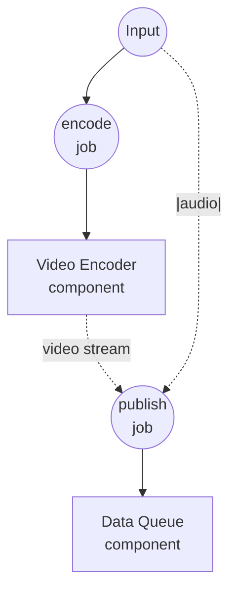

# YouTube Live 直播示例

此示例演示了由共享 `data-queue` 驱动的连续 YouTube Live 直播：一个工作流按需将视频+音频对入队，另一个长时间运行的工作流消费队列并通过 RTMP 将每对推流到 YouTube Live。

## 概述

两个工作流共享一个 `data-queue` 组件实例：

1. **publish-video**：每次调用向队列推送一个 `{video, audio}` 项 — 视频源（文件路径或 URL），以及在直播时替代视频原始音频的（可选）覆盖音轨。反复调用即可排列多个项。
2. **broadcast-live**：持续运行 — 订阅队列并用 `"|"` 拆分运算符把每个 dequeue 到的项扇出为两条并行的按字段流（`video`、`audio`），直接喂给 `rtmp-publisher` 组件。项按 FIFO 顺序推流；仅在被取消时停止。

由于 `data-queue` 实例在工作流调用之间共享，两个工作流从同一队列读写。每次 publish 都会阻塞直到当前视频推流结束，这让直播保持顺畅 — 上一个视频结束的瞬间下一个入队视频就会开始。

### 为什么用单个队列

视频与音频作为同一个队列项一起传递，所以配对天然对齐 — 不需要在两条独立队列之间协调位置。然后 `"|"` 运算符在使用点把 dequeue 流重新拆分回按字段流，无需任何中间粘合步骤。

## 准备工作

### 前置条件

- 已安装 model-compose 并在您的 PATH 中可用
- 本地可用 `ffmpeg`（供 `rtmp-publisher` 组件使用）
- 启用了直播功能的 YouTube 频道，以及来自 [YouTube Studio](https://studio.youtube.com/) → 开始直播的推流密钥
- 运行工作流的机器可访问的一个或多个视频文件（`.mp4`、`.mov`、`.mkv` 等）或公开的视频 URL
- （可选）用于覆盖视频原始音轨的音频文件

### 环境配置

将 `.env.sample` 复制为 `.env` 并填入您的 YouTube Live 推流密钥：

```bash
cp .env.sample .env
```

```
YOUTUBE_STREAM_KEY=put-your-stream-key-here
```

推流密钥可在 YouTube Studio 的 **开始直播 → 直播** 中查看，YouTube 使用它来对 RTMP 会话进行身份验证。

## 运行方式

1. **启动服务：**
   ```bash
   model-compose up
   ```

2. **启动推流器（保持运行状态）：**

   在一个终端或标签页中启动消费者工作流。它会阻塞并等待第一项：

   ```bash
   model-compose run broadcast-live
   ```

   或打开 http://localhost:8081 的 Web UI 并运行 `broadcast-live`。

   一旦第一项被入队，YouTube Studio 的直播控制台就会开始接收 RTMP 信号。准备好公开直播时，请在 YouTube Studio 上点击 **开始直播**。

3. **入队项目（可反复）：**

   在另一个终端（或 Web UI）中，每要推流一项就调用一次 `publish-video`：

   **使用 API：**
   ```bash
   curl -X POST http://localhost:8080/api/workflows/publish-video/runs \
     -H "Content-Type: application/json" \
     -d '{"input": {"video": "/absolute/path/to/clip.mp4"}}'
   ```

   **使用 CLI：**
   ```bash
   model-compose run publish-video --input '{"video": "/absolute/path/to/clip.mp4"}'
   ```

   若要用单独的音轨替代视频原始音频，请同时指定 `audio`：

   ```bash
   model-compose run publish-video --input '{"video": "/path/to/clip.mp4", "audio": "/path/to/track.mp3"}'
   ```

   每次调用追加一项，推流器按顺序消费。

4. **停止直播：**

   通过 Web UI 或点击 runs API 的取消端点来取消 `broadcast-live` 运行。`data-queue` 会干净地传播取消信号，ffmpeg 也会随之停止。

## 组件详情

### 视频编码器组件 (encoder)
- **类型**：`video-encoder` 组件
- **驱动**：`ffmpeg`
- **用途**：将每个输入视频重新编码为可流式传输的 MPEG-TS 字节流，无需中间临时文件即可入队
- **关键选项**：
  - `streaming`：`true` — 发出实时字节流而非落盘的临时文件
  - `encoding.format`：`mpegts` — `rtmp-publisher` 接受的可流式输入格式之一
  - `encoding.video`：`libx264` / 1080p / 30 fps / 4500 kbps
  - `encoding.audio`：`aac` / 160 kbps

### 数据队列组件 (media-queue)
- **类型**：`data-queue` 组件
- **驱动**：`memory`
- **用途**：在生产者与消费者工作流之间共享的 FIFO 缓冲区；每项是 `{video, audio}` 对
- **关键选项**：
  - `max_size`：`100` — 队列满时 publish 会以错误失败（通过显式失败而非阻塞来实现背压）
- **动作**：
  - `enqueue`（method `enqueue`）：将当前输入追加到队列
  - `dequeue`（method `dequeue`）：打开一条流，直到被取消才停止 yield 队列项

### RTMP 推流组件 (publisher)
- **类型**：`rtmp-publisher` 组件
- **驱动**：`ffmpeg`
- **用途**：将队列中的每个视频（连同配对的音频）编码并通过 RTMP 推送到 YouTube Live
- **关键选项**：
  - `url`：`rtmp://a.rtmp.youtube.com/live2/${env.YOUTUBE_STREAM_KEY}` — YouTube Live 摄取端点
  - `video`：要推流的源 — 接受单值、列表或流
  - `audio`：可选的覆盖音频源 — 形态规则与 `video` 相同
  - `encoding`：1080p / 30 fps / H.264 4500 kbps / AAC 160 kbps — 符合 YouTube 摄取推荐的安全默认值

## 工作流详情

### "将视频入队以便直播"工作流 (publish-video)

**描述**：将视频源重新编码为可流式传输的 MPEG-TS 字节流，与（可选的）覆盖音轨配对后推入 `media-queue`。反复调用即可构建直播播放列表。

#### 作业流程

1. **encode**：将输入视频重新编码为 MPEG-TS 字节流
2. **publish**：将编码后的视频与（可选的）音频覆盖组合为 `{video, audio}` 项并入队



#### 输入参数

| 参数 | 类型 | 必需 | 默认 | 描述 |
|-----------|------|----------|---------|-------------|
| `video` | video | 是 | - | 视频源：本地文件路径、`file://` URL 或 `http(s)://` URL |
| `audio` | audio | 否 | - | 可选音轨，直播时替代视频原始音频 |

#### 输出格式

`publish-video` 返回 `null` — publish 是一次即忘操作。

### "将队列中的视频推流到 YouTube Live"工作流 (broadcast-live)

**描述**：持续 dequeue 配对的视频+音频项并通过 RTMP 逐一推流到 YouTube Live。直到被取消才停止。

#### 作业流程

1. **subscribe**：在 `media-queue` 上打开 consume 流，产出 `{video, audio}` 项
2. **broadcast**：用 `"|"` 拆分运算符把项流扇出为两条并行的按字段流（`video`、`audio`），直接喂给 RTMP 推流器，逐项推流

```mermaid
graph TD
    J1((subscribe<br/>job))
    J2((broadcast<br/>job))

    C1[Data Queue<br/>component]
    C2[RTMP Publisher<br/>component]

    J1 --> C1
    C1 -.-> |item stream| J1
    J1 -.-> |video + audio streams via `\|`| J2
    J2 --> C2
```

#### 输入参数

无 — 工作流仅从队列读取。

#### 输出格式

直到被取消才停止；没有终端输出。

## 示例输出

在 `broadcast-live` 正在运行时，按顺序执行以下 `publish-video` 调用：

```bash
model-compose run publish-video --input '{"video": "./videos/intro.mp4"}'
model-compose run publish-video --input '{"video": "./videos/main.mp4", "audio": "./audio/narration.mp3"}'
model-compose run publish-video --input '{"video": "https://example.com/outro.mp4"}'
```

……三个视频会连续推流到您的 YouTube Live 频道 — 其中第二个视频会用指定的旁白音轨替代其原始音频。前一个视频仍在直播时额外调用 `publish-video` 会被入队，一旦推流器完成当前视频就会被接续拾取，从而形成无缝的 24/7 风格直播。

## 自定义

- 调高或调低 `media-queue.max_size` 以改变背压余量
- 根据素材和上行带宽调整 `publisher.action.encoding.video.bitrate` 与 `resolution`（YouTube 推荐 1080p30 为 4500–9000 kbps，1080p60 为 9000–13500 kbps）
- 将 `publisher.action.encoding.video.fps` 改为 `60` 用于高帧率直播
- 在 `publisher.action.url` 中追加第二个 URL 并相应设置 `batch_size`，即可在推流 YouTube 的同时并推 Twitch 或 Facebook Live — 详见 [RTMP publisher 参考](../../../docs/reference/compose/components/rtmp-publisher.md)
- 在 `enqueue`/`dequeue` 上添加 `session` 字段，可按频道或活动对队列进行分区 — 某个会话下 publish 的项目仅对该会话的消费者可见
