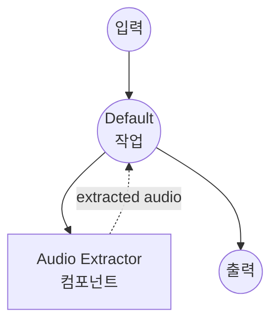

# 오디오 추출기 예제

이 예제는 `audio-extractor` 컴포넌트를 사용한 오디오 추출기를 보여주며, model-compose가 설정 가능한 인코딩 옵션과 함께 ffmpeg 기반의 오디오 추출을 비디오 또는 오디오 파일에서 어떻게 오케스트레이션할 수 있는지 설명합니다.

## 개요

이 워크플로우는 다음과 같은 오디오 추출 서비스를 제공합니다:

1. **오디오 추출**: 비디오 파일(MP4, MKV, MOV 등)에서 오디오를 추출하거나 오디오 파일을 재인코딩
2. **포맷 변환**: 다양한 오디오 포맷(MP3, WAV, FLAC, AAC, M4A, Opus, OGG)으로 변환
3. **설정 가능한 인코딩**: 오디오 코덱, 비트레이트, 멀티 트랙 선택 지원
4. **파일 입출력**: 바이너리 파일 데이터가 컴포넌트와 워크플로우를 통해 어떻게 흐르는지 보여줌
5. **Web UI 통합**: 모든 옵션에 대한 드롭다운 선택기를 갖춘 Gradio 기반 인터페이스 제공

## 준비사항

### 필수 요구사항

- model-compose가 설치되어 PATH에서 사용 가능
- [ffmpeg](https://ffmpeg.org/)가 설치되어 PATH에서 사용 가능

### 환경 구성

1. 이 예제 디렉토리로 이동:
   ```bash
   cd examples/media-processing/audio-extractor
   ```

2. ffmpeg 설치 확인:
   ```bash
   ffmpeg -version
   ```

## 실행 방법

1. **서비스 시작:**
   ```bash
   model-compose up
   ```

2. **워크플로우 실행:**

   **웹 UI 사용:**
   - Web UI 열기: http://localhost:8081
   - 비디오 또는 오디오 파일 업로드
   - 출력 포맷, 코덱, 비트레이트 선택
   - "Run Workflow" 버튼 클릭
   - 추출된 오디오 파일 다운로드

   **API 사용:**
   ```bash
   curl -X POST http://localhost:8080/api/workflows/runs \
     -H "Content-Type: multipart/form-data" \
     -F "source=@input.mp4" \
     -F "format=mp3" \
     -F "codec=libmp3lame" \
     -F "bitrate=192k"
   ```

   **CLI 사용:**
   ```bash
   model-compose run --input '{"source": "path/to/input.mp4", "format": "mp3"}'
   ```

## 컴포넌트 세부사항

### Audio Extractor 컴포넌트
- **유형**: `audio-extractor`
- **드라이버**: ffmpeg
- **목적**: 설정 가능한 인코딩 옵션으로 비디오 또는 오디오 파일에서 오디오 추출

## 워크플로우 세부사항

### "Audio Extractor" 워크플로우 (기본)

**설명**: ffmpeg를 사용하여 비디오 또는 오디오 파일에서 오디오를 추출합니다.

#### 작업 흐름



#### 입력 매개변수

| 매개변수 | 유형 | 필수 | 기본값 | 설명 |
|---------|------|------|--------|------|
| `source` | file | Yes | - | 오디오를 추출할 비디오 또는 오디오 파일 |
| `format` | select | No | `mp3` | 출력 포맷: mp3, wav, flac, aac, m4a, opus, ogg |
| `codec` | select | No | `libmp3lame` | 오디오 코덱: libmp3lame, pcm_s16le, flac, aac, libopus, libvorbis, copy |
| `bitrate` | select | No | `192k` | 오디오 비트레이트: 64k, 128k, 192k, 256k, 320k |

#### 출력 형식

| 필드 | 유형 | 설명 |
|-----|------|------|
| `audio` | audio | 추출된 오디오 파일 |

## 지원 포맷

### 입력
ffmpeg는 다음을 포함한 광범위한 컨테이너 포맷을 지원합니다:

- **비디오 컨테이너**: MP4, MKV, MOV, AVI, WebM, FLV, TS
- **오디오 컨테이너**: MP3, WAV, FLAC, AAC, M4A, OGG, Opus

### 출력
이 예제는 다음의 오디오 출력 포맷을 지원합니다:

- **MP3** - MPEG-1 Audio Layer III (손실 압축)
- **WAV** - Waveform Audio (무압축)
- **FLAC** - Free Lossless Audio Codec
- **AAC** - Advanced Audio Coding (손실 압축)
- **M4A** - MPEG-4 Audio 컨테이너
- **Opus** - 최신 손실 압축 코덱
- **OGG** - Ogg Vorbis 컨테이너

## 팁

- **무손실 추출**: 오디오 품질을 보존하려면 `format=flac` 또는 `format=wav`와 `codec=flac`/`pcm_s16le` 사용
- **재인코딩 없이 복사**: 트랜스코딩 없이 원본 오디오 스트림을 추출하려면 `codec=copy` 사용 (가장 빠르며 품질 손실 없음)
- **멀티 트랙 소스**: 컴포넌트 액션의 `track` 필드는 정수 인덱스(예: `track: 1`)를 받아 MKV, MP4 또는 기타 멀티 트랙 컨테이너에서 특정 오디오 트랙을 선택할 수 있습니다
- **최소 파일 크기**: 최상의 압축률을 위해서는 `format=opus`를 낮은 비트레이트와 함께 사용

## 문제 해결

### 일반적인 문제

1. **ffmpeg를 찾을 수 없음**: ffmpeg가 설치되어 있고 PATH에서 사용 가능한지 확인
2. **지원되지 않는 코덱**: 일부 코덱/포맷 조합은 호환되지 않을 수 있음 (예: libmp3lame과 flac)
3. **트랙을 찾을 수 없음**: 소스에 오디오 트랙이 하나뿐이라면 `track: 0`(기본값)을 유지
4. **Copy 코덱 실패**: `codec=copy`는 소스 코덱이 출력 포맷과 일치할 때만 작동
