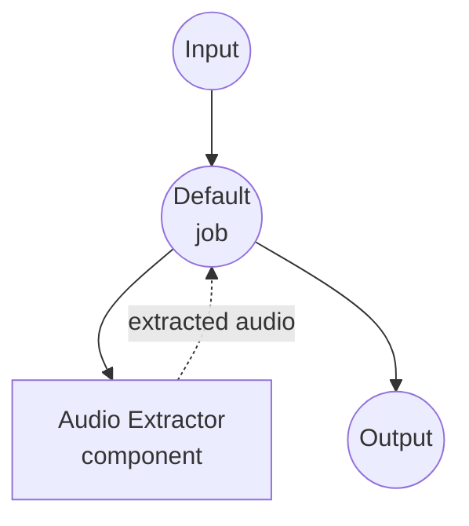

# 音频提取器示例

此示例演示了使用 `audio-extractor` 组件的音频提取器，展示了 model-compose 如何通过可配置的编码选项协调基于 ffmpeg 的从视频或音频文件的音频提取。

## 概述

此工作流提供音频提取服务：

1. **音频提取**：从视频文件（MP4、MKV、MOV 等）中提取音频或重新编码音频文件
2. **格式转换**：转换为各种音频格式（MP3、WAV、FLAC、AAC、M4A、Opus、OGG）
3. **可配置编码**：支持音频编解码器、比特率和多轨选择
4. **文件输入/输出**：展示二进制文件数据如何通过组件和工作流流动
5. **Web UI 集成**：提供基于 Gradio 的界面，所有选项均带下拉选择器

## 准备工作

### 前置条件

- 已安装 model-compose 并在您的 PATH 中可用
- 已安装 [ffmpeg](https://ffmpeg.org/) 并在您的 PATH 中可用

### 环境配置

1. 导航到此示例目录：
   ```bash
   cd examples/media-processing/audio-extractor
   ```

2. 验证 ffmpeg 已安装：
   ```bash
   ffmpeg -version
   ```

## 运行方式

1. **启动服务：**
   ```bash
   model-compose up
   ```

2. **运行工作流：**

   **使用 Web UI：**
   - 打开 Web UI：http://localhost:8081
   - 上传视频或音频文件
   - 选择输出格式、编解码器和比特率
   - 点击"运行工作流"按钮
   - 下载提取的音频文件

   **使用 API：**
   ```bash
   curl -X POST http://localhost:8080/api/workflows/runs \
     -H "Content-Type: multipart/form-data" \
     -F "source=@input.mp4" \
     -F "format=mp3" \
     -F "codec=libmp3lame" \
     -F "bitrate=192k"
   ```

   **使用 CLI：**
   ```bash
   model-compose run --input '{"source": "path/to/input.mp4", "format": "mp3"}'
   ```

## 组件详情

### Audio Extractor 组件
- **类型**：`audio-extractor`
- **驱动**：ffmpeg
- **用途**：使用可配置的编码设置从视频或音频文件中提取音频

## 工作流详情

### "Audio Extractor" 工作流（默认）

**描述**：使用 ffmpeg 从视频或音频文件中提取音频。

#### 作业流程



#### 输入参数

| 参数 | 类型 | 必需 | 默认值 | 描述 |
|------|------|------|--------|------|
| `source` | file | Yes | - | 要从中提取音频的视频或音频文件 |
| `format` | select | No | `mp3` | 输出格式：mp3、wav、flac、aac、m4a、opus、ogg |
| `codec` | select | No | `libmp3lame` | 音频编解码器：libmp3lame、pcm_s16le、flac、aac、libopus、libvorbis、copy |
| `bitrate` | select | No | `192k` | 音频比特率：64k、128k、192k、256k、320k |

#### 输出格式

| 字段 | 类型 | 描述 |
|------|------|------|
| `audio` | audio | 提取的音频文件 |

## 支持的格式

### 输入
ffmpeg 支持广泛的容器格式，包括：

- **视频容器**：MP4、MKV、MOV、AVI、WebM、FLV、TS
- **音频容器**：MP3、WAV、FLAC、AAC、M4A、OGG、Opus

### 输出
此示例支持以下音频输出格式：

- **MP3** - MPEG-1 Audio Layer III（有损）
- **WAV** - Waveform Audio（未压缩）
- **FLAC** - Free Lossless Audio Codec
- **AAC** - Advanced Audio Coding（有损）
- **M4A** - MPEG-4 Audio 容器
- **Opus** - 现代有损编解码器
- **OGG** - Ogg Vorbis 容器

## 提示

- **无损提取**：使用 `format=flac` 或 `format=wav` 配合 `codec=flac`/`pcm_s16le` 以保留音质
- **无需重新编码的复制**：使用 `codec=copy` 提取原始音频流而不进行转码（最快，无质量损失）
- **多轨源**：组件动作上的 `track` 字段接受整数索引（例如 `track: 1`）以从 MKV、MP4 或其他多轨容器中选择特定音频轨道
- **最小文件大小**：使用 `format=opus` 配合低比特率以获得最佳压缩

## 故障排除

### 常见问题

1. **找不到 ffmpeg**：确保 ffmpeg 已安装并在您的 PATH 中可用
2. **不支持的编解码器**：某些编解码器/格式组合可能不兼容（例如 libmp3lame 与 flac）
3. **找不到轨道**：如果源只有一个音频轨道，请保持 `track: 0`（默认值）
4. **Copy 编解码器失败**：`codec=copy` 仅在源编解码器与输出格式匹配时有效
