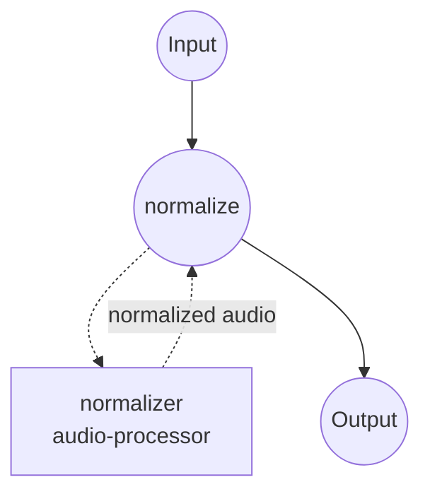

# 오디오 정규화 예제

이 예제는 **`audio-processor`** 컴포넌트를 사용해 입력 오디오를 목표 통합 라우드니스(**LUFS**, ITU-R BS.1770)로 정규화하고, 라우드니스 게인 이후에 트루 피크 상한을 적용합니다. 단순히 피크만 제한하는 것이 아니라 지각 라우드니스를 배포 목표(예: 스트리밍 -14 LUFS)에 맞춰야 할 때 적합한 설정입니다.

## 개요

워크플로우는 하나의 작업으로 구성됩니다:

1. **`normalize`** — 입력의 통합 라우드니스를 측정하고, 목표에 도달하기 위한 게인을 적용한 뒤, 인터샘플 피크가 지정 dBTP를 넘지 않도록 트루 피크 상한을 강제합니다.

여러 소스가 청취자에게 동일한 크기로 들려야 할 때 LUFS가 정답입니다 — 피크/RMS 정규화는 수치는 맞춰도 지각 라우드니스는 맞추지 못합니다. 일반적인 배포 목표:

- **-14 LUFS**: YouTube, Spotify, Apple Music (여기 기본값).
- **-16 LUFS**: 팟캐스트 (Apple Podcasts 권장).
- **-23 LUFS**: EBU R128 방송 표준.

## 준비

### 필수 요구사항

- PATH에 등록된 model-compose.
- Python 의존성은 최초 실행 시 자동 설치됩니다 (`pyloudnorm`, `numpy`, `soundfile`).

### 설정

예제 디렉터리로 이동:

```bash
cd examples/media-processing/audio-normalizer
```

## 실행 방법

1. **서비스 시작:**

   ```bash
   model-compose up
   ```

   - API 엔드포인트: http://localhost:8080/api
   - 웹 UI: http://localhost:8081

2. **워크플로우 실행:**

   **웹 UI 사용:**
   - http://localhost:8081 열기.
   - 오디오 파일 업로드.
   - 선택적으로 `level`, `true_peak_ceiling` 조정.
   - **Run Workflow** 클릭 후 정규화된 오디오 다운로드.

   **CLI 사용:**

   ```bash
   # 기본값: -14 LUFS, -1 dBTP 트루 피크 상한
   model-compose run --input '{"audio": "/path/to/input.wav"}'

   # 방송 목표 (EBU R128)
   model-compose run --input '{
     "audio": "/path/to/input.wav",
     "level": -23,
     "true_peak_ceiling": -1
   }'
   ```

   **API 사용:**

   ```bash
   curl -X POST http://localhost:8080/api/workflows/runs \
     -F "audio=@/path/to/input.wav" \
     -F 'input={"audio": "@audio", "level": -14}'
   ```

## 컴포넌트 상세

### `normalizer` — 오디오 프로세서 (LUFS 모드)

- **타입**: `audio-processor`
- **메서드**: `normalize`
- **모드**: `lufs`
- **목적**: 입력 오디오를 목표 통합 라우드니스로 끌어올리면서 트루 피크를 보호.
- **참고**:
  - 게인 적용 후 재측정해서 결과가 목표의 `tolerance` LU 이내에 들어올 때까지 반복하는 검증 루프를 사용합니다 (기본 0.5 LU).
  - `max_gain`(기본 30 dB)으로 상한을 두어 매우 조용한 소스가 무제한으로 증폭되지 않도록 합니다.
  - 트루 피크 상한은 라우드니스 게인 *이후*에 적용되므로, 지정 dBTP를 초과하지 않습니다 — 이로 인해 라우드니스 목표에 살짝 못 미칠 수도 있습니다.

## 워크플로우 상세

### "Audio Normalizer" 워크플로우

**설명**: 오디오 파일을 목표 LUFS로 정규화하고 트루 피크 상한을 적용합니다.

#### 작업 흐름



#### 입력 파라미터

| 파라미터 | 타입 | 필수 | 기본값 | 설명 |
|----------|------|------|--------|------|
| `audio` | audio | 예 | - | 원본 오디오 파일 (MP3, WAV, FLAC, ...) |
| `level` | number | 아니오 | `-14` | 목표 통합 라우드니스 (LUFS) |
| `true_peak_ceiling` | number | 아니오 | `-1` | 라우드니스 게인 이후 적용되는 트루 피크 상한 (dBTP) |

#### 출력

| 필드 | 타입 | 설명 |
|------|------|------|
| `audio` | audio | 라우드니스 정규화된 오디오 (WAV 바이트 스트림). |

## 커스터마이징

### 피크 또는 RMS 정규화로 전환

컴포넌트 액션의 모드를 바꾸면 됩니다. 헤드룸만 중요하다면 피크 정규화, 풀 라우드니스 미터가 과할 때는 RMS가 가벼운 중간 지점입니다.

```yaml
components:
  - id: normalizer
    type: audio-processor
    action:
      method: normalize
      mode: peak       # 또는 'rms'
      audio: ${input.audio}
      level: ${input.level}   # peak/rms는 LUFS가 아닌 dBFS
```

### 정규화 이후 피크 리미터 추가

트랜지언트가 심한 소재를 마스터링할 때 내장 트루 피크 클리핑보다 부드러운 피크 제어가 필요하다면, 정규화 뒤에 `peak-limit` 액션을 이어붙이세요.

## 팁

- **스트리밍 vs. 방송**: -14 LUFS는 방송 배포에는 공격적입니다. EBU R128은 -23 LUFS, ATSC A/85는 -24 LUFS를 사용하세요.
- **매우 조용한 소스**: 입력이 목표보다 ~30 dB 이상 낮다면 라우드니스 게인이 `max_gain`에 걸립니다. `max_gain`을 무작정 올리지 말고, 앞단에 `gain` 액션을 두어 소스를 먼저 부스트하세요 — 큰 게인은 노이즈도 함께 증폭합니다.
- **트루 피크 상한 헤드룸**: -1 dBTP는 손실 코덱(mp3, aac)에 안전한 기본값입니다 — 디코드 시 샘플 피크보다 몇 dB 높은 피크가 생길 수 있기 때문입니다. 무손실을 유지하는 경우에만 0 dBTP를 쓰세요.

## 문제 해결

### 자주 발생하는 문제

1. **출력 라우드니스가 `tolerance`를 벗어남**: 검증 루프가 수렴하기 전에 `max_gain`에 걸렸습니다. `max_gain`을 조심스레 올리거나, 앞단에서 게인/컴프레션으로 소스를 사전 조정하세요.
2. **출력이 왜곡됨**: 트랜지언트가 강한 소재가 트루 피크 상한을 세게 치고 있습니다. 목표 `level`을 낮추거나(게인 감소), 정규화 앞에 부드러운 피크 리미터를 두세요.
3. **출력이 무음이거나 거의 무음**: 입력 자체가 무음이 아닌지 확인하세요 — 진짜 무음에 대한 LUFS 측정은 -inf를 반환하고 게인이 적용되지 않습니다.
