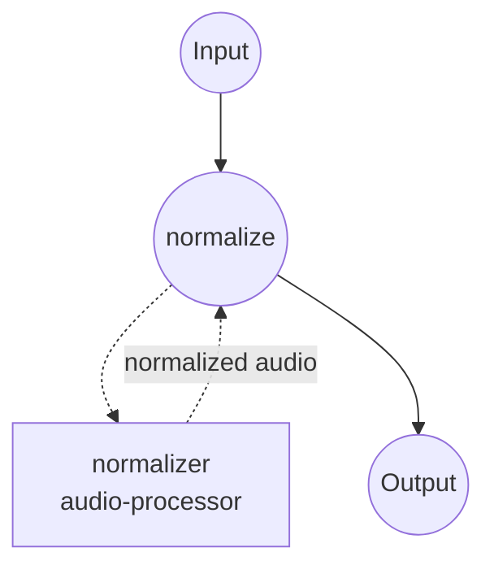

# Audio Normalizer Example

This example uses the **`audio-processor`** component to normalize an input audio to a target integrated loudness in **LUFS** (ITU-R BS.1770), with a true-peak ceiling applied after the loudness gain. It's the go-to setup when you need perceived loudness to match a delivery target (e.g. -14 LUFS for streaming) rather than just capping peaks.

## Overview

The workflow runs a single job:

1. **`normalize`** — Measures the input's integrated loudness, applies the gain needed to hit the target, and then enforces a true-peak ceiling so inter-sample peaks stay below the specified dBTP.

LUFS is the right choice when several sources need to sound equally loud to a listener — peak/RMS normalization align numeric levels but not perceived loudness. Common delivery targets:

- **-14 LUFS**: YouTube, Spotify, Apple Music (default here).
- **-16 LUFS**: Podcasts (Apple Podcasts recommendation).
- **-23 LUFS**: EBU R128 broadcast standard.

## Preparation

### Prerequisites

- model-compose installed and available on `PATH`.
- Python dependencies are installed automatically on first run (`pyloudnorm`, `numpy`, `soundfile`).

### Setup

Navigate to this example directory:

```bash
cd examples/media-processing/audio-normalizer
```

## How to Run

1. **Start the service:**

   ```bash
   model-compose up
   ```

   - API endpoint: http://localhost:8080/api
   - Web UI: http://localhost:8081

2. **Run the workflow:**

   **Using Web UI:**
   - Open http://localhost:8081.
   - Upload an audio file.
   - Optionally override `level` and `true_peak_ceiling`.
   - Click **Run Workflow** and download the normalized audio.

   **Using CLI:**

   ```bash
   # Default: -14 LUFS with -1 dBTP true-peak ceiling
   model-compose run --input '{"audio": "/path/to/input.wav"}'

   # Broadcast target (EBU R128)
   model-compose run --input '{
     "audio": "/path/to/input.wav",
     "level": -23,
     "true_peak_ceiling": -1
   }'
   ```

   **Using API:**

   ```bash
   curl -X POST http://localhost:8080/api/workflows/runs \
     -F "audio=@/path/to/input.wav" \
     -F 'input={"audio": "@audio", "level": -14}'
   ```

## Component Details

### `normalizer` — Audio Processor (LUFS mode)

- **Type**: `audio-processor`
- **Method**: `normalize`
- **Mode**: `lufs`
- **Purpose**: Bring the input audio to a target integrated loudness with true-peak protection.
- **Notes**:
  - Uses a verify loop that re-measures after gain and iterates until the result sits within `tolerance` LU of the target (defaults to 0.5 LU).
  - Bounded by `max_gain` (defaults to 30 dB) so an extremely quiet source can't be lifted arbitrarily.
  - The true-peak ceiling is enforced *after* the loudness gain, so the output never exceeds the specified dBTP even if it means landing slightly below the loudness target.

## Workflow Details

### "Audio Normalizer" Workflow

**Description**: Normalize an audio file to a target LUFS with a true-peak ceiling.

#### Job Flow



#### Input Parameters

| Parameter | Type | Required | Default | Description |
|-----------|------|----------|---------|-------------|
| `audio` | audio | Yes | - | Source audio file (MP3, WAV, FLAC, ...) |
| `level` | number | No | `-14` | Target integrated loudness in LUFS |
| `true_peak_ceiling` | number | No | `-1` | True-peak ceiling in dBTP applied after loudness gain |

#### Output

| Field | Type | Description |
|-------|------|-------------|
| `audio` | audio | The loudness-normalized audio as a WAV byte stream. |

## Customization

### Switch to peak or RMS normalization

Swap the component action to use a different mode. Peak normalization is best when only headroom matters; RMS is a lightweight middle ground when a full loudness meter is overkill.

```yaml
components:
  - id: normalizer
    type: audio-processor
    action:
      method: normalize
      mode: peak       # or 'rms'
      audio: ${input.audio}
      level: ${input.level}   # dBFS for peak/rms (not LUFS)
```

### Add a peak limiter after normalization

If you're mastering material with heavy transients and want smoother peak control than the built-in true-peak clip, chain a `peak-limit` action after normalization.

## Tips

- **Streaming vs. broadcast**: -14 LUFS is aggressive for broadcast delivery. Use -23 LUFS for EBU R128 or -24 LUFS for ATSC A/85.
- **Very quiet sources**: If the input is more than ~30 dB below target, the loudness gain will be clamped by `max_gain`. Boost the source first (e.g. via a preceding `gain` action) rather than raising `max_gain` blindly, since large gains amplify noise.
- **True-peak ceiling headroom**: -1 dBTP is a safe default for lossy codecs (mp3, aac) which can introduce peaks a few dB above the sample-peak on decode. Use 0 dBTP only if the output stays lossless.

## Troubleshooting

### Common Issues

1. **Output loudness is off by more than `tolerance`**: The verify loop hit `max_gain` before converging. Raise `max_gain` cautiously, or pre-condition the source with a gain/compression pass.
2. **Output sounds distorted**: The true-peak ceiling is being hit hard by transient-heavy material. Either lower the target `level` (less gain applied) or precede the normalizer with a smooth peak limiter.
3. **Output is silent or nearly silent**: Verify the input isn't already silent — LUFS measurement on true silence returns -inf and no gain is applied.
