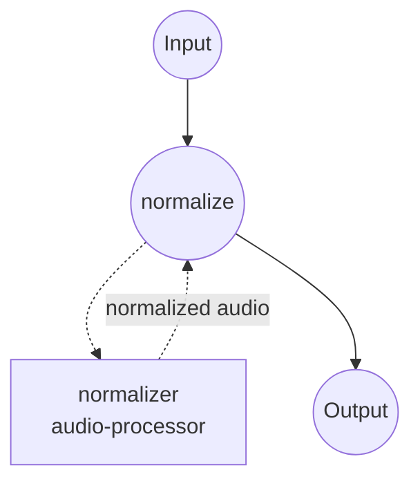

# 音频归一化示例

本示例使用 **`audio-processor`** 组件将输入音频归一化到目标综合响度（**LUFS**，ITU-R BS.1770），并在响度增益后施加真峰值上限。当需要让感知响度匹配交付目标（例如流媒体的 -14 LUFS），而不仅仅是限制峰值时，这是首选方案。

## 概述

工作流由一个作业组成：

1. **`normalize`** — 测量输入的综合响度，施加达到目标所需的增益，然后强制真峰值上限，确保采样间峰值保持在指定的 dBTP 以下。

当多个源需要在听感上一样响时，LUFS 才是正确选择 — 峰值/RMS 归一化只能对齐数字电平，无法对齐感知响度。常见交付目标：

- **-14 LUFS**：YouTube、Spotify、Apple Music（本例默认值）。
- **-16 LUFS**：播客（Apple Podcasts 推荐值）。
- **-23 LUFS**：EBU R128 广播标准。

## 准备

### 前置要求

- 已安装 model-compose 并可在 `PATH` 中调用。
- Python 依赖将在首次运行时自动安装（`pyloudnorm`、`numpy`、`soundfile`）。

### 设置

进入本示例目录：

```bash
cd examples/media-processing/audio-normalizer
```

## 运行方式

1. **启动服务：**

   ```bash
   model-compose up
   ```

   - API 端点：http://localhost:8080/api
   - Web UI：http://localhost:8081

2. **运行工作流：**

   **使用 Web UI：**
   - 打开 http://localhost:8081。
   - 上传音频文件。
   - 可选覆盖 `level` 和 `true_peak_ceiling`。
   - 点击 **Run Workflow** 并下载归一化后的音频。

   **使用 CLI：**

   ```bash
   # 默认：-14 LUFS，-1 dBTP 真峰值上限
   model-compose run --input '{"audio": "/path/to/input.wav"}'

   # 广播目标 (EBU R128)
   model-compose run --input '{
     "audio": "/path/to/input.wav",
     "level": -23,
     "true_peak_ceiling": -1
   }'
   ```

   **使用 API：**

   ```bash
   curl -X POST http://localhost:8080/api/workflows/runs \
     -F "audio=@/path/to/input.wav" \
     -F 'input={"audio": "@audio", "level": -14}'
   ```

## 组件详情

### `normalizer` — 音频处理器（LUFS 模式）

- **类型**：`audio-processor`
- **方法**：`normalize`
- **模式**：`lufs`
- **用途**：将输入音频提升到目标综合响度，同时保护真峰值。
- **说明**：
  - 采用增益后再测量的校验循环，直到结果落在目标的 `tolerance` LU 之内（默认 0.5 LU）。
  - 由 `max_gain`（默认 30 dB）设定上限，防止极安静的源被无限提升。
  - 真峰值上限在响度增益 *之后* 强制执行，因此输出永远不会超过指定 dBTP，即便这意味着略低于响度目标。

## 工作流详情

### "Audio Normalizer" 工作流

**描述**：将音频文件归一化到目标 LUFS，并施加真峰值上限。

#### 作业流



#### 输入参数

| 参数 | 类型 | 必填 | 默认值 | 说明 |
|------|------|------|--------|------|
| `audio` | audio | 是 | - | 源音频文件（MP3、WAV、FLAC、...） |
| `level` | number | 否 | `-14` | 目标综合响度（LUFS） |
| `true_peak_ceiling` | number | 否 | `-1` | 响度增益后施加的真峰值上限（dBTP） |

#### 输出

| 字段 | 类型 | 说明 |
|------|------|------|
| `audio` | audio | 响度归一化后的音频（WAV 字节流）。 |

## 自定义

### 切换到峰值或 RMS 归一化

修改组件动作以使用不同模式。仅关心余量时用峰值归一化；当完整响度表过于复杂时，RMS 是较轻量的中间方案。

```yaml
components:
  - id: normalizer
    type: audio-processor
    action:
      method: normalize
      mode: peak       # 或 'rms'
      audio: ${input.audio}
      level: ${input.level}   # peak/rms 使用 dBFS 而非 LUFS
```

### 归一化后添加峰值限制器

若在处理瞬态强烈的素材时需要比内置真峰值削波更平滑的峰值控制，可在归一化后串联一个 `peak-limit` 动作。

## 提示

- **流媒体 vs. 广播**：-14 LUFS 对广播交付偏激进。EBU R128 使用 -23 LUFS，ATSC A/85 使用 -24 LUFS。
- **非常安静的源**：若输入比目标低约 30 dB 以上，响度增益会被 `max_gain` 钳制。不要盲目调高 `max_gain`，先用前置 `gain` 动作提升源 — 大增益会同时放大噪声。
- **真峰值上限余量**：对有损编码（mp3、aac），-1 dBTP 是安全默认值 — 解码时可能产生高于采样峰值几 dB 的峰值。仅在输出保持无损时才使用 0 dBTP。

## 故障排除

### 常见问题

1. **输出响度偏差超过 `tolerance`**：校验循环在收敛前触及了 `max_gain`。谨慎调高 `max_gain`，或在前置步骤用增益/压缩预处理源。
2. **输出听起来失真**：瞬态密集的素材猛烈冲击了真峰值上限。降低目标 `level`（减少施加的增益），或在归一化前置一个平滑的峰值限制器。
3. **输出无声或几乎无声**：先确认输入本身不是静音 — 对真正静音的 LUFS 测量返回 -inf，不会施加任何增益。
