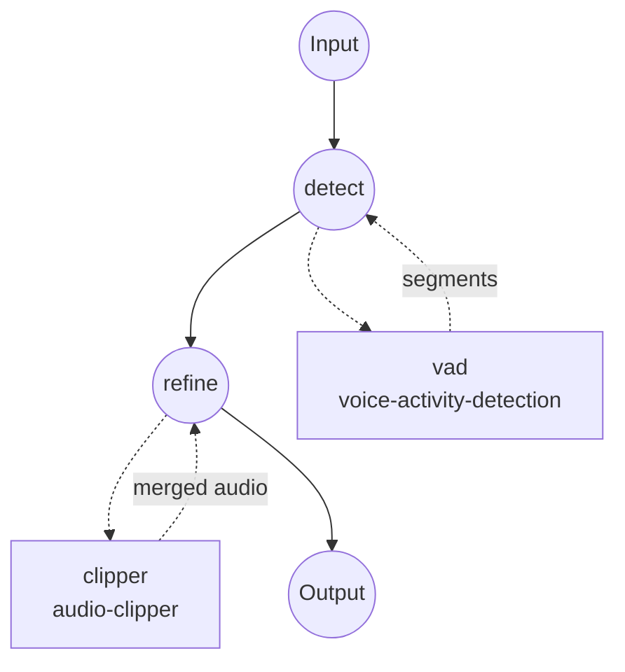

# 오디오 정제 예제

이 예제는 **Silero VAD**와 **`audio-clipper`** 컴포넌트를 연결하여, 감지된 음성 구간만 남기고 하나의 오디오로 정제하는 워크플로우를 보여줍니다. 무음, 숨소리, 배경 소음은 제거되고 남은 음성 클립들은 하나의 파일로 병합됩니다.

## 개요

워크플로우는 두 개의 작업으로 구성됩니다:

1. **`detect`** — Silero VAD 모델을 로컬에서 실행해, 입력 오디오에서 `{start_time, end_time, confidence}` 형태의 음성 구간 리스트를 생성합니다.
2. **`refine`** — 그 구간 리스트를 그대로 `audio-clipper`의 `span`으로 넘기고 `merge: true`를 지정해, ffmpeg가 모든 음성 클립을 하나의 오디오로 이어붙이도록 합니다.

VAD의 세그먼트 스키마(`start_time`, `end_time`)가 클리퍼의 span 스키마와 1:1로 일치하므로 별도의 형태 변환 단계가 필요 없습니다. 각 세그먼트에 붙는 `confidence` 필드는 클리퍼가 무시합니다.

주요 사용 예:
- ASR 서비스에 업로드하기 전, 오디오에서 무음을 제거해 비용을 줄이고 hallucination을 감소.
- 팟캐스트나 인터뷰 오디오에서 긴 침묵을 제거.
- 다운스트림 화자 분리/임베딩을 위한 "음성만 남긴" 원본 사본 생성.

## 준비

### 필수 요구사항

- PATH에 등록된 model-compose
- PATH에 등록된 [ffmpeg](https://ffmpeg.org/) (audio-clipper에서 사용)
- Python 의존성은 최초 실행 시 자동 설치됩니다:
  - `silero-vad`, `torch`, `torchaudio`, `numpy` — VAD 모델

### 설정

예제 디렉터리로 이동:

```bash
cd examples/media-processing/audio-refiner
```

ffmpeg 설치 확인:

```bash
ffmpeg -version
```

## 실행 방법

1. **서비스 시작:**

   ```bash
   model-compose up
   ```

   - API 엔드포인트: http://localhost:8080/api
   - 웹 UI: http://localhost:8081

2. **워크플로우 실행:**

   **웹 UI 사용:**
   - http://localhost:8081 열기
   - 오디오 파일 업로드
   - 선택적으로 `threshold`, `min_speech_duration`, `min_silence_duration`, `speech_padding_time` 조정
   - **Run Workflow** 클릭 후 정제된 오디오 다운로드

   **CLI 사용:**

   ```bash
   # 기본 파라미터
   model-compose run --input '{"audio": "/path/to/recording.wav"}'

   # 더 엄격한 VAD + 클립 경계 패딩 확장
   model-compose run --input '{
     "audio": "/path/to/recording.wav",
     "threshold": 0.6,
     "min_speech_duration": "500ms",
     "speech_padding_time": "200ms"
   }'
   ```

   **API 사용:**

   ```bash
   curl -X POST http://localhost:8080/api/workflows/runs \
     -F "audio=@/path/to/recording.wav" \
     -F 'input={"audio": "@audio", "threshold": 0.6}'
   ```

## 컴포넌트 상세

### `vad` — 음성 활성도 감지

- **타입**: `voice-activity-detection` 태스크의 모델 컴포넌트
- **드라이버**: `custom`
- **패밀리**: `silero`
- **목적**: 입력 오디오에서 음성 구간을 감지
- **참고**:
  - 모델은 `silero-vad` 파이썬 패키지에 번들되어 있어 HuggingFace 다운로드가 필요 없음
  - 입력은 내부적으로 16 kHz 모노로 리샘플링됨
  - `[{start_time, end_time, confidence}, ...]`을 반환

### `clipper` — 오디오 클리퍼

- **타입**: `audio-clipper`
- **드라이버**: `ffmpeg`
- **목적**: `ffmpeg -c copy`(재인코딩 없음)로 VAD가 찾아낸 모든 구간을 잘라내고 하나의 파일로 이어붙임
- **참고**:
  - `merge: true`는 ffmpeg `concat` demuxer를 사용. 모든 클립이 동일한 소스에서 나오므로 코덱/컨테이너 일관성이 보장됨
  - 클리퍼는 각 span에서 `start_time`, `end_time`만 읽으므로, VAD의 `confidence` 필드는 그대로 통과함

## 워크플로우 상세

### "Audio Refiner" 워크플로우

**설명**: Silero VAD로 음성 구간을 감지하고, 이를 병합해 하나의 정제된 오디오 파일을 생성합니다.

#### 작업 흐름



#### 입력 파라미터

| 파라미터 | 타입 | 필수 | 기본값 | 설명 |
|----------|------|------|--------|------|
| `audio` | audio | 예 | - | 원본 오디오 파일 (MP3, WAV, FLAC, ...) |
| `threshold` | number | 아니오 | `0.5` | Silero 음성 확률 임계값 (0.0–1.0), 높을수록 엄격 |
| `min_speech_duration` | duration | 아니오 | `250ms` | 이 값보다 짧은 음성 청크는 폐기 |
| `min_silence_duration` | duration | 아니오 | `500ms` | 인접 청크를 분리하는 데 필요한 침묵 길이 |
| `speech_padding_time` | duration | 아니오 | `100ms` | 감지된 청크의 앞뒤에 추가하는 패딩 |

Duration 필드는 `"250ms"`, `"0.5s"` 형태나 단순 초 단위 숫자를 받습니다.

#### 출력

| 필드 | 타입 | 설명 |
|------|------|------|
| `audio` | audio | 감지된 모든 음성 구간이 순서대로 이어붙여진 단일 오디오, 비음성 구간은 제거됨 |

## 커스터마이징

### 각 음성 구간을 개별 클립으로 유지

`merge: true`를 제거하고 출력을 리스트로 변경:

```yaml
workflow:
  jobs:
    - id: refine
      component: clipper
      depends_on: [ detect ]
      input:
        audio: ${input.audio as audio}
        spans: ${jobs.detect.output}
      output:
        audios: ${output as audio[]}

components:
  - id: clipper
    type: audio-clipper
    action:
      audio: ${input.audio}
      span: ${input.spans}
      # merge 미지정 -> span당 하나의 클립 출력
```

### 정제된 오디오를 다운스트림 ASR에 연결

세 번째 작업을 추가해 `${jobs.refine.output.audio}`를 `speech-to-text` 모델 컴포넌트의 입력으로 넘기면 됩니다. 정제된 오디오에 ASR을 돌리면 비용과 hallucination이 모두 감소하는 경향이 있습니다.

## 팁

- **무손실 클리핑**: 클리퍼는 `ffmpeg -c copy`를 사용하므로, 클립 경계는 컨테이너가 허용하는 가장 가까운 키프레임/프레임에 맞춰집니다. 손실 코덱(mp3, aac)에서는 수 ms의 오차가 발생할 수 있습니다.
- **패딩의 중요성**: `speech_padding_time`을 100–200ms로 두면 Silero의 프레임 단위 임계 판정 때문에 어두(語頭)가 잘리는 문제를 대개 방지할 수 있습니다.
- **Whisper 전처리**: 정제된 오디오를 Whisper에 넣을 계획이라면 `min_silence_duration`을 약간 크게(`1s` 정도) 잡아 발화 내부 짧은 쉼을 여러 개의 미세 클립으로 쪼개지 않도록 하세요.

## 문제 해결

### 자주 발생하는 문제

1. **출력 오디오가 비거나 매우 짧음**: 임계값이 너무 엄격할 가능성이 높습니다. `threshold`를 낮추거나(`0.3` 정도) `min_speech_duration`을 줄이세요.
2. **클립 경계에서 단어가 잘림**: `speech_padding_time`을 늘리세요 (`200ms` 정도).
3. **`ffmpeg` not found**: ffmpeg(및 ffprobe)를 설치하고 PATH에 등록되어 있는지 확인하세요.
4. **병합된 출력에 잡음(연결부)이 들림**: 일부 코덱은 프레임 경계에서 양자화됩니다. 아티팩트를 수용하거나 별도 ffmpeg 단계로 재인코딩하세요.
