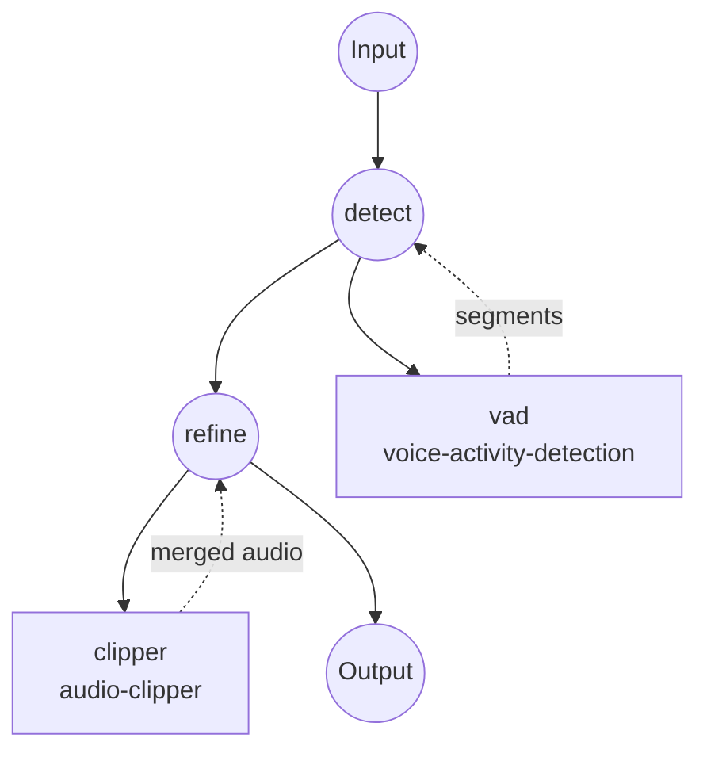

# Audio Refiner Example

This example chains **Silero VAD** with the **`audio-clipper`** component to produce a refined audio file that contains only detected speech. Silence, breaths, and background-noise regions are dropped, and the remaining speech clips are concatenated into a single output.

## Overview

The workflow runs two jobs:

1. **`detect`** — Runs the Silero VAD model locally over the input audio and emits a flat list of `{start_time, end_time, confidence}` speech segments.
2. **`refine`** — Feeds those segments straight into `audio-clipper` as the `span` list, with `merge: true` so ffmpeg concatenates every speech clip into a single output audio.

VAD's segment schema (`start_time`, `end_time`) matches the clipper's span schema 1:1, so no shape-mapping step is needed — the extra `confidence` field on each segment is simply ignored by the clipper.

Typical use cases:
- Cleaning up voice recordings before uploading them to an ASR service, to cut cost and reduce hallucinations on silent regions.
- Pre-processing podcast or interview audio to remove long dead air.
- Building a "speech-only" copy of a raw recording for downstream diarization or embeddings.

## Preparation

### Prerequisites

- model-compose installed and available on `PATH`.
- [ffmpeg](https://ffmpeg.org/) installed and available on `PATH` (used by `audio-clipper`).
- Python dependencies are installed automatically on first run:
  - `silero-vad`, `torch`, `torchaudio`, `numpy` — VAD model.

### Setup

Navigate to this example directory:

```bash
cd examples/media-processing/audio-refiner
```

Verify ffmpeg is installed:

```bash
ffmpeg -version
```

## How to Run

1. **Start the service:**

   ```bash
   model-compose up
   ```

   - API endpoint: http://localhost:8080/api
   - Web UI: http://localhost:8081

2. **Run the workflow:**

   **Using Web UI:**
   - Open http://localhost:8081.
   - Upload an audio file.
   - Optionally override `threshold`, `min_speech_duration`, `min_silence_duration`, `speech_padding_time`.
   - Click **Run Workflow** and download the refined audio.

   **Using CLI:**

   ```bash
   # Default parameters
   model-compose run --input '{"audio": "/path/to/recording.wav"}'

   # Stricter VAD (drop more marginal speech), and pad clip boundaries so
   # words aren't clipped at the edges.
   model-compose run --input '{
     "audio": "/path/to/recording.wav",
     "threshold": 0.6,
     "min_speech_duration": "500ms",
     "speech_padding_time": "200ms"
   }'
   ```

   **Using API:**

   ```bash
   curl -X POST http://localhost:8080/api/workflows/runs \
     -F "audio=@/path/to/recording.wav" \
     -F 'input={"audio": "@audio", "threshold": 0.6}'
   ```

## Component Details

### `vad` — Voice Activity Detection

- **Type**: Model component with `voice-activity-detection` task
- **Driver**: `custom`
- **Family**: `silero`
- **Purpose**: Detect speech regions in the input audio.
- **Notes**:
  - Model is bundled inside the `silero-vad` pip package — no HuggingFace download required.
  - Input is resampled to 16 kHz mono internally.
  - Emits `[{start_time, end_time, confidence}, ...]`.

### `clipper` — Audio Clipper

- **Type**: `audio-clipper`
- **Driver**: `ffmpeg`
- **Purpose**: Cut every VAD-detected span out of the source audio using `ffmpeg -c copy` (no re-encoding) and concatenate the clips into one file.
- **Notes**:
  - `merge: true` uses ffmpeg's `concat` demuxer to join clips; because all clips come from the same source, codec/container consistency is guaranteed.
  - The clipper reads only `start_time` and `end_time` from each span, so VAD's additional `confidence` field passes through harmlessly.

## Workflow Details

### "Audio Refiner" Workflow

**Description**: Detect speech regions with Silero VAD and merge them into a single refined audio file.

#### Job Flow



#### Input Parameters

| Parameter | Type | Required | Default | Description |
|-----------|------|----------|---------|-------------|
| `audio` | audio | Yes | - | Source audio file (MP3, WAV, FLAC, ...) |
| `threshold` | number | No | `0.5` | Silero speech-probability threshold (0.0–1.0); higher = stricter |
| `min_speech_duration` | duration | No | `250ms` | Discard speech chunks shorter than this |
| `min_silence_duration` | duration | No | `500ms` | Silence required to split adjacent chunks |
| `speech_padding_time` | duration | No | `100ms` | Padding added to both sides of each detected chunk |

Duration fields accept values like `"250ms"`, `"0.5s"`, or bare numeric seconds.

#### Output

| Field | Type | Description |
|-------|------|-------------|
| `audio` | audio | The refined audio — a single file with all detected speech regions concatenated in order, non-speech dropped. |

## Customization

### Keep each speech region as a separate clip

Drop `merge: true` and change the output to a list:

```yaml
workflow:
  jobs:
    - id: refine
      component: clipper
      depends_on: [ detect ]
      input:
        audio: ${input.audio as audio}
        spans: ${jobs.detect.output}
      output:
        audios: ${output as audio[]}

components:
  - id: clipper
    type: audio-clipper
    action:
      audio: ${input.audio}
      span: ${input.spans}
      # merge omitted -> one output clip per span
```

### Feed the refined audio into a downstream ASR

Add a third job that takes `${jobs.refine.output.audio}` as input to a `speech-to-text` model component — running ASR on the pre-cleaned audio typically cuts both cost and hallucinations.

## Tips

- **Lossless clipping**: The clipper uses `ffmpeg -c copy`, so clip boundaries land on the nearest keyframe/frame supported by the container. For a lossy codec (mp3, aac) the cuts may be off by a few ms.
- **Padding matters**: A `speech_padding_time` of 100–200ms usually prevents word-onset clipping caused by Silero's frame-level threshold.
- **Whisper pre-processing**: If you plan to send the refined audio to Whisper, use a slightly larger `min_silence_duration` (e.g. `1s`) so within-utterance pauses aren't fragmented into many tiny clips.

## Troubleshooting

### Common Issues

1. **Output audio is empty / very short**: The threshold is likely too strict — lower `threshold` (e.g. `0.3`) or reduce `min_speech_duration`.
2. **Words clipped at clip boundaries**: Increase `speech_padding_time` (e.g. `200ms`).
3. **`ffmpeg` not found**: Install ffmpeg (and ffprobe) and ensure both are on `PATH`.
4. **Merged output has audible seams**: Some codecs quantize at frame boundaries; either accept the artifact or re-encode the merged output with a follow-up ffmpeg step.
