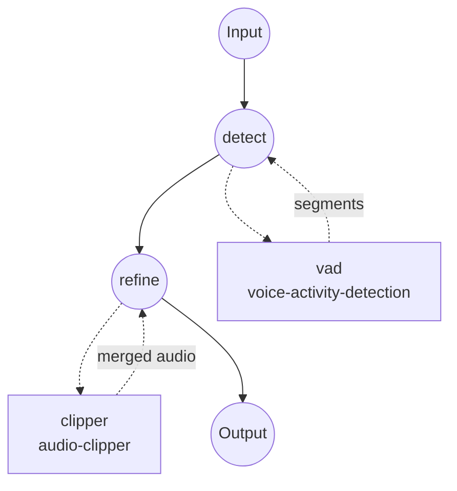

# 音频精炼示例

本示例将 **Silero VAD** 与 **`audio-clipper`** 组件串联，生成仅包含检测到的语音区段的精炼音频文件。静音、呼吸声和背景噪声被丢弃，剩余的语音片段被合并成一个输出。

## 概述

工作流由两个作业组成：

1. **`detect`** — 在输入音频上本地运行 Silero VAD 模型，输出扁平的 `{start_time, end_time, confidence}` 语音区段列表。
2. **`refine`** — 将这些区段直接作为 `span` 传递给 `audio-clipper`，并设置 `merge: true`，让 ffmpeg 将所有语音片段拼接成一个音频输出。

VAD 的段结构（`start_time`、`end_time`）与 clipper 的 span 结构 1:1 对应，无需任何形状映射步骤，每段附加的 `confidence` 字段会被 clipper 直接忽略。

典型用例：
- 在上传到 ASR 服务前清理语音录音，降低成本并减少对静音区域的幻觉。
- 预处理播客或访谈音频，去除长时间的空白。
- 为下游说话人分离或嵌入构建"仅语音"版本的原始录音。

## 准备

### 前置要求

- 已安装 model-compose 并可在 `PATH` 中调用。
- 已安装 [ffmpeg](https://ffmpeg.org/) 并可在 `PATH` 中调用（`audio-clipper` 使用）。
- Python 依赖将在首次运行时自动安装：
  - `silero-vad`、`torch`、`torchaudio`、`numpy` — VAD 模型。

### 设置

进入本示例目录：

```bash
cd examples/media-processing/audio-refiner
```

确认 ffmpeg 已安装：

```bash
ffmpeg -version
```

## 运行方式

1. **启动服务：**

   ```bash
   model-compose up
   ```

   - API 端点：http://localhost:8080/api
   - Web UI：http://localhost:8081

2. **运行工作流：**

   **使用 Web UI：**
   - 打开 http://localhost:8081。
   - 上传音频文件。
   - 可选覆盖 `threshold`、`min_speech_duration`、`min_silence_duration`、`speech_padding_time`。
   - 点击 **Run Workflow** 并下载精炼后的音频。

   **使用 CLI：**

   ```bash
   # 默认参数
   model-compose run --input '{"audio": "/path/to/recording.wav"}'

   # 更严格的 VAD 阈值，并扩大剪辑边界的填充
   model-compose run --input '{
     "audio": "/path/to/recording.wav",
     "threshold": 0.6,
     "min_speech_duration": "500ms",
     "speech_padding_time": "200ms"
   }'
   ```

   **使用 API：**

   ```bash
   curl -X POST http://localhost:8080/api/workflows/runs \
     -F "audio=@/path/to/recording.wav" \
     -F 'input={"audio": "@audio", "threshold": 0.6}'
   ```

## 组件详情

### `vad` — 语音活动检测

- **类型**：`voice-activity-detection` 任务的模型组件
- **驱动**：`custom`
- **家族**：`silero`
- **用途**：检测输入音频中的语音区段。
- **说明**：
  - 模型已随 `silero-vad` pip 包一起打包，无需下载 HuggingFace 权重。
  - 输入在内部会重采样为 16 kHz 单声道。
  - 输出 `[{start_time, end_time, confidence}, ...]`。

### `clipper` — 音频剪辑器

- **类型**：`audio-clipper`
- **驱动**：`ffmpeg`
- **用途**：使用 `ffmpeg -c copy`（无重编码）剪出 VAD 检测到的每一段，并将它们拼接为一个文件。
- **说明**：
  - `merge: true` 使用 ffmpeg 的 `concat` demuxer 拼接；由于所有片段来自同一源，编解码器/容器一致性有保证。
  - clipper 只读取每个 span 中的 `start_time` 和 `end_time`，因此 VAD 提供的额外 `confidence` 字段可无害地一并传入。

## 工作流详情

### "Audio Refiner" 工作流

**描述**：使用 Silero VAD 检测语音区段，并将其合并为一个精炼的音频文件。

#### 作业流



#### 输入参数

| 参数 | 类型 | 必填 | 默认值 | 说明 |
|------|------|------|--------|------|
| `audio` | audio | 是 | - | 源音频文件（MP3、WAV、FLAC、...） |
| `threshold` | number | 否 | `0.5` | Silero 语音概率阈值（0.0–1.0），越高越严格 |
| `min_speech_duration` | duration | 否 | `250ms` | 短于该值的语音片段将被丢弃 |
| `min_silence_duration` | duration | 否 | `500ms` | 用于分割相邻片段所需的静音长度 |
| `speech_padding_time` | duration | 否 | `100ms` | 在每个检测到的片段两侧添加的填充 |

时长字段接受 `"250ms"`、`"0.5s"` 或纯数字秒。

#### 输出

| 字段 | 类型 | 说明 |
|------|------|------|
| `audio` | audio | 精炼后的音频 — 一个文件，按顺序拼接了所有检测到的语音区段，非语音部分被丢弃。 |

## 自定义

### 将每个语音区段保留为独立片段

去掉 `merge: true` 并将输出改为列表：

```yaml
workflow:
  jobs:
    - id: refine
      component: clipper
      depends_on: [ detect ]
      input:
        audio: ${input.audio as audio}
        spans: ${jobs.detect.output}
      output:
        audios: ${output as audio[]}

components:
  - id: clipper
    type: audio-clipper
    action:
      audio: ${input.audio}
      span: ${input.spans}
      # 省略 merge -> 每个 span 输出一个片段
```

### 将精炼后的音频送入下游 ASR

添加第三个作业，将 `${jobs.refine.output.audio}` 作为输入送入一个 `speech-to-text` 模型组件 — 在预清理后的音频上运行 ASR 通常能同时降低成本和幻觉率。

## 提示

- **无损剪辑**：clipper 使用 `ffmpeg -c copy`，剪辑边界会落在容器允许的最近关键帧/帧边界。对有损编码（mp3、aac）可能有几毫秒偏差。
- **填充很重要**：将 `speech_padding_time` 设为 100–200ms 通常可避免因 Silero 帧级阈值判定造成的词头被截断。
- **Whisper 预处理**：若打算把精炼音频送入 Whisper，可稍微增大 `min_silence_duration`（例如 `1s`），避免话语内部的短停顿被切成多个小片段。

## 故障排除

### 常见问题

1. **输出音频为空或非常短**：阈值可能过于严格 — 降低 `threshold`（如 `0.3`）或减小 `min_speech_duration`。
2. **词在片段边界被截断**：增大 `speech_padding_time`（如 `200ms`）。
3. **`ffmpeg` not found**：安装 ffmpeg（和 ffprobe）并确保二者都在 `PATH` 中。
4. **合并输出中能听到接缝**：某些编码器会在帧边界量化；接受该伪影或通过后续 ffmpeg 步骤重编码。
