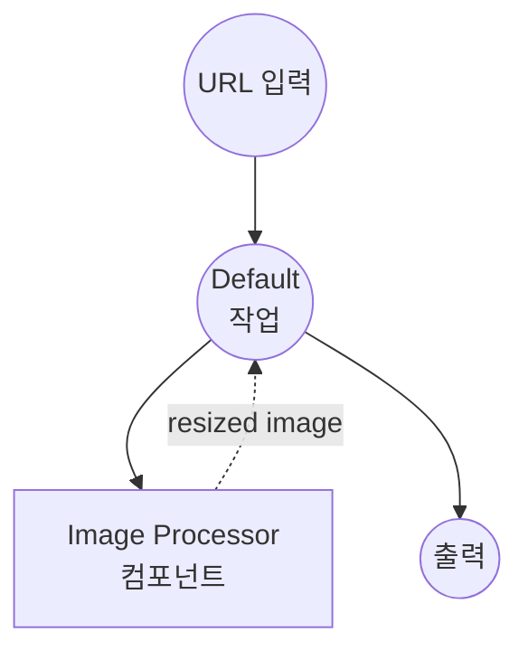
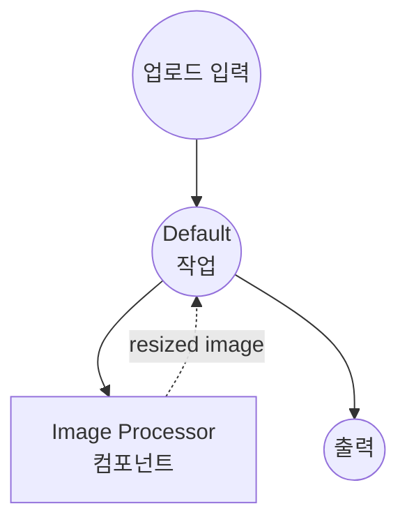

# 이미지 프로세서 이중 입력 예제

이 예제는 `image-processor` 컴포넌트를 두 개의 워크플로우로 노출하여 동일한 `resize` 액션을 두 가지 다른 입력 경로(원격 URL과 multipart 파일 업로드)로 사용할 수 있도록 하는 방법을 보여줍니다. model-compose의 타입 강제 변환(`as image;url` vs `as image`)이 두 진입점 모두를 컴포넌트가 보기 전에 PIL 이미지로 정규화하는 방법을 설명합니다.

## 개요

두 워크플로우가 단일 `image-processor` 컴포넌트와 그 `resize` 액션을 공유합니다:

1. **URL에서 리사이즈**: 원격 이미지 URL을 수락합니다. `as image;url` 타입 선언은 model-compose에 문자열을 원격 이미지 리소스로 취급하고 지연 다운로드하도록 지시합니다.
2. **업로드에서 리사이즈**: multipart 파일 업로드를 수락합니다. `as image` 타입 선언은 업로드된 스트림을 그대로 전달합니다.

컴포넌트 액션 내부에서는 두 경로 모두 `${input.image as image}`로 수신되므로, 기본 리사이즈 로직은 한 번만 작성되어 두 진입점 모두에 재사용됩니다.

## 준비사항

### 필수 요구사항

- model-compose가 설치되어 PATH에서 사용 가능
- Pillow (첫 컴포넌트 실행 시 자동 설치됨)

### 환경 구성

1. 이 예제 디렉토리로 이동:
   ```bash
   cd examples/media-processing/image-processor-dual-input
   ```

## 실행 방법

1. **서비스 시작:**
   ```bash
   model-compose up
   ```

2. **워크플로우 실행:**

   **웹 UI 사용:**
   - Web UI 열기: http://localhost:8081
   - **Resize Image (URL input)** 또는 **Resize Image (file upload)** 워크플로우 선택
   - URL을 제공하거나 파일을 업로드하고 `width`와 `height` 설정
   - **Run Workflow** 클릭
   - 리사이즈된 이미지 미리보기 또는 다운로드

   **API 사용:**
   ```bash
   # URL 입력 (기본 워크플로우)
   curl -X POST http://localhost:8080/api/workflows/runs \
     -H "Content-Type: application/json" \
     -d '{
       "workflow_id": "resize-from-url",
       "input": {
         "image_url": "https://example.com/photo.jpg",
         "width": 512,
         "height": 512
       }
     }'

   # 파일 업로드
   curl -X POST http://localhost:8080/api/workflows/runs \
     -H "Content-Type: multipart/form-data" \
     -F "workflow_id=resize-from-upload" \
     -F "image=@photo.jpg" \
     -F "width=512" \
     -F "height=512"
   ```

   **CLI 사용:**
   ```bash
   model-compose run resize-from-url --input '{"image_url": "https://example.com/photo.jpg", "width": 512, "height": 512}'
   model-compose run resize-from-upload --input '{"image": "path/to/photo.jpg", "width": 512, "height": 512}'
   ```

## 컴포넌트 세부사항

### Image Processor 컴포넌트
- **유형**: `image-processor`
- **계산**: Pillow (PIL)
- **목적**: 이미지 변환 적용. 이 예제는 `resize` 메서드를 사용합니다.

`resize` 액션은 `image`, `width`, `height`, `scale_mode`를 수락합니다. 호출자가 URL을 제공했는지 업로드된 파일을 제공했는지에 관계없이, 액션은 타입 강제 변환 후 이미지를 PIL 객체로 수신합니다:

- URL 입력(`as image;url`)은 HTTP를 통해 가져와 PIL 이미지로 디코딩됩니다.
- 업로드된 파일 입력(`as image`)은 multipart 스트림에서 읽어 PIL 이미지로 디코딩됩니다.

## 워크플로우 세부사항

### "Resize Image (URL input)" 워크플로우 (resize-from-url)

**설명**: 원격 URL이 참조하는 이미지를 리사이즈합니다.

#### 작업 흐름



#### 입력 매개변수

| 매개변수 | 유형 | 필수 | 기본값 | 설명 |
|---------|------|------|--------|------|
| `image_url` | image (url) | Yes | - | 소스 이미지의 원격 URL |
| `width` | integer | Yes | - | 픽셀 단위의 대상 너비 |
| `height` | integer | Yes | - | 픽셀 단위의 대상 높이 |

### "Resize Image (file upload)" 워크플로우 (resize-from-upload)

**설명**: multipart 파일로 업로드된 이미지를 리사이즈합니다.

#### 작업 흐름



#### 입력 매개변수

| 매개변수 | 유형 | 필수 | 기본값 | 설명 |
|---------|------|------|--------|------|
| `image` | image (file) | Yes | - | 업로드된 이미지 파일 |
| `width` | integer | Yes | - | 픽셀 단위의 대상 너비 |
| `height` | integer | Yes | - | 픽셀 단위의 대상 높이 |

### 컴포넌트 액션 매개변수 (resize)

위 두 워크플로우는 입력을 컴포넌트 액션으로 전달합니다. 액션 자체는 다음 옵션을 지원합니다:

| 매개변수 | 유형 | 필수 | 기본값 | 설명 |
|---------|------|------|--------|------|
| `image` | image | Yes | - | 소스 이미지 (URL 또는 업로드에서 PIL로 정규화됨) |
| `width` | integer | Yes | - | 픽셀 단위의 대상 너비 |
| `height` | integer | Yes | - | 픽셀 단위의 대상 높이 |
| `scale_mode` | select | No | `fit` | 스케일링 동작: `fit`, `fill`, `stretch` |

#### 출력 형식

각 워크플로우는 리사이즈된 이미지를 직접 반환합니다:

| 필드 | 유형 | 설명 |
|-----|------|------|
| `output` | image | 리사이즈된 이미지 |

## 스케일 모드

- **`fit`**: 종횡비 유지. 출력이 요청된 박스 내에 포함됨 (필요 시 레터박스 처리).
- **`fill`**: 종횡비 유지. 출력이 요청된 박스를 완전히 채움 (필요 시 크롭됨).
- **`stretch`**: 종횡비 무시. 이미지를 정확한 `width × height`로 강제 조정.

## 사용자 정의

- **더 많은 액션 추가**: `image-processor` 컴포넌트에 `crop`, `rotate`, `convert` 등을 확장하고 새 워크플로우에서 참조
- **워크플로우 체인**: `resize-from-url`과 다운스트림 분석기/업로드 단계를 멀티 잡 워크플로우로 래핑
- **입력 소스 교체**: 이중 입력 패턴은 `as X;url`과 `as X`를 페어링하여 `audio`, `video`, `file` 등 모든 바이너리 자산으로 일반화됩니다
