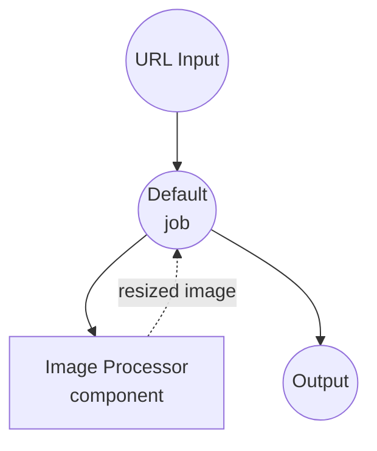
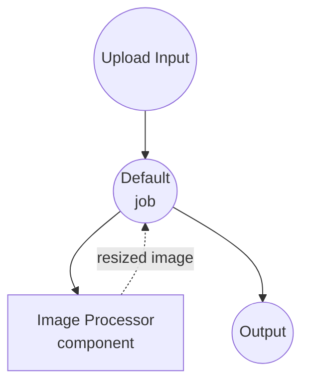

# Image Processor Dual Input Example

This example demonstrates the `image-processor` component with two workflows that expose the same `resize` action through two different input paths: a remote URL and a multipart file upload. It illustrates how model-compose's type coercion (`as image;url` vs `as image`) normalizes both entry points into a PIL image before the component sees it.

## Overview

Two workflows share a single `image-processor` component and its `resize` action:

1. **Resize from URL**: Accepts a remote image URL. The `as image;url` type declaration tells model-compose to treat the string as a remote image resource and download it lazily.
2. **Resize from Upload**: Accepts a multipart file upload. The `as image` type declaration passes the uploaded stream straight through.

Inside the component action both paths are received as `${input.image as image}`, so the underlying resize logic is written once and reused for both entry points.

## Preparation

### Prerequisites

- model-compose installed and available in your PATH
- Pillow (installed automatically on first component run)

### Environment Configuration

1. Navigate to this example directory:
   ```bash
   cd examples/media-processing/image-processor-dual-input
   ```

## How to Run

1. **Start the service:**
   ```bash
   model-compose up
   ```

2. **Run a workflow:**

   **Using Web UI:**
   - Open the Web UI: http://localhost:8081
   - Pick the **Resize Image (URL input)** or **Resize Image (file upload)** workflow
   - Provide the URL or upload a file, set `width` and `height`
   - Click **Run Workflow**
   - Preview or download the resized image

   **Using API:**
   ```bash
   # URL input (default workflow)
   curl -X POST http://localhost:8080/api/workflows/runs \
     -H "Content-Type: application/json" \
     -d '{
       "workflow_id": "resize-from-url",
       "input": {
         "image_url": "https://example.com/photo.jpg",
         "width": 512,
         "height": 512
       }
     }'

   # File upload
   curl -X POST http://localhost:8080/api/workflows/runs \
     -H "Content-Type: multipart/form-data" \
     -F "workflow_id=resize-from-upload" \
     -F "image=@photo.jpg" \
     -F "width=512" \
     -F "height=512"
   ```

   **Using CLI:**
   ```bash
   model-compose run resize-from-url --input '{"image_url": "https://example.com/photo.jpg", "width": 512, "height": 512}'
   model-compose run resize-from-upload --input '{"image": "path/to/photo.jpg", "width": 512, "height": 512}'
   ```

## Component Details

### Image Processor Component
- **Type**: `image-processor`
- **Compute**: Pillow (PIL)
- **Purpose**: Apply image transformations. This example uses the `resize` method.

The `resize` action accepts `image`, `width`, `height`, and `scale_mode`. Regardless of whether the caller supplied a URL or an uploaded file, the action receives the image as a PIL object after type coercion:

- URL inputs (`as image;url`) are fetched over HTTP and decoded into a PIL image.
- Uploaded file inputs (`as image`) are read from the multipart stream and decoded into a PIL image.

## Workflow Details

### "Resize Image (URL input)" Workflow (resize-from-url)

**Description**: Resize an image referenced by a remote URL.

#### Job Flow



#### Input Parameters

| Parameter | Type | Required | Default | Description |
|-----------|------|----------|---------|-------------|
| `image_url` | image (url) | Yes | - | Remote URL of the source image |
| `width` | integer | Yes | - | Target width in pixels |
| `height` | integer | Yes | - | Target height in pixels |

### "Resize Image (file upload)" Workflow (resize-from-upload)

**Description**: Resize an image uploaded as a multipart file.

#### Job Flow



#### Input Parameters

| Parameter | Type | Required | Default | Description |
|-----------|------|----------|---------|-------------|
| `image` | image (file) | Yes | - | Uploaded image file |
| `width` | integer | Yes | - | Target width in pixels |
| `height` | integer | Yes | - | Target height in pixels |

### Component Action Parameters (resize)

The two workflows above forward their inputs into the component action. The action itself supports the following knobs:

| Parameter | Type | Required | Default | Description |
|-----------|------|----------|---------|-------------|
| `image` | image | Yes | - | Source image (normalized to PIL from either URL or upload) |
| `width` | integer | Yes | - | Target width in pixels |
| `height` | integer | Yes | - | Target height in pixels |
| `scale_mode` | select | No | `fit` | Scaling behavior: `fit`, `fill`, `stretch` |

#### Output Format

Each workflow returns the resized image directly:

| Field | Type | Description |
|-------|------|-------------|
| `output` | image | The resized image |

## Scale Modes

- **`fit`**: Preserve aspect ratio; the output is contained within the requested box (letterboxed if necessary).
- **`fill`**: Preserve aspect ratio; the output completely fills the requested box (cropped if necessary).
- **`stretch`**: Ignore aspect ratio; force the image into the exact `width × height`.

## Customization

- **Add more actions**: Extend the `image-processor` component with `crop`, `rotate`, `convert`, etc., and reference them from new workflows.
- **Chain workflows**: Wrap `resize-from-url` and a downstream analyzer/upload step in a multi-job workflow.
- **Swap input source**: The dual-input pattern generalizes to any binary asset — `audio`, `video`, `file` — by pairing `as X;url` with `as X`.
