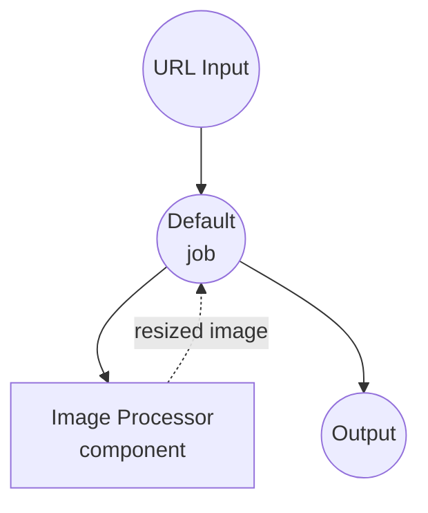
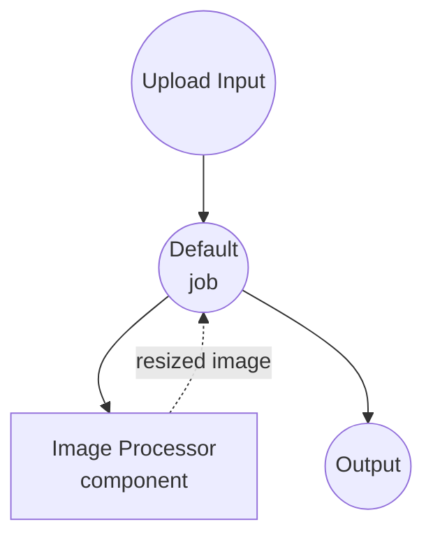

# 图像处理器双输入示例

此示例演示了 `image-processor` 组件，通过两个工作流将相同的 `resize` 动作暴露给两种不同的输入路径：远程 URL 和 multipart 文件上传。它说明了 model-compose 的类型强制转换（`as image;url` 与 `as image`）如何在组件看到之前将两个入口点规范化为 PIL 图像。

## 概述

两个工作流共享一个 `image-processor` 组件及其 `resize` 动作：

1. **从 URL 调整大小**：接受远程图像 URL。`as image;url` 类型声明告诉 model-compose 将字符串视为远程图像资源并延迟下载。
2. **从上传调整大小**：接受 multipart 文件上传。`as image` 类型声明将上传的流直接传递。

在组件动作内部，两条路径都以 `${input.image as image}` 接收，因此底层的调整大小逻辑只需编写一次即可被两个入口点重用。

## 准备工作

### 前置条件

- 已安装 model-compose 并在您的 PATH 中可用
- Pillow（首次组件运行时自动安装）

### 环境配置

1. 导航到此示例目录：
   ```bash
   cd examples/media-processing/image-processor-dual-input
   ```

## 运行方式

1. **启动服务：**
   ```bash
   model-compose up
   ```

2. **运行工作流：**

   **使用 Web UI：**
   - 打开 Web UI：http://localhost:8081
   - 选择 **Resize Image (URL input)** 或 **Resize Image (file upload)** 工作流
   - 提供 URL 或上传文件，设置 `width` 和 `height`
   - 点击 **Run Workflow**
   - 预览或下载调整后的图像

   **使用 API：**
   ```bash
   # URL 输入（默认工作流）
   curl -X POST http://localhost:8080/api/workflows/runs \
     -H "Content-Type: application/json" \
     -d '{
       "workflow_id": "resize-from-url",
       "input": {
         "image_url": "https://example.com/photo.jpg",
         "width": 512,
         "height": 512
       }
     }'

   # 文件上传
   curl -X POST http://localhost:8080/api/workflows/runs \
     -H "Content-Type: multipart/form-data" \
     -F "workflow_id=resize-from-upload" \
     -F "image=@photo.jpg" \
     -F "width=512" \
     -F "height=512"
   ```

   **使用 CLI：**
   ```bash
   model-compose run resize-from-url --input '{"image_url": "https://example.com/photo.jpg", "width": 512, "height": 512}'
   model-compose run resize-from-upload --input '{"image": "path/to/photo.jpg", "width": 512, "height": 512}'
   ```

## 组件详情

### Image Processor 组件
- **类型**：`image-processor`
- **计算**：Pillow (PIL)
- **用途**：应用图像转换。此示例使用 `resize` 方法。

`resize` 动作接受 `image`、`width`、`height` 和 `scale_mode`。无论调用方提供 URL 还是上传的文件，动作在类型强制转换后都会将图像作为 PIL 对象接收：

- URL 输入（`as image;url`）通过 HTTP 获取并解码为 PIL 图像
- 上传的文件输入（`as image`）从 multipart 流中读取并解码为 PIL 图像

## 工作流详情

### "Resize Image (URL input)" 工作流 (resize-from-url)

**描述**：调整远程 URL 引用的图像大小。

#### 作业流程



#### 输入参数

| 参数 | 类型 | 必需 | 默认值 | 描述 |
|------|------|------|--------|------|
| `image_url` | image (url) | Yes | - | 源图像的远程 URL |
| `width` | integer | Yes | - | 目标宽度（像素） |
| `height` | integer | Yes | - | 目标高度（像素） |

### "Resize Image (file upload)" 工作流 (resize-from-upload)

**描述**：调整作为 multipart 文件上传的图像大小。

#### 作业流程



#### 输入参数

| 参数 | 类型 | 必需 | 默认值 | 描述 |
|------|------|------|--------|------|
| `image` | image (file) | Yes | - | 上传的图像文件 |
| `width` | integer | Yes | - | 目标宽度（像素） |
| `height` | integer | Yes | - | 目标高度（像素） |

### 组件动作参数 (resize)

上述两个工作流将其输入转发到组件动作。动作本身支持以下选项：

| 参数 | 类型 | 必需 | 默认值 | 描述 |
|------|------|------|--------|------|
| `image` | image | Yes | - | 源图像（从 URL 或上传规范化为 PIL） |
| `width` | integer | Yes | - | 目标宽度（像素） |
| `height` | integer | Yes | - | 目标高度（像素） |
| `scale_mode` | select | No | `fit` | 缩放行为：`fit`、`fill`、`stretch` |

#### 输出格式

每个工作流直接返回调整后的图像：

| 字段 | 类型 | 描述 |
|------|------|------|
| `output` | image | 调整后的图像 |

## 缩放模式

- **`fit`**：保留宽高比；输出包含在请求的框内（必要时添加信箱边框）
- **`fill`**：保留宽高比；输出完全填充请求的框（必要时裁剪）
- **`stretch`**：忽略宽高比；将图像强制调整为精确的 `width × height`

## 自定义

- **添加更多动作**：使用 `crop`、`rotate`、`convert` 等扩展 `image-processor` 组件，并从新工作流中引用
- **链接工作流**：将 `resize-from-url` 和下游分析器/上传步骤包装到多作业工作流中
- **交换输入源**：双输入模式通过将 `as X;url` 与 `as X` 配对，可泛化到任何二进制资产 —— `audio`、`video`、`file`
