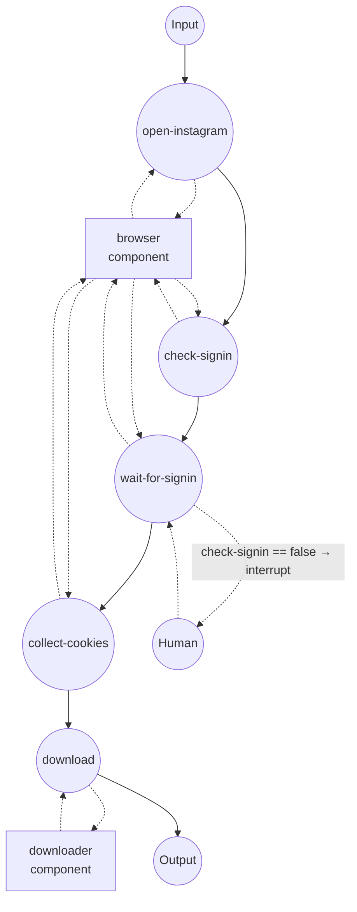

# Instagram Downloader (Authenticated)

Download an Instagram post, reel, or IGTV clip (or its audio track)
using the session cookies of a locally-attached Chrome browser.
Instagram almost always requires a signed-in cookie set — stories,
reels, feed videos, and private-account posts all return "login to
continue" without one.

## Overview

Two components cooperate:

1. **`browser` (`web-browser` / `chrome`)** — attaches to a Chrome you
   launched with `--remote-debugging-port=9222`. You sign into
   Instagram once in that window; the workflow then reads back the
   cookies Instagram set for your session.
2. **`downloader` (`media-downloader` / `ytdlp`)** — receives those
   cookies as a list and hands them to yt-dlp, which downloads the
   media (or audio) using your authenticated session.

The cookie format returned by `web-browser`'s `get-cookies` is the
same shape `media-downloader` expects, so you can wire one directly
into the other without any conversion step.

## Preparation

### Prerequisites

- model-compose installed and available in your PATH
- Google Chrome (or Chromium) installed
- `yt-dlp` — installed automatically on first run via the driver's
  setup requirements
- `ffmpeg` on your PATH (required for audio extraction and for merging
  separate video/audio streams)

### Launch Chrome with remote debugging

Start Chrome in a dedicated profile so it doesn't collide with your
day-to-day browser session:

**macOS**
```bash
/Applications/Google\ Chrome.app/Contents/MacOS/Google\ Chrome \
  --remote-debugging-port=9222 \
  --user-data-dir=/tmp/chrome-instagram-profile
```

**Linux**
```bash
google-chrome \
  --remote-debugging-port=9222 \
  --user-data-dir=/tmp/chrome-instagram-profile
```

**Windows (PowerShell)**
```powershell
& "C:\Program Files\Google\Chrome\Application\chrome.exe" `
  --remote-debugging-port=9222 `
  --user-data-dir=$env:TEMP\chrome-instagram-profile
```

Leave that window open. Once you sign into Instagram in it, the
session persists across workflow runs (until you clear the profile or
Instagram expires the cookies — typically a few weeks of inactivity).

## How to Run

1. **Start the controller:**
   ```bash
   model-compose up
   ```

2. **Run a workflow:**

   **Using API:**
   ```bash
   curl -X POST http://localhost:8080/api/workflows/runs \
     -H "Content-Type: application/json" \
     -d '{
       "workflow_id": "download-instagram-media",
       "input": {
         "url": "https://www.instagram.com/reel/C5XxYyZzZz0/"
       }
     }'
   ```

   **Using Web UI:**
   - Open http://localhost:8081
   - Enter the post/reel/IGTV URL and (optionally) `format`
   - Click Run

   **Using CLI:**
   ```bash
   model-compose run download-instagram-media \
     --input '{"url": "https://www.instagram.com/reel/C5XxYyZzZz0/"}'
   ```

3. **If the workflow pauses:**
   - The `check-signin` job probes the page for the signed-in nav
     bar. If it's not there (no signed-in session), `wait-for-signin`
     interrupts before it runs.
   - Switch to the Chrome window at localhost:9222, sign into
     Instagram, then click Resume in the Web UI or send a resume
     request via the API.
   - The workflow then waits for the signed-in nav to render before
     collecting cookies and handing off to yt-dlp.
   - When Chrome already has a valid Instagram session (typical after
     the first run), `check-signin` returns true and the interrupt is
     skipped entirely.

4. **Stop the controller:**
   ```bash
   model-compose down
   ```

## Workflow Details

### "Download Instagram media" Workflow

**Description**: Sign into Instagram in the attached Chrome (only if
the session isn't already warm), hand the resulting session cookies to
yt-dlp, and download the requested post, reel, or IGTV clip.

#### Job Flow



#### Input Parameters

| Parameter | Type | Required | Default | Description |
|-----------|------|----------|---------|-------------|
| `url` | string | Yes | — | Instagram post, reel, or IGTV URL |
| `format` | string \| object | No | `mp4` | Media downloader `format`: preset (`mp4`, `webm`, `mkv`, `mp3`, ...), raw yt-dlp expression, or structured spec. |

#### Output Format

| Field | Type | Description |
|-------|------|-------------|
| `video` | video stream | Downloaded media file, streamed back |

The Web UI renders an inline player; the HTTP API returns the stream
with the correct content type. For single-image posts, the extractor
returns the image file as the download.

## Component Details

### `browser` — web-browser (Chrome via CDP)

Attaches to Chrome over the DevTools Protocol at `localhost:9222`. No
browser is launched by model-compose — you own the browser process,
which is what lets you complete sign-in, 2FA, "suspicious login" email
confirmation, and any CAPTCHA challenges manually.

Actions:

| Action | Method | Description |
|--------|--------|-------------|
| `navigate` | `navigate` | Open a URL and wait until the DOM is parsed |
| `check-signin` | `evaluate` | Poll the page for up to 5 seconds and return `true` if the signed-in nav bar is present |
| `wait-for-nav` | `wait-for` | Wait until the Instagram signed-in nav becomes visible (up to 5 minutes) |
| `get-instagram-cookies` | `get-cookies` | Return cookies scoped to `instagram.com` |

### `downloader` — media-downloader (yt-dlp)

Runs yt-dlp with the cookies received from the browser. yt-dlp writes
them into a temporary Netscape cookie file, preserving each cookie's
domain, path, secure flag, and expiry, so authenticated requests to
`instagram.com` succeed exactly as they would from the browser.

## Notes on Cookies

The cookie objects returned by `web-browser`'s `get-cookies` — with
`name`, `value`, `domain`, `path`, `secure`, `expires`, etc. — are
what `media-downloader` accepts directly on its `cookies` field. This
is the same shape the Chrome DevTools Protocol and Playwright use, so
you can chain other cookie sources (a stored fixture, a
`set-cookies`-style seed) into the downloader in the same way.

Unlike YouTube and TikTok, Instagram does not reliably serve public
content without a session. If you drop the first four jobs and call
`download` with an empty `cookies` field, expect most URLs to fail
with "login required" errors.

## Notes on Rate Limiting

Instagram aggressively rate-limits scraped traffic, and repeated
downloads from a single account can trigger a temporary action block
("We restrict certain activity to protect our community"). To stay
below the radar:

- Space requests out; avoid batch-downloading dozens of URLs in a
  tight loop.
- Prefer a dedicated throwaway account over your personal one.
- If you hit an action block, let the account rest in the browser for
  a day or two before retrying — repeatedly retrying will extend the
  block.

## Troubleshooting

- **`wait-for-nav` times out**: The Chrome window may not actually be
  at Instagram, or you're not signed in. Navigate to
  https://www.instagram.com/ in the attached window, sign in (clear
  any "save login info" or "turn on notifications" prompts so the
  nav fully renders), then retry the workflow.
- **CDP connection refused**: Chrome wasn't launched with
  `--remote-debugging-port=9222`, or another process is using the
  port. Check with `lsof -i :9222`.
- **`Requested content is not available` / HTTP 404**: The post may
  have been deleted, the account made private without you following
  it, or the URL is a story that already expired. Open the URL in
  the attached browser to confirm it still resolves.
- **`login required` even with cookies collected**: Instagram
  invalidated the session (common after a password change, 2FA
  reset, or long inactivity). Sign in again in the attached browser
  — the next run will pick up the fresh cookies.
- **"We restrict certain activity" / action block**: You've triggered
  Instagram's rate limiter. See "Notes on Rate Limiting" above.
- **Web UI player takes a long time to appear after download**: Gradio
  transcodes the file to a browser-compatible codec when the source
  is HEVC or VP9. If the wait is unacceptable, pass a structured
  `format` on the download action to prefer H.264 (e.g. `{ media:
  video, container: mp4, codec: avc1 }`).
