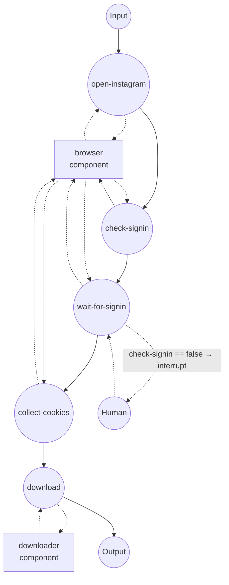

# Instagram 下载器（基于已登录会话）

使用本地运行的 Chrome 浏览器的会话 Cookie 下载 Instagram 帖子、
Reels 或 IGTV 片段（或其音频轨道）。Instagram 几乎所有请求都需要
登录会话 — 快拍、Reels、动态视频和私密账号的帖子，没有 Cookie 都会
返回“登录以继续”。

## 概览

两个组件协同工作：

1. **`browser` (`web-browser` / `chrome`)** — 附加到用户以
   `--remote-debugging-port=9222` 启动的 Chrome 实例。你只需在该窗口
   中登录一次 Instagram，工作流就能读取到会话 Cookie。
2. **`downloader` (`media-downloader` / `ytdlp`)** — 直接接收 Cookie
   列表并交给 yt-dlp,用已登录的会话下载媒体。

`web-browser` 的 `get-cookies` 返回的 Cookie 结构与 `media-downloader`
所期望的完全一致，因此可以直接串联，无需任何转换步骤。

## 准备

### 前置条件

- 已安装 model-compose 并加入 PATH
- 已安装 Google Chrome（或 Chromium）
- `yt-dlp` — 首次运行时通过驱动的 setup requirement 自动安装
- `ffmpeg` 位于 PATH（音频提取以及分离视频/音频流的合并都需要它）

### 以远程调试模式启动 Chrome

使用独立的用户目录，避免与日常浏览器会话冲突：

**macOS**
```bash
/Applications/Google\ Chrome.app/Contents/MacOS/Google\ Chrome \
  --remote-debugging-port=9222 \
  --user-data-dir=/tmp/chrome-instagram-profile
```

**Linux**
```bash
google-chrome \
  --remote-debugging-port=9222 \
  --user-data-dir=/tmp/chrome-instagram-profile
```

**Windows (PowerShell)**
```powershell
& "C:\Program Files\Google\Chrome\Application\chrome.exe" `
  --remote-debugging-port=9222 `
  --user-data-dir=$env:TEMP\chrome-instagram-profile
```

保持该窗口打开。一旦在其中登录 Instagram，会话就会在多次工作流运行
之间持续（直到清除该用户目录或 Instagram 让 Cookie 过期 — 通常是
数周未活动后）。

## 运行方式

1. **启动控制器：**
   ```bash
   model-compose up
   ```

2. **运行工作流：**

   **通过 API：**
   ```bash
   curl -X POST http://localhost:8080/api/workflows/runs \
     -H "Content-Type: application/json" \
     -d '{
       "workflow_id": "download-instagram-media",
       "input": {
         "url": "https://www.instagram.com/reel/C5XxYyZzZz0/"
       }
     }'
   ```

   **通过 Web UI：**
   - 打开 http://localhost:8081
   - 输入帖子/Reel/IGTV URL（可选：`format`）
   - 点击 Run

   **通过 CLI：**
   ```bash
   model-compose run download-instagram-media \
     --input '{"url": "https://www.instagram.com/reel/C5XxYyZzZz0/"}'
   ```

3. **当工作流暂停时：**
   - `check-signin` 任务检查页面中是否存在已登录的导航栏。如果不
     存在（未登录），`wait-for-signin` 任务会在执行前触发中断。
   - 切换到 attach 在 localhost:9222 的 Chrome 窗口，登录 Instagram，
     然后在 Web UI 点击 Resume，或通过 API 发送 resume 请求。
   - 之后工作流会等到已登录的导航栏渲染出来，再收集 Cookie 并交给
     yt-dlp。
   - 当 Chrome 已经有有效的 Instagram 会话时（首次运行之后通常如此），
     `check-signin` 返回 true，中断会被完全跳过。

4. **停止控制器：**
   ```bash
   model-compose down
   ```

## 工作流详情

### "Download Instagram media" 工作流

**描述**：仅在需要时通过 attach 的 Chrome 登录 Instagram，将获得的
会话 Cookie 交给 yt-dlp,下载请求的帖子、Reel 或 IGTV 片段。

#### 任务流程



#### 输入参数

| 参数 | 类型 | 必填 | 默认值 | 说明 |
|-----------|------|----------|---------|-------------|
| `url` | string | 是 | — | Instagram 帖子、Reel 或 IGTV URL |
| `format` | string \| object | 否 | `mp4` | media-downloader 的 `format`：preset（`mp4`、`webm`、`mkv`、`mp3` 等）、原生 yt-dlp 表达式，或结构化 spec。 |

#### 输出格式

| 字段 | 类型 | 说明 |
|-------|------|-------------|
| `video` | video stream | 下载后的媒体文件，以流形式返回 |

Web UI 会嵌入播放器直接播放；HTTP API 会以正确的 content type 返回
数据流。对于单图帖子，extractor 会把图片文件作为下载结果返回。

## 组件详情

### `browser` — web-browser（通过 CDP 连接 Chrome）

通过 Chrome DevTools Protocol 附加到 `localhost:9222`。model-compose
不会主动启动浏览器 — 用户拥有该浏览器进程，因此可以手动完成登录、
2FA、“可疑登录”邮件确认和 CAPTCHA。

动作：

| 动作 | 方法 | 说明 |
|--------|--------|-------------|
| `navigate` | `navigate` | 打开 URL 并等待 DOM 解析完成 |
| `check-signin` | `evaluate` | 最多 5 秒轮询页面，若存在已登录的导航栏则返回 `true` |
| `wait-for-nav` | `wait-for` | 等待 Instagram 已登录的导航栏可见（最多 5 分钟） |
| `get-instagram-cookies` | `get-cookies` | 返回作用域为 `instagram.com` 的 Cookie |

### `downloader` — media-downloader（yt-dlp）

使用从浏览器获取的 Cookie 运行 yt-dlp。yt-dlp 会将这些 Cookie 写入
临时 Netscape 格式的 Cookie 文件，保留每条 Cookie 的 domain、path、
secure 标志和过期时间，从而让对 `instagram.com` 的已登录请求与浏览器
中完全一致地成功。

## 关于 Cookie 的说明

`web-browser` 的 `get-cookies` 返回的 Cookie 对象 — 包含 `name`、
`value`、`domain`、`path`、`secure`、`expires` 等字段 — 就是
`media-downloader` 的 `cookies` 字段所接受的形状。这与 Chrome
DevTools Protocol 和 Playwright 使用的结构一致，因此其他 Cookie 来源
（存储的固件、通过 `set-cookies` 注入的种子等）也可以用相同方式接入
downloader。

与 YouTube 和 TikTok 不同，Instagram 不会可靠地在无会话状态下提供
公开内容。如果删除前四个任务并给 `download` 传入空 `cookies`，大多数
URL 都会以 "login required" 错误失败。

## 关于速率限制的说明

Instagram 对抓取流量有激进的速率限制，单一账号的反复下载会触发
临时操作封禁（“为保护社区我们限制了某些操作”）。要降低风险：

- 请求之间保留间隔；不要在短循环中批量下载数十个 URL。
- 使用一个专用的小号而不是你的主账号。
- 如果触发操作封禁，让该账号在浏览器中静置一两天再重试 — 反复重试
  会延长封禁时间。

## 故障排查

- **`wait-for-nav` 超时**：附加的 Chrome 窗口可能未处于 Instagram
  页面，或未登录。请在该窗口中打开 https://www.instagram.com/ ，
  登录（关闭所有“保存登录信息”、“打开通知”等提示以让导航栏完全
  渲染）后重新运行工作流。
- **CDP 连接被拒绝**：Chrome 未以 `--remote-debugging-port=9222` 启动，
  或该端口已被其他进程占用。可用 `lsof -i :9222` 检查。
- **`Requested content is not available` / HTTP 404**：帖子可能已被
  删除、账号转为私密且你未关注、或该 URL 是已过期的快拍。请在附加的
  浏览器中打开该 URL 以确认它是否仍然可访问。
- **已采集 Cookie 仍然 `login required`**：Instagram 已让会话失效
  （常见于修改密码、重置 2FA 或长期未使用之后）。请在附加的浏览器
  中重新登录 — 下次运行会读取新的 Cookie。
- **"我们限制了某些操作" / 操作封禁**：触发了 Instagram 的速率限制。
  请参阅上文“关于速率限制的说明”。
- **下载完成后 Web UI 播放器很久才出现**：当源视频为 HEVC 或 VP9 时，
  Gradio 会将其转码为浏览器兼容的编码。若无法接受等待时间，可将
  download 动作的 `format` 覆写为结构化 spec 以优先选择 H.264
  （例如 `{ media: video, container: mp4, codec: avc1 }`）。
