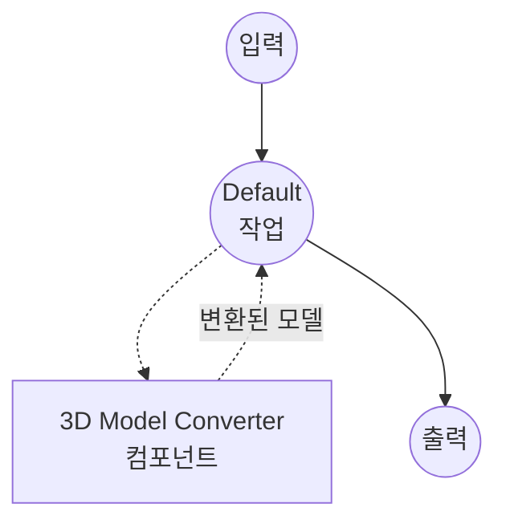

# 3D Model Converter 예제

이 예제는 `model-3d-converter` 컴포넌트를 사용한 3D 모델 포맷 변환기를 보여주며, model-compose가 일반적인 3D 자산 포맷 간 변환을 선언적으로 조합하는 방법을 시연합니다.

## 개요

이 워크플로우는 다음과 같은 3D 모델 변환 서비스를 제공합니다:

1. **3D 포맷 변환**: 일반적인 3D 자산 포맷(glTF/GLB, OBJ, STL, PLY, DAE, OFF, 3MF) 간 변환
2. **파일 입출력**: 바이너리 3D 자산 데이터가 컴포넌트와 워크플로우를 통해 흐르는 방식 표시
3. **웹 UI 통합**: 3D 뷰어와 출력 포맷 드롭다운이 있는 Gradio 기반 인터페이스 제공

## 준비사항

### 필수 요구사항

- model-compose가 설치되어 PATH에서 사용 가능
- `trimesh` 설치 (`pip install trimesh`)

### 환경 구성

1. 이 예제 디렉토리로 이동:
   ```bash
   cd examples/media-processing/model-3d-converter
   ```

2. trimesh 설치 확인:
   ```bash
   python -c "import trimesh; print(trimesh.__version__)"
   ```

## 실행 방법

1. **서비스 시작:**
   ```bash
   model-compose up
   ```

2. **워크플로우 실행:**

   **웹 UI 사용:**
   - Web UI 열기: http://localhost:8081
   - 3D 모델 파일 업로드 (예: `.obj`, `.glb`, `.stl`)
   - 출력 포맷 선택
   - "Run Workflow" 버튼 클릭
   - 변환된 3D 모델 파일 다운로드

   **API 사용:**
   ```bash
   curl -X POST http://localhost:8080/api/workflows/runs \
     -F "model_3d=@input.obj" \
     -F "format=glb"
   ```

   **CLI 사용:**
   ```bash
   model-compose run --input '{"model_3d": "path/to/input.obj", "format": "glb"}'
   ```

## 컴포넌트 세부사항

### 3D Model Converter 컴포넌트
- **유형**: `model-3d-converter`
- **드라이버**: `native` (기본값) — 내부적으로 trimesh 사용
- **목적**: 3D 모델 파일을 다른 포맷으로 변환

## 워크플로우 세부사항

### "3D Model Converter" 워크플로우 (기본)

**설명**: trimesh를 사용하여 3D 모델 파일을 다른 포맷으로 변환합니다.

#### 작업 흐름



#### 입력 매개변수

| 매개변수 | 유형 | 필수 | 기본값 | 설명 |
|---------|------|------|--------|------|
| `model_3d` | model-3d | 예 | - | 변환할 3D 모델 파일 |
| `format` | select | 아니오 | `glb` | 출력 포맷: glb, gltf, obj, stl, ply, dae, off, 3mf |

#### 출력 형식

| 필드 | 유형 | 설명 |
|-----|------|------|
| `model_3d` | model-3d | 변환된 3D 모델 파일 |

## 지원되는 포맷

`native` 드라이버는 trimesh를 사용하며, 다음 포맷을 지원합니다:

- **glTF / GLB** — Khronos 런타임 3D 자산 포맷 (바이너리 및 JSON)
- **OBJ** — Wavefront OBJ (지오메트리, 씬 그래프 없음)
- **STL** — Stereolithography (지오메트리 전용)
- **PLY** — Polygon File Format
- **DAE** — Collada
- **OFF** — Object File Format
- **3MF** — 3D Manufacturing Format

모든 입력 특성이 모든 출력 포맷에서 유지되는 것은 아닙니다 — 예를 들어, 텍스처가 있는 GLB를 STL로 내보내면 재질과 UV가 사라집니다. STL은 이런 정보를 담을 수 없기 때문입니다.

## 문제 해결

### 일반적인 문제

1. **trimesh를 찾을 수 없음**: `pip install trimesh`로 설치하세요.
2. **지원되지 않는 출력 포맷**: 일부 소스 자산은 요청한 포맷으로 내보낼 수 없습니다 (예: 포인트 클라우드를 OBJ로 내보내기). 워크플로우가 "cannot export to format" 오류로 실패하면 입력의 내용과 호환되는 포맷을 선택하세요.
3. **변환 후 텍스처 누락**: STL, OFF 같은 포맷은 지오메트리만 담습니다. 재질과 텍스처를 유지하려면 GLB/glTF로 변환하세요.
