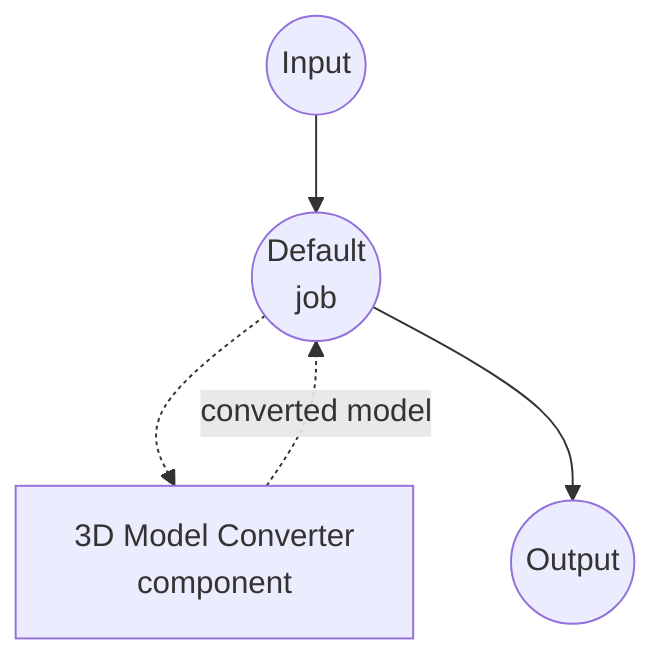

# 3D Model Converter Example

This example demonstrates a 3D model format converter using the `model-3d-converter` component, showcasing how model-compose can convert between common 3D asset formats declaratively.

## Overview

This workflow provides a 3D model conversion service that:

1. **3D Format Conversion**: Converts between common 3D asset formats (glTF/GLB, OBJ, STL, PLY, DAE, OFF, 3MF)
2. **File Input/Output**: Shows how binary 3D asset data flows through components and workflows
3. **Web UI Integration**: Provides a Gradio-based interface with a 3D viewer and a dropdown for the output format

## Preparation

### Prerequisites

- model-compose installed and available in your PATH
- `trimesh` installed (`pip install trimesh`)

### Environment Configuration

1. Navigate to this example directory:
   ```bash
   cd examples/media-processing/model-3d-converter
   ```

2. Verify trimesh is installed:
   ```bash
   python -c "import trimesh; print(trimesh.__version__)"
   ```

## How to Run

1. **Start the service:**
   ```bash
   model-compose up
   ```

2. **Run the workflow:**

   **Using Web UI:**
   - Open the Web UI: http://localhost:8081
   - Upload a 3D model file (e.g. `.obj`, `.glb`, `.stl`)
   - Select the output format
   - Click the "Run Workflow" button
   - Download the converted 3D model file

   **Using API:**
   ```bash
   curl -X POST http://localhost:8080/api/workflows/runs \
     -F "model_3d=@input.obj" \
     -F "format=glb"
   ```

   **Using CLI:**
   ```bash
   model-compose run --input '{"model_3d": "path/to/input.obj", "format": "glb"}'
   ```

## Component Details

### 3D Model Converter Component
- **Type**: `model-3d-converter`
- **Driver**: `native` (default) — backed by trimesh
- **Purpose**: Convert 3D model files between formats

## Workflow Details

### "3D Model Converter" Workflow (Default)

**Description**: Converts a 3D model file to another format using trimesh.

#### Job Flow



#### Input Parameters

| Parameter | Type | Required | Default | Description |
|-----------|------|----------|---------|-------------|
| `model_3d` | model-3d | Yes | - | The 3D model file to convert |
| `format` | select | No | `glb` | Output format: glb, gltf, obj, stl, ply, dae, off, 3mf |

#### Output Format

| Field | Type | Description |
|-------|------|-------------|
| `model_3d` | model-3d | The converted 3D model file |

## Supported Formats

The `native` driver uses trimesh, which supports:

- **glTF / GLB** — Khronos runtime 3D asset format (binary and JSON)
- **OBJ** — Wavefront OBJ (geometry, no scene graph)
- **STL** — Stereolithography (geometry only)
- **PLY** — Polygon File Format
- **DAE** — Collada
- **OFF** — Object File Format
- **3MF** — 3D Manufacturing Format

Not every input feature survives every output format — for example, exporting a
textured GLB to STL drops materials and UVs because STL has no concept of them.

## Troubleshooting

### Common Issues

1. **trimesh Not Found**: Install it with `pip install trimesh`.
2. **Unsupported Output Format**: Some source assets cannot be exported to a
   requested format (e.g. a point cloud exported as OBJ). The workflow will
   fail with a "cannot export to format" error — pick a format compatible with
   the input's contents.
3. **Missing Textures After Conversion**: Formats like STL and OFF only carry
   geometry. Convert to GLB/glTF to preserve materials and textures.
