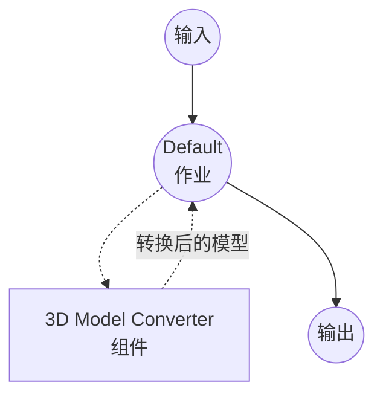

# 3D Model Converter 示例

此示例演示了使用 `model-3d-converter` 组件的 3D 模型格式转换器，展示 model-compose 如何以声明方式在常见 3D 资产格式之间进行转换。

## 概述

此工作流提供了一个 3D 模型转换服务：

1. **3D 格式转换**：在常见 3D 资产格式（glTF/GLB、OBJ、STL、PLY、DAE、OFF、3MF）之间转换
2. **文件输入/输出**：展示二进制 3D 资产数据如何在组件和工作流之间流动
3. **Web UI 集成**：提供带有 3D 查看器和输出格式下拉选择器的 Gradio 界面

## 准备工作

### 前置条件

- 已安装 model-compose 并在您的 PATH 中可用
- 已安装 `trimesh`（`pip install trimesh`）

### 环境配置

1. 导航到此示例目录：
   ```bash
   cd examples/media-processing/model-3d-converter
   ```

2. 验证 trimesh 已安装：
   ```bash
   python -c "import trimesh; print(trimesh.__version__)"
   ```

## 运行方式

1. **启动服务：**
   ```bash
   model-compose up
   ```

2. **运行工作流：**

   **使用 Web UI：**
   - 打开 Web UI：http://localhost:8081
   - 上传 3D 模型文件（例如 `.obj`、`.glb`、`.stl`）
   - 选择输出格式
   - 点击"运行工作流"按钮
   - 下载转换后的 3D 模型文件

   **使用 API：**
   ```bash
   curl -X POST http://localhost:8080/api/workflows/runs \
     -F "model_3d=@input.obj" \
     -F "format=glb"
   ```

   **使用 CLI：**
   ```bash
   model-compose run --input '{"model_3d": "path/to/input.obj", "format": "glb"}'
   ```

## 组件详情

### 3D Model Converter 组件
- **类型**：`model-3d-converter`
- **驱动**：`native`（默认）— 底层使用 trimesh
- **用途**：在不同格式之间转换 3D 模型文件

## 工作流详情

### "3D Model Converter" 工作流（默认）

**描述**：使用 trimesh 将 3D 模型文件转换为其他格式。

#### 作业流程



#### 输入参数

| 参数 | 类型 | 必需 | 默认值 | 描述 |
|-----------|------|----------|---------|-------------|
| `model_3d` | model-3d | 是 | - | 要转换的 3D 模型文件 |
| `format` | select | 否 | `glb` | 输出格式：glb、gltf、obj、stl、ply、dae、off、3mf |

#### 输出格式

| 字段 | 类型 | 描述 |
|-------|------|-------------|
| `model_3d` | model-3d | 转换后的 3D 模型文件 |

## 支持的格式

`native` 驱动使用 trimesh，支持以下格式：

- **glTF / GLB** — Khronos 运行时 3D 资产格式（二进制和 JSON）
- **OBJ** — Wavefront OBJ（仅几何体，无场景图）
- **STL** — Stereolithography（仅几何体）
- **PLY** — Polygon File Format
- **DAE** — Collada
- **OFF** — Object File Format
- **3MF** — 3D Manufacturing Format

并非所有输入特性都能在所有输出格式中保留 —— 例如，将带纹理的 GLB 导出为 STL 会丢失材质和 UV，因为 STL 无法表示这些信息。

## 故障排除

### 常见问题

1. **找不到 trimesh**：使用 `pip install trimesh` 安装。
2. **不支持的输出格式**：某些源资产无法导出为请求的格式（例如将点云导出为 OBJ）。如果工作流以 "cannot export to format" 错误失败，请选择与输入内容兼容的格式。
3. **转换后缺失纹理**：STL、OFF 等格式仅承载几何体。若要保留材质和纹理，请转换为 GLB/glTF。
