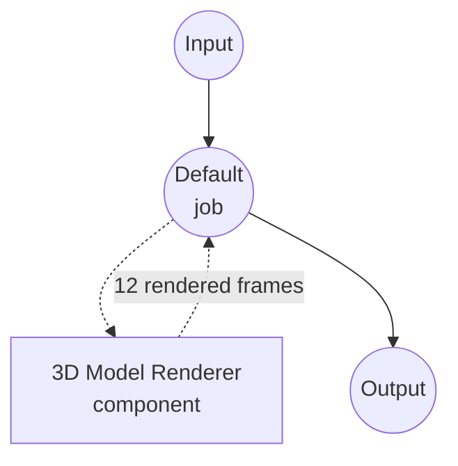

# 3D Model Renderer 예제

이 예제는 `model-3d-renderer` 컴포넌트를 사용한 3D 모델 턴테이블 렌더러를 보여줍니다. 하나의 모델에 카메라 각도 리스트를 짝지어 선언적으로 순차적인 2D 뷰 시퀀스를 생성하는 방법을 시연합니다.

## 개요

이 워크플로우는 3D 모델의 12프레임 턴테이블을 렌더링합니다:

1. **Yaw 스윕**: 카메라가 피사체 주위를 0°부터 330°까지 30° 단위로 공전하며 12프레임 생성
2. **카메라 브로드캐스팅**: `camera` 필드가 12개 설정 리스트이므로, 컴포넌트가 하나의 모델에 12개 카메라를 짝지어 12개 이미지 반환
3. **투명 배경**: 각 프레임은 알파가 포함된 PNG로, 어떤 배경 위에도 피사체를 합성할 수 있음
4. **웹 UI 통합**: 입력용 3D 뷰어와 출력용 이미지 갤러리가 있는 Gradio 기반 인터페이스 제공

## 준비사항

### 필수 요구사항

- model-compose가 설치되어 PATH에서 사용 가능
- `trimesh`, `moderngl`, `pillow` 설치 (`pip install trimesh moderngl pillow`)
- `moderngl`은 macOS(Metal), Linux(GLX), Windows에서 standalone offscreen context를 생성하므로 추가 시스템 라이브러리가 필요하지 않습니다.

### 환경 구성

1. 이 예제 디렉토리로 이동:
   ```bash
   cd examples/media-processing/model-3d-renderer
   ```

2. moderngl 가져오기 확인:
   ```bash
   python -c "import moderngl; ctx = moderngl.create_standalone_context(); print(ctx.info['GL_VERSION'])"
   ```

## 실행 방법

1. **서비스 시작:**
   ```bash
   model-compose up
   ```

2. **워크플로우 실행:**

   **웹 UI 사용:**
   - Web UI 열기: http://localhost:8081
   - 3D 모델 파일 업로드 (예: `.obj`, `.glb`, `.stl`)
   - pitch / width / height 조정
   - "Run Workflow" 버튼 클릭
   - 출력 갤러리에서 렌더링된 12프레임 탐색

   **API 사용:**
   ```bash
   curl -X POST http://localhost:8080/api/workflows/runs \
     -F "model_3d=@input.glb" \
     -F "pitch=20"
   ```

   **CLI 사용:**
   ```bash
   model-compose run --input '{"model_3d": "path/to/input.glb", "pitch": 20}'
   ```

## 컴포넌트 세부사항

### 3D Model Renderer 컴포넌트
- **Type**: `model-3d-renderer`
- **Driver**: `native` (기본값) — trimesh + moderngl 오프스크린 렌더링 기반
- **용도**: 지정된 카메라 각도에서 3D 모델을 하나 이상의 2D 이미지로 래스터화

## 워크플로우 세부사항

### "3D Model Turntable" 워크플로우 (기본)

**설명**: 3D 모델의 12프레임 턴테이블(yaw 0°~330°, 30° 간격)을 렌더링합니다.

#### Job 흐름



#### 입력 파라미터

| 파라미터  | 타입     | 필수 | 기본값 | 설명 |
|-----------|----------|------|--------|------|
| `model_3d`| model-3d | 예   | -      | 렌더링할 3D 모델 파일 |
| `pitch`   | number   | 아니오 | 20   | 수평선 위 카메라 pitch(도), 모든 프레임에 공유 |
| `width`   | number   | 아니오 | 512  | 출력 이미지 너비(픽셀) |
| `height`  | number   | 아니오 | 512  | 출력 이미지 높이(픽셀) |

#### 출력 형식

| 필드     | 타입      | 설명 |
|----------|-----------|------|
| `images` | image[]   | yaw 0°, 30°, 60°, …, 330°에서 렌더링된 12프레임 |

## 턴테이블 커스터마이징

프레임 리스트는 `model-compose.yml`의 `components[0].action.camera`에 직접 정의되어 있습니다. 리스트를 수정해 프레임 개수나 yaw 스윕을 변경할 수 있습니다:

```yaml
camera:
  - yaw:   0
    pitch: ${input.pitch}
  - yaw:  45
    pitch: ${input.pitch}
  # ...출력 프레임마다 하나의 엔트리
```

컴포넌트는 단일 카메라 객체도 지원하므로, 리스트를 아래처럼 단일 블록 엔트리로 교체하면 워크플로우가 이미지 하나를 반환하는 단일 샷 렌더러가 됩니다:

```yaml
camera:
  yaw: 30
  pitch: 20
```

Flow-style 매핑(`{ yaw: 30, pitch: 20 }`)은 여기에서 지원되지 않습니다. YAML 파서가 `{}` 안의 `${…}` 보간을 중첩 매핑으로 해석하기 때문입니다.

## 지원 입력 포맷

`trimesh`가 로드할 수 있는 모든 3D 포맷(glTF/GLB, OBJ, STL, PLY, DAE, OFF, 3MF 등).

## 트러블슈팅

### 자주 발생하는 문제

1. **moderngl을 찾을 수 없음**: `pip install moderngl`로 설치하세요.
2. **"Cannot create OpenGL context"**: GPU 드라이버가 없는 완전 헤드리스 리눅스 서버에서는 Mesa를 설치하면(`apt install libgl1 libegl1`) moderngl이 소프트웨어 렌더링으로 대체 동작합니다.
3. **전체가 검게 또는 비어 보임**: 카메라가 메쉬 내부에 있을 수 있습니다. `camera.pitch`를 더 완만한 각도로 낮추거나, 각 프레임에 명시적인 `camera.distance`를 추가하세요.
4. **그림자나 환경 반사가 없음**: `native` 드라이버는 glTF의 base color, metallic, roughness, normal, occlusion, emissive 맵을 사용하는 물리 기반 BRDF(Cook-Torrance / GGX)로 셰이딩하고, Khronos PBR Neutral로 톤매핑합니다. 캐스트 섀도, IBL(Image-Based Lighting), 스크린 스페이스 효과는 시뮬레이션하지 않습니다. 어두운 조명에서 피사체가 흐릿하게 보이면 `lighting.exposure`를 올리거나 `outdoor` 프리셋으로 전환하세요.
