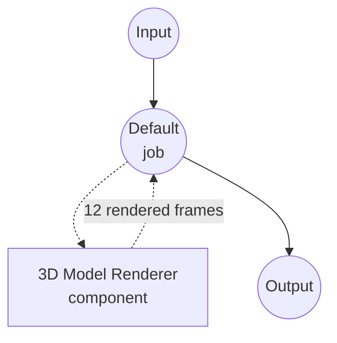

# 3D Model Renderer Example

This example demonstrates a 3D model turntable renderer using the `model-3d-renderer` component. It showcases how model-compose can rasterize a 3D asset into an ordered sequence of 2D views declaratively, by pairing a single model with a list of camera angles.

## Overview

This workflow renders a 12-frame turntable of a 3D model:

1. **Yaw Sweep**: Camera orbits the subject from 0° to 330° in 30° steps, producing 12 frames
2. **Camera Broadcasting**: The `camera` field is a list of 12 configurations, so the component zips one model against 12 cameras and returns 12 images
3. **Transparent Background**: Each frame is a PNG with alpha so the subject can be composited onto any backdrop
4. **Web UI Integration**: Provides a Gradio-based interface with a 3D viewer for the input and an image gallery for the output

## Preparation

### Prerequisites

- model-compose installed and available in your PATH
- `trimesh`, `moderngl`, and `pillow` installed (`pip install trimesh moderngl pillow`)
- `moderngl` creates a standalone offscreen context on macOS (Metal), Linux (GLX), and Windows — no extra system libraries are required.

### Environment Configuration

1. Navigate to this example directory:
   ```bash
   cd examples/media-processing/model-3d-renderer
   ```

2. Verify moderngl is importable:
   ```bash
   python -c "import moderngl; ctx = moderngl.create_standalone_context(); print(ctx.info['GL_VERSION'])"
   ```

## How to Run

1. **Start the service:**
   ```bash
   model-compose up
   ```

2. **Run the workflow:**

   **Using Web UI:**
   - Open the Web UI: http://localhost:8081
   - Upload a 3D model file (e.g. `.obj`, `.glb`, `.stl`)
   - Adjust pitch / width / height
   - Click the "Run Workflow" button
   - Browse the 12 rendered frames in the output gallery

   **Using API:**
   ```bash
   curl -X POST http://localhost:8080/api/workflows/runs \
     -F "model_3d=@input.glb" \
     -F "pitch=20"
   ```

   **Using CLI:**
   ```bash
   model-compose run --input '{"model_3d": "path/to/input.glb", "pitch": 20}'
   ```

## Component Details

### 3D Model Renderer Component
- **Type**: `model-3d-renderer`
- **Driver**: `native` (default) — backed by trimesh + moderngl offscreen rendering
- **Purpose**: Rasterize a 3D model to one or more 2D images from the specified camera angles

## Workflow Details

### "3D Model Turntable" Workflow (Default)

**Description**: Renders a 12-frame turntable (yaw 0°-330° in 30° steps) of a 3D model.

#### Job Flow



#### Input Parameters

| Parameter | Type     | Required | Default | Description |
|-----------|----------|----------|---------|-------------|
| `model_3d`| model-3d | Yes      | -       | The 3D model file to render |
| `pitch`   | number   | No       | 20      | Camera pitch in degrees above the horizon, shared across every frame |
| `width`   | number   | No       | 512     | Output image width in pixels |
| `height`  | number   | No       | 512     | Output image height in pixels |

#### Output Format

| Field    | Type      | Description |
|----------|-----------|-------------|
| `images` | image[]   | 12 rendered frames at yaw 0°, 30°, 60°, …, 330° |

## Customizing the Turntable

The frame list lives directly in `model-compose.yml` under `components[0].action.camera`. Edit the list to change the number of frames or the yaw sweep:

```yaml
camera:
  - yaw:   0
    pitch: ${input.pitch}
  - yaw:  45
    pitch: ${input.pitch}
  # ...one entry per output frame
```

Because the component also supports a single camera object, replacing the list with a single block entry turns the workflow into a single-shot renderer that returns one image:

```yaml
camera:
  yaw: 30
  pitch: 20
```

Flow-style mappings (`{ yaw: 30, pitch: 20 }`) are not supported here because the YAML parser treats `${…}` interpolations inside `{}` as nested mappings.

## Supported Input Formats

Any 3D format `trimesh` can load, including glTF / GLB, OBJ, STL, PLY, DAE, OFF, 3MF.

## Troubleshooting

### Common Issues

1. **moderngl Not Found**: Install it with `pip install moderngl`.
2. **"Cannot create OpenGL context"**: On a truly headless Linux box without a GPU driver, install Mesa (`apt install libgl1 libegl1`) so moderngl can fall back to software rendering.
3. **All-black or empty frames**: The camera may be inside the mesh. Lower `camera.pitch` to a shallower angle, or add an explicit `camera.distance` to each frame.
4. **No shadows or environment reflections**: The `native` driver shades with a physically-based BRDF (Cook-Torrance / GGX) over the glTF base color, metallic, roughness, normal, occlusion and emissive maps, tone-mapped with Khronos PBR Neutral. Cast shadows, image-based lighting and screen-space effects are not simulated — if the subject looks dull in dim light, raise `lighting.exposure` or switch to the `outdoor` preset.
