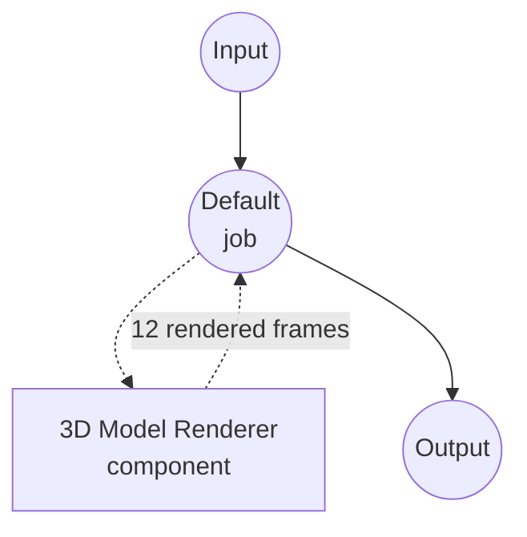

# 3D Model Renderer 示例

此示例演示了使用 `model-3d-renderer` 组件的 3D 模型旋转展示（turntable）渲染器，展示 model-compose 如何通过将单个模型与相机角度列表配对，以声明方式将 3D 资产栅格化为一组有序的 2D 视图序列。

## 概述

此工作流渲染 3D 模型的 12 帧旋转展示：

1. **Yaw 扫描**：相机以 30° 为步长，围绕主体从 0° 到 330° 公转，共生成 12 帧
2. **相机广播**：`camera` 字段是一个包含 12 个配置的列表，因此组件将一个模型与 12 个相机配对，并返回 12 张图像
3. **透明背景**：每一帧都是带 alpha 的 PNG，便于将主体合成到任意背景上
4. **Web UI 集成**：提供带有输入 3D 查看器和输出图像画廊的 Gradio 界面

## 准备工作

### 前置条件

- 已安装 model-compose 并在您的 PATH 中可用
- 已安装 `trimesh`、`moderngl` 和 `pillow`（`pip install trimesh moderngl pillow`）
- `moderngl` 在 macOS（Metal）、Linux（GLX）和 Windows 上会创建独立的离屏（offscreen）上下文，无需额外的系统库。

### 环境配置

1. 导航到此示例目录：
   ```bash
   cd examples/media-processing/model-3d-renderer
   ```

2. 验证 moderngl 可以导入：
   ```bash
   python -c "import moderngl; ctx = moderngl.create_standalone_context(); print(ctx.info['GL_VERSION'])"
   ```

## 运行方式

1. **启动服务：**
   ```bash
   model-compose up
   ```

2. **运行工作流：**

   **使用 Web UI：**
   - 打开 Web UI：http://localhost:8081
   - 上传 3D 模型文件（例如 `.obj`、`.glb`、`.stl`）
   - 调整 pitch / width / height
   - 点击 "Run Workflow" 按钮
   - 在输出画廊中浏览渲染出的 12 帧

   **使用 API：**
   ```bash
   curl -X POST http://localhost:8080/api/workflows/runs \
     -F "model_3d=@input.glb" \
     -F "pitch=20"
   ```

   **使用 CLI：**
   ```bash
   model-compose run --input '{"model_3d": "path/to/input.glb", "pitch": 20}'
   ```

## 组件详情

### 3D Model Renderer 组件
- **Type**：`model-3d-renderer`
- **Driver**：`native`（默认）—— 基于 trimesh + moderngl 离屏渲染
- **用途**：将 3D 模型从指定的相机角度栅格化为一张或多张 2D 图像

## 工作流详情

### "3D Model Turntable" 工作流（默认）

**说明**：渲染 3D 模型的 12 帧旋转展示（yaw 从 0° 到 330°，每 30° 一帧）。

#### Job 流程



#### 输入参数

| 参数      | 类型     | 必需 | 默认值 | 说明 |
|-----------|----------|------|--------|------|
| `model_3d`| model-3d | 是   | -      | 要渲染的 3D 模型文件 |
| `pitch`   | number   | 否   | 20     | 相机水平线以上的 pitch（度），所有帧共享 |
| `width`   | number   | 否   | 512    | 输出图像宽度（像素） |
| `height`  | number   | 否   | 512    | 输出图像高度（像素） |

#### 输出格式

| 字段     | 类型      | 说明 |
|----------|-----------|------|
| `images` | image[]   | 在 yaw 0°、30°、60°、…、330° 处渲染的 12 帧 |

## 自定义旋转展示

帧列表直接定义在 `model-compose.yml` 的 `components[0].action.camera` 中。编辑该列表即可修改帧数或 yaw 扫描：

```yaml
camera:
  - yaw:   0
    pitch: ${input.pitch}
  - yaw:  45
    pitch: ${input.pitch}
  # ...每一帧对应一个条目
```

组件同样支持单个相机对象，因此只需将列表替换为单个块式条目，就可以把工作流变成只返回一张图像的单次渲染器：

```yaml
camera:
  yaw: 30
  pitch: 20
```

这里不支持流式映射（`{ yaw: 30, pitch: 20 }`），因为 YAML 解析器会把 `{}` 内的 `${…}` 插值当作嵌套映射来解析。

## 支持的输入格式

`trimesh` 能加载的所有 3D 格式，包括 glTF / GLB、OBJ、STL、PLY、DAE、OFF、3MF。

## 故障排除

### 常见问题

1. **找不到 moderngl**：使用 `pip install moderngl` 安装。
2. **"Cannot create OpenGL context"**：在没有 GPU 驱动的完全无头 Linux 服务器上，安装 Mesa（`apt install libgl1 libegl1`）以便 moderngl 可以回退到软件渲染。
3. **整帧全黑或为空**：相机可能位于网格内部。将 `camera.pitch` 调整为更小的角度，或为每一帧添加显式的 `camera.distance`。
4. **没有阴影或环境反射**：`native` 驱动使用物理基础 BRDF（Cook-Torrance / GGX）进行着色，支持 glTF 的 base color、metallic、roughness、normal、occlusion 和 emissive 贴图，并通过 Khronos PBR Neutral 进行色调映射。它不模拟投射阴影、基于图像的照明（IBL）或屏幕空间效果。如果主体在昏暗光照下显得发暗，可以提高 `lighting.exposure` 或切换到 `outdoor` 预设。
