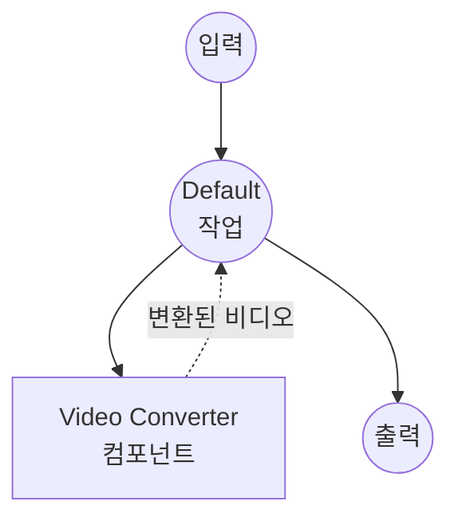

# Video Converter 예제

이 예제는 `video-converter` 컴포넌트를 사용한 비디오 포맷 변환기를 보여주며, model-compose가 ffmpeg 기반 비디오 처리를 설정 가능한 인코딩 옵션과 함께 조합하는 방법을 시연합니다.

## 개요

이 워크플로우는 다음과 같은 비디오 변환 서비스를 제공합니다:

1. **비디오 포맷 변환**: 다양한 비디오 포맷(MP4, WebM, AVI, MKV, MOV, FLV) 간 변환
2. **인코딩 설정**: 비디오 코덱, 오디오 코덱, 비트레이트, 해상도, FPS 옵션 지원
3. **파일 입출력**: 바이너리 파일 데이터가 컴포넌트와 워크플로우를 통해 흐르는 방식 표시
4. **웹 UI 통합**: 모든 옵션에 대한 드롭다운 선택기가 있는 Gradio 기반 인터페이스 제공

## 준비사항

### 필수 요구사항

- model-compose가 설치되어 PATH에서 사용 가능
- [ffmpeg](https://ffmpeg.org/)가 설치되어 PATH에서 사용 가능

### 환경 구성

1. 이 예제 디렉토리로 이동:
   ```bash
   cd examples/video-converter
   ```

2. ffmpeg 설치 확인:
   ```bash
   ffmpeg -version
   ```

## 실행 방법

1. **서비스 시작:**
   ```bash
   model-compose up
   ```

2. **워크플로우 실행:**

   **웹 UI 사용:**
   - Web UI 열기: http://localhost:8081
   - 비디오 파일 업로드
   - 출력 포맷, 코덱, 오디오 코덱, 비트레이트, 해상도, FPS 선택
   - "Run Workflow" 버튼 클릭
   - 변환된 비디오 파일 다운로드

   **API 사용:**
   ```bash
   curl -X POST http://localhost:8080/api/workflows/runs \
     -H "Content-Type: multipart/form-data" \
     -F "video=@input.mov" \
     -F "format=mp4" \
     -F "codec=libx264" \
     -F "audio_codec=aac" \
     -F "bitrate=2M" \
     -F "resolution=1920x1080" \
     -F "fps=30"
   ```

   **CLI 사용:**
   ```bash
   model-compose run --input '{"video": "path/to/input.mov", "format": "mp4"}'
   ```

## 컴포넌트 세부사항

### Video Converter 컴포넌트
- **유형**: `video-converter`
- **드라이버**: ffmpeg
- **목적**: 설정 가능한 인코딩 옵션으로 비디오 파일을 다른 포맷으로 변환

## 워크플로우 세부사항

### "Video Converter" 워크플로우 (기본)

**설명**: ffmpeg를 사용하여 비디오 파일을 다른 포맷으로 변환합니다.

#### 작업 흐름



#### 입력 매개변수

| 매개변수 | 유형 | 필수 | 기본값 | 설명 |
|---------|------|------|--------|------|
| `video` | video | 예 | - | 변환할 비디오 파일 |
| `format` | select | 아니오 | `mp4` | 출력 포맷: mp4, webm, avi, mkv, mov, flv |
| `codec` | select | 아니오 | `libx264` | 비디오 코덱: libx264, libx265, vp9, av1, copy |
| `audio_codec` | select | 아니오 | `aac` | 오디오 코덱: aac, opus, mp3, flac, copy |
| `bitrate` | select | 아니오 | `2M` | 비디오 비트레이트: 512k, 1M, 2M, 5M, 10M |
| `resolution` | select | 아니오 | `1920x1080` | 출력 해상도: 1920x1080, 1280x720, 854x480, 3840x2160 |
| `fps` | select | 아니오 | `30` | 프레임 레이트: 24, 30, 60 |

#### 출력 형식

| 필드 | 유형 | 설명 |
|-----|------|------|
| `video` | video | 변환된 비디오 파일 |

## 지원되는 포맷

ffmpeg는 다음을 포함한 다양한 비디오 포맷을 지원합니다:

- **MP4** - MPEG-4 Part 14
- **WebM** - Web Media
- **AVI** - Audio Video Interleave
- **MKV** - Matroska Video
- **MOV** - Apple QuickTime
- **FLV** - Flash Video

## 문제 해결

### 일반적인 문제

1. **ffmpeg를 찾을 수 없음**: ffmpeg가 설치되어 PATH에서 사용 가능한지 확인
2. **지원되지 않는 코덱**: 일부 코덱/포맷 조합이 호환되지 않을 수 있음 (예: vp9와 avi)
3. **출력 파일이 너무 큼**: 더 낮은 비트레이트나 해상도를 시도
