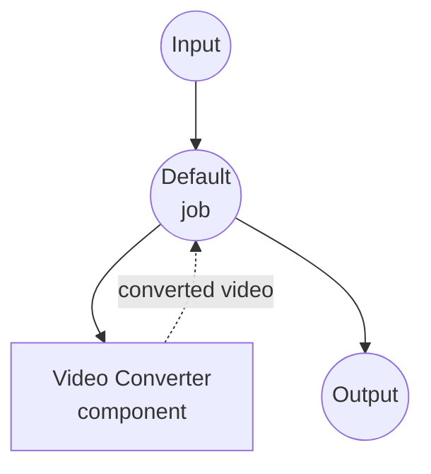

# Video Converter Example

This example demonstrates a video format converter using the `video-converter` component, showcasing how model-compose can orchestrate ffmpeg-based video processing with configurable encoding options.

## Overview

This workflow provides a video conversion service that:

1. **Video Format Conversion**: Converts between various video formats (MP4, WebM, AVI, MKV, MOV, FLV)
2. **Configurable Encoding**: Supports video codec, audio codec, bitrate, resolution, and FPS options
3. **File Input/Output**: Shows how binary file data flows through components and workflows
4. **Web UI Integration**: Provides a Gradio-based interface with dropdown selectors for all options

## Preparation

### Prerequisites

- model-compose installed and available in your PATH
- [ffmpeg](https://ffmpeg.org/) installed and available in your PATH

### Environment Configuration

1. Navigate to this example directory:
   ```bash
   cd examples/video-converter
   ```

2. Verify ffmpeg is installed:
   ```bash
   ffmpeg -version
   ```

## How to Run

1. **Start the service:**
   ```bash
   model-compose up
   ```

2. **Run the workflow:**

   **Using Web UI:**
   - Open the Web UI: http://localhost:8081
   - Upload a video file
   - Select output format, codec, audio codec, bitrate, resolution, and FPS
   - Click the "Run Workflow" button
   - Download the converted video file

   **Using API:**
   ```bash
   curl -X POST http://localhost:8080/api/workflows/runs \
     -H "Content-Type: multipart/form-data" \
     -F "video=@input.mov" \
     -F "format=mp4" \
     -F "codec=libx264" \
     -F "audio_codec=aac" \
     -F "bitrate=2M" \
     -F "resolution=1920x1080" \
     -F "fps=30"
   ```

   **Using CLI:**
   ```bash
   model-compose run --input '{"video": "path/to/input.mov", "format": "mp4"}'
   ```

## Component Details

### Video Converter Component
- **Type**: `video-converter`
- **Driver**: ffmpeg
- **Purpose**: Convert video files between formats with configurable encoding settings

## Workflow Details

### "Video Converter" Workflow (Default)

**Description**: Converts a video file to another format using ffmpeg.

#### Job Flow



#### Input Parameters

| Parameter | Type | Required | Default | Description |
|-----------|------|----------|---------|-------------|
| `video` | video | Yes | - | The video file to convert |
| `format` | select | No | `mp4` | Output format: mp4, webm, avi, mkv, mov, flv |
| `codec` | select | No | `libx264` | Video codec: libx264, libx265, vp9, av1, copy |
| `audio_codec` | select | No | `aac` | Audio codec: aac, opus, mp3, flac, copy |
| `bitrate` | select | No | `2M` | Video bitrate: 512k, 1M, 2M, 5M, 10M |
| `resolution` | select | No | `1920x1080` | Output resolution: 1920x1080, 1280x720, 854x480, 3840x2160 |
| `fps` | select | No | `30` | Frame rate: 24, 30, 60 |

#### Output Format

| Field | Type | Description |
|-------|------|-------------|
| `video` | video | The converted video file |

## Supported Formats

ffmpeg supports a wide range of video formats, including but not limited to:

- **MP4** - MPEG-4 Part 14
- **WebM** - Web Media
- **AVI** - Audio Video Interleave
- **MKV** - Matroska Video
- **MOV** - Apple QuickTime
- **FLV** - Flash Video

## Troubleshooting

### Common Issues

1. **ffmpeg Not Found**: Ensure ffmpeg is installed and available in your PATH
2. **Unsupported Codec**: Some codec/format combinations may not be compatible (e.g. vp9 with avi)
3. **Output File Too Large**: Try a lower bitrate or resolution
