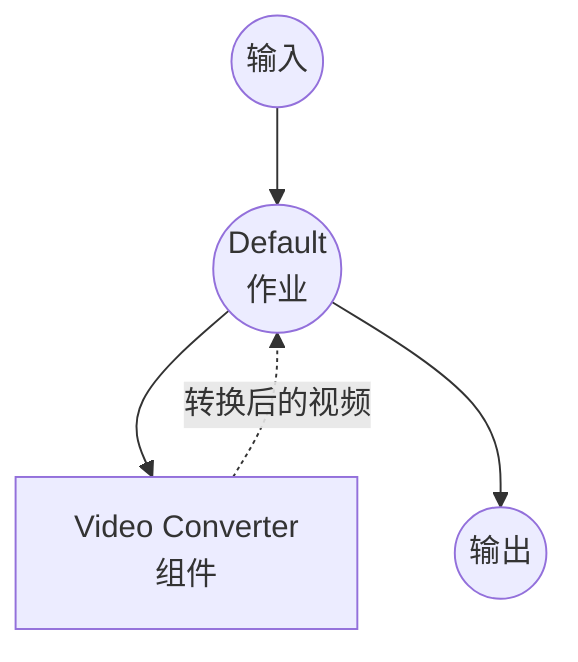

# Video Converter 示例

此示例演示了使用 `video-converter` 组件的视频格式转换器，展示 model-compose 如何使用可配置的编码选项编排基于 ffmpeg 的视频处理。

## 概述

此工作流提供了一个视频转换服务：

1. **视频格式转换**：在各种视频格式（MP4、WebM、AVI、MKV、MOV、FLV）之间转换
2. **可配置编码**：支持视频编解码器、音频编解码器、比特率、分辨率和帧率选项
3. **文件输入/输出**：展示二进制文件数据如何在组件和工作流之间流动
4. **Web UI 集成**：提供带有所有选项下拉选择器的 Gradio 界面

## 准备工作

### 前置条件

- 已安装 model-compose 并在您的 PATH 中可用
- 已安装 [ffmpeg](https://ffmpeg.org/) 并在您的 PATH 中可用

### 环境配置

1. 导航到此示例目录：
   ```bash
   cd examples/video-converter
   ```

2. 验证 ffmpeg 已安装：
   ```bash
   ffmpeg -version
   ```

## 运行方式

1. **启动服务：**
   ```bash
   model-compose up
   ```

2. **运行工作流：**

   **使用 Web UI：**
   - 打开 Web UI：http://localhost:8081
   - 上传视频文件
   - 选择输出格式、编解码器、音频编解码器、比特率、分辨率和帧率
   - 点击"运行工作流"按钮
   - 下载转换后的视频文件

   **使用 API：**
   ```bash
   curl -X POST http://localhost:8080/api/workflows/runs \
     -H "Content-Type: multipart/form-data" \
     -F "video=@input.mov" \
     -F "format=mp4" \
     -F "codec=libx264" \
     -F "audio_codec=aac" \
     -F "bitrate=2M" \
     -F "resolution=1920x1080" \
     -F "fps=30"
   ```

   **使用 CLI：**
   ```bash
   model-compose run --input '{"video": "path/to/input.mov", "format": "mp4"}'
   ```

## 组件详情

### Video Converter 组件
- **类型**：`video-converter`
- **驱动**：ffmpeg
- **用途**：使用可配置的编码设置在不同格式之间转换视频文件

## 工作流详情

### "Video Converter" 工作流（默认）

**描述**：使用 ffmpeg 将视频文件转换为其他格式。

#### 作业流程



#### 输入参数

| 参数 | 类型 | 必需 | 默认值 | 描述 |
|-----------|------|----------|---------|-------------|
| `video` | video | 是 | - | 要转换的视频文件 |
| `format` | select | 否 | `mp4` | 输出格式：mp4、webm、avi、mkv、mov、flv |
| `codec` | select | 否 | `libx264` | 视频编解码器：libx264、libx265、vp9、av1、copy |
| `audio_codec` | select | 否 | `aac` | 音频编解码器：aac、opus、mp3、flac、copy |
| `bitrate` | select | 否 | `2M` | 视频比特率：512k、1M、2M、5M、10M |
| `resolution` | select | 否 | `1920x1080` | 输出分辨率：1920x1080、1280x720、854x480、3840x2160 |
| `fps` | select | 否 | `30` | 帧率：24、30、60 |

#### 输出格式

| 字段 | 类型 | 描述 |
|-------|------|-------------|
| `video` | video | 转换后的视频文件 |

## 支持的格式

ffmpeg 支持多种视频格式，包括但不限于：

- **MP4** - MPEG-4 Part 14
- **WebM** - Web Media
- **AVI** - Audio Video Interleave
- **MKV** - Matroska Video
- **MOV** - Apple QuickTime
- **FLV** - Flash Video

## 故障排除

### 常见问题

1. **找不到 ffmpeg**：确保 ffmpeg 已安装并在您的 PATH 中可用
2. **不支持的编解码器**：某些编解码器/格式组合可能不兼容（例如 vp9 与 avi）
3. **输出文件过大**：尝试使用较低的比特率或分辨率
