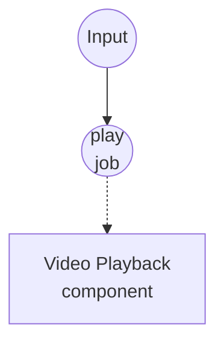

# 비디오 재생 예제

이 예제는 OS 네이티브 창을 열어 하나의 비디오 소스를 번들된 `ffplay` 바이너리로 재생합니다. 오디오 트랙이 있으면 비디오와 함께 시스템 기본 출력으로 재생됩니다.

## 개요

단일 워크플로우가 하나의 `video-playback` 컴포넌트 인스턴스를 구동합니다:

1. **play-video**: 입력 소스(로컬 파일, `file://` URL, 또는 `http(s)://` URL)와 몇 가지 창 옵션을 받아 비디오가 끝나거나 사용자가 창을 닫을 때까지 네이티브 창에서 비디오를 재생합니다.

`video-playback`은 내부적으로 `ffplay`를 사용하므로 별도의 오디오 파이프라인이 필요하지 않습니다 — 같은 프로세스가 비디오는 창으로, 오디오는 시스템 출력으로 각각 디먹싱합니다. `mute: true`로 설정하면 비디오 재생에 영향을 주지 않고 오디오 트랙만 비활성화됩니다.

## 준비사항

### 필수 요구사항

- model-compose가 설치되어 PATH에서 사용 가능
- 로컬에 `ffplay` 사용 가능 (대부분의 `ffmpeg` 설치에 번들됨. macOS Homebrew의 경우 `brew install ffmpeg`에 포함)
- 워크플로우를 실행하는 머신에서 접근 가능한 비디오 파일 (`.mp4`, `.mkv`, `.mov`, `.webm` 등) 또는 공개 비디오 URL

### 환경 구성

환경 변수는 필요하지 않습니다.

## 실행 방법

1. **서비스 시작:**
   ```bash
   model-compose up
   ```

2. **비디오 재생:**

   **API 사용:**
   ```bash
   curl -X POST http://localhost:8080/api/workflows/play-video/runs \
     -H "Content-Type: application/json" \
     -d '{"input": {"source": "/absolute/path/to/clip.mp4"}}'
   ```

   **CLI 사용:**
   ```bash
   model-compose run play-video --input '{"source": "/absolute/path/to/clip.mp4"}'
   ```

   또는 http://localhost:8081 의 Web UI에서 `play-video`를 실행합니다.

3. **재생 중지:**

   `ffplay` 창을 닫거나, 비디오가 끝날 때까지 기다리거나, Web UI / runs API에서 실행을 취소하세요. 취소하면 `ffplay` 프로세스가 깔끔하게 종료됩니다.

## 컴포넌트 상세

### 비디오 재생 컴포넌트 (player)
- **타입**: `video-playback` 컴포넌트
- **드라이버**: `ffplay`
- **목적**: 네이티브 창을 열어 각 비디오 소스를 오디오와 동기화하여 재생
- **주요 옵션**:
  - `video`: 재생할 소스 — 단일 값, 리스트, 또는 스트림 허용
  - `window_title`: 재생 창에 표시되는 제목
  - `window_size`: `WIDTHxHEIGHT` (예: `1280x720`); 미설정 시 비디오의 원본 크기 사용
  - `fullscreen`: 창을 전체화면 모드로 열기
  - `always_on_top`: 다른 창 위에 항상 유지
  - `borderless`: OS 창 테두리 없이 그리기
  - `mute`: 오디오 트랙 비활성화
  - `volume`: 시작 볼륨 `0`(무음)부터 `100`(변경 없음)까지
  - `duration`: 재생 시간 제한; 미설정 시 입력 끝까지 재생
  - `wait_for_finish: true`: 재생이 끝날 때까지 대기하여 리스트/스트림 입력이 겹치지 않고 순차적으로 재생되도록 함

## 워크플로우 상세

### "비디오 재생" 워크플로우 (play-video)

**설명**: 네이티브 창을 열어 비디오 소스 하나를 재생합니다. 비디오가 끝나거나(`ffplay -autoexit`) 사용자가 창을 닫으면 자동으로 창이 닫힙니다.

#### 작업 흐름

1. **play**: 입력을 비디오 소스로 렌더링하여 `video-playback`에 전달



#### 입력 매개변수

| 매개변수 | 타입 | 필수 | 기본값 | 설명 |
|-----------|------|----------|---------|-------------|
| `source` | video | 예 | - | 비디오 소스: 로컬 파일 경로, `file://` URL, 또는 `http(s)://` URL |
| `title` | string | 아니오 | `Video Playback` | 재생 창에 표시되는 제목 |
| `fullscreen` | boolean | 아니오 | `false` | 창을 전체화면으로 열지 여부 |
| `mute` | boolean | 아니오 | `false` | 오디오 재생 비활성화 여부 |
| `duration` | string | 아니오 | - | 최대 재생 시간 (예: `10s`, `1m30s`); 미설정 시 끝까지 재생 |

#### 출력 형식

`play-video`는 `null`을 반환합니다 — 재생은 값이 아닌 부수 효과(창 + 스피커)입니다.

## 예상 출력

```bash
model-compose run play-video --input '{"source": "./samples/demo.mp4"}'
```

...제목이 "Video Playback"인 `ffplay` 창이 열리고 `demo.mp4`가 사운드와 함께 재생됩니다. 비디오가 끝나거나 창을 닫으면 워크플로우가 반환됩니다.

원격 클립을 음소거 상태로 전체화면 재생:

```bash
model-compose run play-video --input '{
  "source": "https://example.com/trailer.mp4",
  "title": "Trailer",
  "fullscreen": true,
  "mute": true
}'
```

## 커스터마이징

- 특정 창 해상도를 강제하려면 `player.action.window_size: "1920x1080"`을 설정하세요
- 재생 창을 다른 창 위에 유지하려면 `player.action.always_on_top: true`를 설정하세요
- 테두리 없는 창(키오스크나 오버레이 용도)이 필요하면 `player.action.borderless: true`를 설정하세요
- 기본 시작 볼륨의 절반으로 낮추려면 `player.action.volume: 50`을 설정하세요
- 재생을 fire-and-forget으로 실행하고 즉시 반환하려면 `player.action.wait_for_finish: false`를 설정하세요 — 다른 워크플로우에서 백그라운드 재생을 트리거할 때 유용합니다
- 여러 클립을 이어서 재생하려면 `player.action.video`에 리스트나 스트림을 전달하세요 (예: `${jobs.dequeue.output as video}`). `wait_for_finish: true`와 조합해 겹침을 방지합니다
