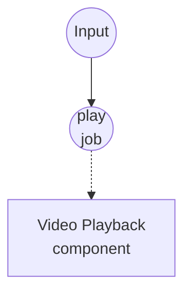

# Video Playback Example

This example opens an OS-native window and plays a single video source through the bundled `ffplay` binary. Audio, if present, plays through the system default output alongside the video.

## Overview

A single workflow drives one `video-playback` component instance:

1. **play-video**: Takes an input source (local file, `file://` URL, or `http(s)://` URL) and a few window options, and plays the video in a native window until it ends or the user closes the window.

Because `video-playback` uses `ffplay` under the hood, no separate audio pipeline is needed — the same process demuxes video to the window and audio to the system output. Setting `mute: true` disables the audio track without affecting video playback.

## Preparation

### Prerequisites

- model-compose installed and available in your PATH
- `ffplay` available locally (bundled with most `ffmpeg` installations; on macOS Homebrew, `brew install ffmpeg` includes it)
- A video file reachable from the machine running the workflow (`.mp4`, `.mkv`, `.mov`, `.webm`, etc.), or a public video URL

### Environment Configuration

No environment variables are required.

## How to Run

1. **Start the service:**
   ```bash
   model-compose up
   ```

2. **Play a video:**

   **Using API:**
   ```bash
   curl -X POST http://localhost:8080/api/workflows/play-video/runs \
     -H "Content-Type: application/json" \
     -d '{"input": {"source": "/absolute/path/to/clip.mp4"}}'
   ```

   **Using CLI:**
   ```bash
   model-compose run play-video --input '{"source": "/absolute/path/to/clip.mp4"}'
   ```

   Or open the Web UI at http://localhost:8081 and run `play-video`.

3. **Stop playback:**

   Close the `ffplay` window, wait for the video to finish, or cancel the run from the Web UI / runs API. Cancellation terminates the `ffplay` process cleanly.

## Component Details

### Video Playback Component (player)
- **Type**: `video-playback` component
- **Driver**: `ffplay`
- **Purpose**: Opens a native window and plays each video source with synchronized audio
- **Key options**:
  - `video`: source(s) to play — accepts a single value, a list, or a stream
  - `window_title`: title shown on the playback window
  - `window_size`: `WIDTHxHEIGHT` (e.g. `1280x720`); when unset, the video's native size is used
  - `fullscreen`: open the window in fullscreen mode
  - `always_on_top`: keep the window above other windows
  - `borderless`: draw the window without OS chrome
  - `mute`: disable the audio track
  - `volume`: startup volume from `0` (mute) to `100` (unchanged)
  - `duration`: cap playback length; when unset, plays to the end of the input
  - `wait_for_finish: true`: waits for playback to finish before returning, which is what makes list/stream inputs play sequentially without overlap

## Workflow Details

### "Play a video" Workflow (play-video)

**Description**: Open a native window and play one video source. The window closes on its own when the video ends (`ffplay -autoexit`) or when the user closes it.

#### Job Flow

1. **play**: Renders the input as a video source and hands it to `video-playback`



#### Input Parameters

| Parameter | Type | Required | Default | Description |
|-----------|------|----------|---------|-------------|
| `source` | video | Yes | - | Video source: local file path, `file://` URL, or `http(s)://` URL |
| `title` | string | No | `Video Playback` | Title displayed on the playback window |
| `fullscreen` | boolean | No | `false` | Whether to open the window in fullscreen |
| `mute` | boolean | No | `false` | Whether to disable audio playback |
| `duration` | string | No | - | Maximum playback duration (e.g. `10s`, `1m30s`); when unset, plays to the end |

#### Output Format

`play-video` returns `null` — playback is a side effect (window + speakers), not a value.

## Example Output

```bash
model-compose run play-video --input '{"source": "./samples/demo.mp4"}'
```

...opens an `ffplay` window titled "Video Playback" and plays `demo.mp4` with sound. The workflow returns once the video finishes or the window is closed.

Fullscreen playback of a remote clip, muted:

```bash
model-compose run play-video --input '{
  "source": "https://example.com/trailer.mp4",
  "title": "Trailer",
  "fullscreen": true,
  "mute": true
}'
```

## Customization

- Set `player.action.window_size: "1920x1080"` to force a specific window resolution
- Set `player.action.always_on_top: true` to keep the playback window above other windows
- Set `player.action.borderless: true` for a chromeless window (useful for kiosks or overlays)
- Set `player.action.volume: 50` to halve the default startup volume
- Set `player.action.wait_for_finish: false` to fire-and-forget playback and return immediately — useful when triggering background playback from another workflow
- Pass a list or stream to `player.action.video` (e.g. `${jobs.dequeue.output as video}`) to play multiple clips back-to-back; combine with `wait_for_finish: true` to avoid overlap
