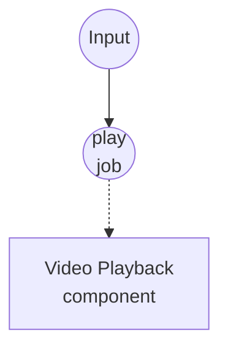

# 视频播放示例

此示例打开一个操作系统原生窗口，通过随附的 `ffplay` 二进制文件播放单个视频源。如果视频包含音频轨道，音频会与视频一起通过系统默认输出播放。

## 概述

一个工作流驱动一个 `video-playback` 组件实例：

1. **play-video**：接收一个输入源（本地文件、`file://` URL 或 `http(s)://` URL）以及若干窗口选项，在原生窗口中播放视频，直到视频结束或用户关闭窗口。

由于 `video-playback` 底层使用 `ffplay`，无需单独的音频管线 —— 同一个进程将视频解复用到窗口，将音频解复用到系统输出。设置 `mute: true` 会禁用音频轨道而不影响视频播放。

## 准备工作

### 前置条件

- 已安装 model-compose 并在您的 PATH 中可用
- 本地可用 `ffplay`（随大多数 `ffmpeg` 安装一起提供；在 macOS Homebrew 上，`brew install ffmpeg` 会包含它）
- 运行工作流的机器可访问的视频文件（`.mp4`、`.mkv`、`.mov`、`.webm` 等）或公开的视频 URL

### 环境配置

不需要环境变量。

## 运行方式

1. **启动服务：**
   ```bash
   model-compose up
   ```

2. **播放视频：**

   **使用 API：**
   ```bash
   curl -X POST http://localhost:8080/api/workflows/play-video/runs \
     -H "Content-Type: application/json" \
     -d '{"input": {"source": "/absolute/path/to/clip.mp4"}}'
   ```

   **使用 CLI：**
   ```bash
   model-compose run play-video --input '{"source": "/absolute/path/to/clip.mp4"}'
   ```

   或打开 http://localhost:8081 的 Web UI 并运行 `play-video`。

3. **停止播放：**

   关闭 `ffplay` 窗口、等待视频结束，或通过 Web UI / runs API 取消运行。取消操作会干净地终止 `ffplay` 进程。

## 组件详情

### 视频播放组件 (player)
- **类型**：`video-playback` 组件
- **驱动**：`ffplay`
- **用途**：打开原生窗口，同步播放每个视频源及其音频
- **关键选项**：
  - `video`：要播放的源 —— 接受单值、列表或流
  - `window_title`：播放窗口上显示的标题
  - `window_size`：`WIDTHxHEIGHT`（例如 `1280x720`）；未设置时使用视频的原始尺寸
  - `fullscreen`：以全屏模式打开窗口
  - `always_on_top`：窗口始终置于其他窗口之上
  - `borderless`：绘制无操作系统边框的窗口
  - `mute`：禁用音频轨道
  - `volume`：启动音量，`0`（静音）到 `100`（不变）
  - `duration`：限制播放时长；未设置时播放到输入结束
  - `wait_for_finish: true`：等待播放结束后再返回，让列表/流输入按顺序播放而不重叠

## 工作流详情

### "播放视频"工作流 (play-video)

**描述**：打开原生窗口播放一个视频源。视频结束（`ffplay -autoexit`）或用户关闭窗口时窗口会自动关闭。

#### 作业流程

1. **play**：将输入渲染为视频源并交给 `video-playback`



#### 输入参数

| 参数 | 类型 | 必需 | 默认 | 描述 |
|-----------|------|----------|---------|-------------|
| `source` | video | 是 | - | 视频源：本地文件路径、`file://` URL 或 `http(s)://` URL |
| `title` | string | 否 | `Video Playback` | 播放窗口上显示的标题 |
| `fullscreen` | boolean | 否 | `false` | 是否以全屏方式打开窗口 |
| `mute` | boolean | 否 | `false` | 是否禁用音频播放 |
| `duration` | string | 否 | - | 最大播放时长（例如 `10s`、`1m30s`）；未设置时播放到结束 |

#### 输出格式

`play-video` 返回 `null` —— 播放是副作用（窗口 + 扬声器），而非返回值。

## 示例输出

```bash
model-compose run play-video --input '{"source": "./samples/demo.mp4"}'
```

……会打开一个标题为 "Video Playback" 的 `ffplay` 窗口，并带声音播放 `demo.mp4`。视频结束或窗口关闭后工作流返回。

以静音方式全屏播放远程片段：

```bash
model-compose run play-video --input '{
  "source": "https://example.com/trailer.mp4",
  "title": "Trailer",
  "fullscreen": true,
  "mute": true
}'
```

## 自定义

- 设置 `player.action.window_size: "1920x1080"` 以强制指定窗口分辨率
- 设置 `player.action.always_on_top: true` 使播放窗口保持在其他窗口之上
- 设置 `player.action.borderless: true` 以获得无边框窗口（适用于自助终端或叠加显示）
- 设置 `player.action.volume: 50` 将默认启动音量减半
- 设置 `player.action.wait_for_finish: false` 以一次即忘方式触发播放并立即返回 —— 在从另一个工作流触发后台播放时很有用
- 向 `player.action.video` 传入列表或流（例如 `${jobs.dequeue.output as video}`）可连续播放多个片段；配合 `wait_for_finish: true` 避免重叠
