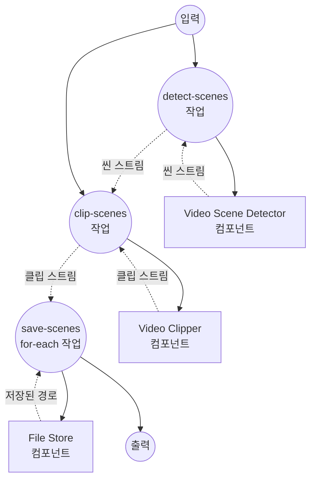

# 비디오 씬 분할 예제

이 예제는 비디오의 씬 경계를 감지하여 각 씬을 개별 파일로 저장하는 스트리밍 워크플로우를 보여줍니다. 씬 감지, 클립 자르기, 파일 쓰기가 모두 파이프라인을 통해 스트리밍되면서 동시에 실행됩니다.

## 개요

이 워크플로우는 다음 프로세스를 통해 작동합니다:

1. **씬 감지**: `video-scene-detector`(pyscenedetect 드라이버)가 감지되는 대로 씬 경계를 `{start_time, end_time}` 객체로 한 번에 하나씩 스트리밍합니다
2. **씬 자르기**: `video-clipper`(ffmpeg 드라이버)가 씬 스트림을 `span` 입력으로 받아 씬당 하나의 클립을 산출하며, `return_timestamp: true`를 통해 각 클립에 원본 span을 함께 실어 보냅니다
3. **씬 저장**: `for-each` 작업이 클립 스트림을 소비하며 씬의 시작/끝 시간을 파일명으로 사용해 각 씬을 로컬 파일 스토어에 기록합니다

감지기와 클리퍼 모두 출력을 스트리밍하기 때문에, 뒤쪽 씬이 아직 감지되는 동안에도 앞쪽 씬은 이미 잘려서 디스크에 저장되고 있습니다.

## 준비사항

### 필수 요구사항

- model-compose가 설치되어 PATH에서 사용 가능
- 로컬에 `ffmpeg` 사용 가능
- `pyscenedetect` 설치 (`pip install scenedetect[opencv]`)
- 워크플로우를 실행하는 머신에서 접근 가능한 소스 비디오 파일

### 환경 구성

환경 변수는 필요하지 않습니다.

## 실행 방법

1. **서비스 시작:**
   ```bash
   model-compose up
   ```

   서비스가 다음 주소에서 시작됩니다:
   - API 엔드포인트: http://localhost:8080/api
   - Web UI: http://localhost:8081

2. **워크플로우 실행:**

   **API 사용:**
   ```bash
   curl -X POST http://localhost:8080/api/workflows/runs \
     -H "Content-Type: application/json" \
     -d '{"input": {"video": "/absolute/path/to/video.mp4", "threshold": 27.0}}'
   ```

   **웹 UI 사용:**
   - Web UI 열기: http://localhost:8081
   - 비디오를 업로드하고 (선택적으로) 감지 임계값을 조정한 뒤 "Run Workflow" 클릭

   **CLI 사용:**
   ```bash
   model-compose run --input '{"video": "/absolute/path/to/video.mp4", "threshold": 27.0}'
   ```

추출된 씬은 `./output/scenes/scene_<start>-<end>.mp4` 경로에 기록됩니다.

## 컴포넌트 세부사항

### Video Scene Detector 컴포넌트 (scene-detector)
- **유형**: `video-scene-detector` 컴포넌트
- **드라이버**: `pyscenedetect`
- **목적**: 입력 비디오에서 씬 경계를 한 번에 하나씩 스트리밍
- **주요 옵션**:
  - `video`: 소스 비디오 미디어
  - `detector`: 감지 알고리즘 (여기서는 `adaptive` — 대부분의 콘텐츠에 적합한 기본값)
  - `threshold`: 감지 민감도; 값이 낮을수록 더 많은 씬 컷 생성
  - `streaming: true`: 리스트가 아닌 비동기 이터레이터로 씬을 제공

### Video Clipper 컴포넌트 (clipper)
- **유형**: `video-clipper` 컴포넌트
- **드라이버**: `ffmpeg`
- **목적**: `ffmpeg -c copy`로 씬당 하나의 클립을 자름 (재인코딩 없음)
- **주요 옵션**:
  - `video`: 감지기가 가리키던 동일한 소스 비디오
  - `span`: 감지기가 스트리밍하는 씬 리스트 (각 항목은 `{start_time, end_time}` 객체)
  - `return_timestamp: true`: 각 클립에 원본 span을 `{video, start_time, end_time}` 형태로 첨부해 다운스트림에서 씬 기준으로 파일명 지을 수 있게 함

### File Store 컴포넌트 (storage)
- **유형**: `file-store` 컴포넌트
- **드라이버**: `local`
- **기본 경로**: `./output/scenes`
- **목적**: 스트리밍된 각 씬 클립을 MP4 파일로 영속화
- **액션**: 씬별 `path`와 MP4 `source`를 갖는 `put`

## 워크플로우 세부사항

### "Split Video Into Per-Scene Files" 워크플로우 (기본)

**설명**: 씬을 감지하고, 씬당 클립을 자른 뒤, 각 클립을 디스크에 저장합니다 — 전 과정 스트리밍.

#### 작업 흐름

1. **detect-scenes**: `{start_time, end_time}` 씬 경계 스트림 생성
2. **clip-scenes**: 씬 스트림을 소비하며 `{video, start_time, end_time}` 클립 스트림 생성
3. **save-scenes**: 스트리밍된 각 클립을 `scene_<start>-<end>.mp4` 이름으로 로컬 파일 스토어에 기록



#### 입력 매개변수

| 매개변수 | 유형 | 필수 | 기본값 | 설명 |
|---------|------|------|--------|------|
| `video` | video | 예 | - | 씬별 파일로 분할할 소스 비디오 |
| `threshold` | number | 아니오 | `27.0` | 씬 감지 민감도; 값이 낮을수록 컷이 많아짐 |

#### 출력 형식

`save-scenes` for-each의 각 반복은 `storage` 컴포넌트가 반환한 저장 경로(`${result.path}`)를 JSON 스트림으로 산출합니다.

| 필드 | 유형 | 설명 |
|-----|------|------|
| `path` | text | 저장된 각 씬 클립의 로컬 경로 |

## 예제 출력

세 개의 씬이 감지된 비디오에 대해 다음과 같은 파일이 생성됩니다:

```
output/scenes/scene_0.0-12.5.mp4
output/scenes/scene_12.5-30.083.mp4
output/scenes/scene_30.083-45.2.mp4
```

각 파일은 해당 씬이 잘리는 즉시 기록되므로, 전체 비디오 분석이 끝나기 전에도 다운스트림 소비자가 씬을 처리하기 시작할 수 있습니다.

## 사용자 정의

- `threshold`를 낮추면(예: `20.0`) 미묘한 씬 변화까지 감지하고, 높이면(예: `35.0`) 강한 컷만 남김
- `scene-detector` 드라이버를 `ffmpeg`(자체 임계값 체계) 또는 학습 모델인 `transnetv2`로 교체
- `storage.base_path`를 다른 디렉토리로 지정하거나 원격 스토어(S3, GCS, Azure Blob) 드라이버로 교체
- `save-scenes` for-each 본문에 비디오 인코더나 요약 모델 등 클립별 처리를 추가

## 팁

- **무손실 자르기**: `video-clipper`는 `ffmpeg -c copy`를 사용하므로 씬 컷이 직전 키프레임으로 스냅됩니다. 프레임 단위 정확한 자르기가 필요하다면 `video-encoder`로 재인코딩하세요.
- **파일명 고유성**: 씬 시작/끝 시간은 비디오 내에서 고유하므로 `scene_<start>-<end>.mp4`는 파일명으로 안전합니다. 정렬 가능한 자릿수 패딩 이름이 필요하다면 `for-each` 본문의 `path` 표현식을 바꾸세요.
- **임계값 튜닝**: 씬 감지는 콘텐츠에 민감합니다. 기본값으로 한 번 돌려보고 결과 파일을 살펴본 뒤 `threshold`를 위/아래로 조정하세요.
