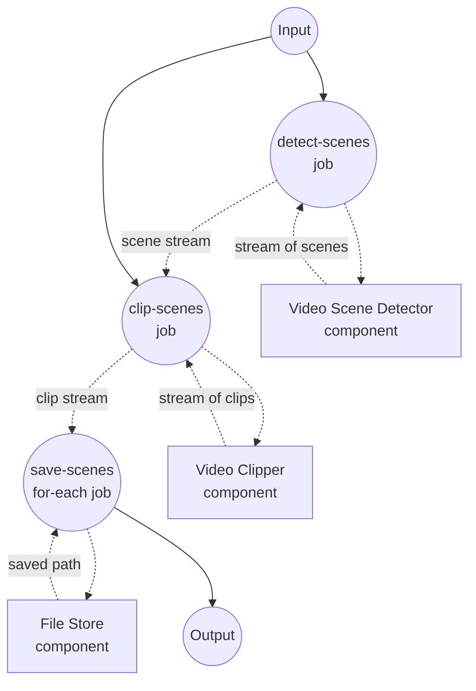

# Video Scene Splitter Example

This example demonstrates a streaming workflow that detects scene boundaries in a video and saves each scene as its own file. Scene detection, clipping, and file writing all run concurrently as data streams through the pipeline.

## Overview

This workflow operates through the following process:

1. **Detect Scenes**: A `video-scene-detector` (pyscenedetect driver) streams scene boundaries as they are found, one `{start_time, end_time}` object at a time
2. **Clip Scenes**: A `video-clipper` (ffmpeg driver) consumes the scene stream as its `span` input and yields one clip per scene, carrying the source span alongside each clip via `return_timestamp: true`
3. **Save Scenes**: A `for-each` job consumes the clip stream and writes each scene to the local file store, naming files by the scene's start/end times

Because both the detector and the clipper stream their output, later scenes are still being detected while earlier ones are already being cut and saved to disk.

## Preparation

### Prerequisites

- model-compose installed and available in your PATH
- `ffmpeg` available locally
- `pyscenedetect` installed (`pip install scenedetect[opencv]`)
- A source video file accessible from the machine running the workflow

### Environment Configuration

No environment variables are required.

## How to Run

1. **Start the service:**
   ```bash
   model-compose up
   ```

   The service will start:
   - API endpoint: http://localhost:8080/api
   - Web UI: http://localhost:8081

2. **Run the workflow:**

   **Using API:**
   ```bash
   curl -X POST http://localhost:8080/api/workflows/runs \
     -H "Content-Type: application/json" \
     -d '{"input": {"video": "/absolute/path/to/video.mp4", "threshold": 27.0}}'
   ```

   **Using Web UI:**
   - Open the Web UI: http://localhost:8081
   - Upload a video and (optionally) tune the detection threshold, then click "Run Workflow"

   **Using CLI:**
   ```bash
   model-compose run --input '{"video": "/absolute/path/to/video.mp4", "threshold": 27.0}'
   ```

Extracted scenes are written to `./output/scenes/scene_<start>-<end>.mp4`.

## Component Details

### Video Scene Detector Component (scene-detector)
- **Type**: `video-scene-detector` component
- **Driver**: `pyscenedetect`
- **Purpose**: Streams scene boundaries out of the input video one at a time
- **Key options**:
  - `video`: source video media
  - `detector`: detection algorithm (`adaptive` here — good default for most content)
  - `threshold`: detection sensitivity; lower values yield more scene cuts
  - `streaming: true`: yields scenes as an async iterator instead of returning a list

### Video Clipper Component (clipper)
- **Type**: `video-clipper` component
- **Driver**: `ffmpeg`
- **Purpose**: Cuts one clip per scene using `ffmpeg -c copy` (no re-encoding)
- **Key options**:
  - `video`: same source video the detector was pointed at
  - `span`: the streaming scene list from the detector (each item is a `{start_time, end_time}` object)
  - `return_timestamp: true`: attaches each source span to its clip as `{video, start_time, end_time}` so downstream jobs can name files by scene

### File Store Component (storage)
- **Type**: `file-store` component
- **Driver**: `local`
- **Base path**: `./output/scenes`
- **Purpose**: Persists each streamed scene clip as an MP4 file
- **Action**: `put` with a per-scene `path` and MP4 `source`

## Workflow Details

### "Split Video Into Per-Scene Files" Workflow (Default)

**Description**: Detect scenes, cut a clip per scene, and save each clip to disk — all streaming.

#### Job Flow

1. **detect-scenes**: Produce a stream of `{start_time, end_time}` scene boundaries
2. **clip-scenes**: Consume the scene stream and produce a stream of `{video, start_time, end_time}` clips
3. **save-scenes**: For each streamed clip, write it to the local file store under `scene_<start>-<end>.mp4`



#### Input Parameters

| Parameter | Type | Required | Default | Description |
|-----------|------|----------|---------|-------------|
| `video` | video | Yes | - | Source video to split into per-scene files |
| `threshold` | number | No | `27.0` | Scene detection sensitivity; lower values produce more cuts |

#### Output Format

Each iteration of the `save-scenes` for-each yields the saved file path returned by the `storage` component (`${result.path}`), streamed as JSON.

| Field | Type | Description |
|-------|------|-------------|
| `path` | text | Local path of each saved scene clip |

## Example Output

Given a video with three detected scenes, the workflow produces files such as:

```
output/scenes/scene_0.0-12.5.mp4
output/scenes/scene_12.5-30.083.mp4
output/scenes/scene_30.083-45.2.mp4
```

Each file is written as soon as its scene is cut, so downstream consumers can start processing scenes before the full video has finished being analyzed.

## Customization

- Lower `threshold` (e.g. `20.0`) to detect subtler scene changes; raise it (e.g. `35.0`) to keep only strong cuts
- Swap the `scene-detector` driver to `ffmpeg` (with its own threshold semantics) or `transnetv2` for a learned model
- Point `storage.base_path` at a different directory or swap the driver for a remote store (S3, GCS, Azure Blob)
- Insert per-clip processing (e.g. a video encoder or a summarizer model) between `clip-scenes` and `save-scenes` by adding it inside the `save-scenes` for-each body

## Tips

- **Lossless clipping**: `video-clipper` uses `ffmpeg -c copy`, so scene cuts snap to the nearest preceding keyframe. If frame-accurate cuts are required, follow up with `video-encoder` to re-encode.
- **File name uniqueness**: Scene start/end times are unique per video, so `scene_<start>-<end>.mp4` is safe as a filename. If you want zero-padded sortable names, replace the `path` expression in the `for-each` body accordingly.
- **Threshold tuning**: Scene detection is content-sensitive. Run once at the default, inspect the resulting files, then tune `threshold` up or down.
