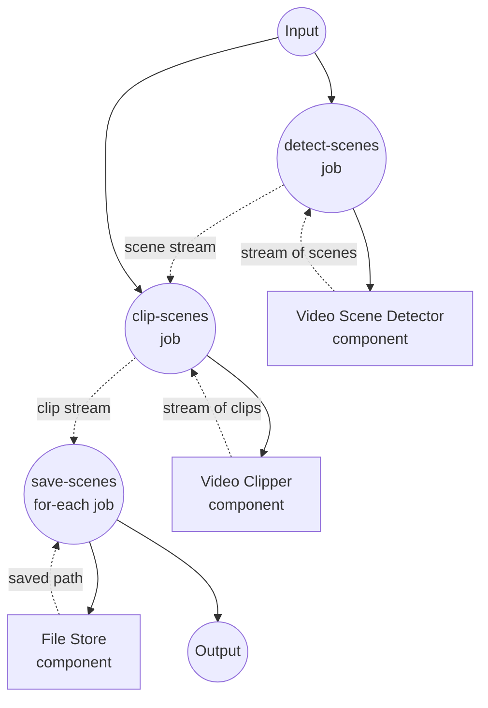

# 视频场景分割示例

此示例演示了一个流式工作流：检测视频中的场景边界，并将每个场景保存为独立的文件。场景检测、剪辑和文件写入都随着数据在管道中流动而并发执行。

## 概述

此工作流通过以下流程运行：

1. **检测场景**：`video-scene-detector`（pyscenedetect 驱动）在检测到场景边界时立即以 `{start_time, end_time}` 对象的形式逐个流式输出
2. **剪辑场景**：`video-clipper`（ffmpeg 驱动）将场景流作为 `span` 输入消费，每个场景产出一个剪辑；通过 `return_timestamp: true` 将源 span 与每个剪辑一同带出
3. **保存场景**：`for-each` 作业消费剪辑流，并以场景的起止时间作为文件名将每个场景写入本地文件存储

由于检测器和剪辑器都以流式方式输出，后续场景仍在检测时，前面的场景已经在剪辑并保存到磁盘。

## 准备工作

### 前置条件

- 已安装 model-compose 并在您的 PATH 中可用
- 本地可用 `ffmpeg`
- 已安装 `pyscenedetect`（`pip install scenedetect[opencv]`）
- 运行工作流的机器可访问的源视频文件

### 环境配置

不需要环境变量。

## 运行方式

1. **启动服务：**
   ```bash
   model-compose up
   ```

   服务将在以下地址启动:
   - API 端点：http://localhost:8080/api
   - Web UI：http://localhost:8081

2. **运行工作流：**

   **使用 API：**
   ```bash
   curl -X POST http://localhost:8080/api/workflows/runs \
     -H "Content-Type: application/json" \
     -d '{"input": {"video": "/absolute/path/to/video.mp4", "threshold": 27.0}}'
   ```

   **使用 Web UI：**
   - 打开 Web UI：http://localhost:8081
   - 上传视频并（可选）调整检测阈值，然后点击"运行工作流"

   **使用 CLI：**
   ```bash
   model-compose run --input '{"video": "/absolute/path/to/video.mp4", "threshold": 27.0}'
   ```

提取的场景将写入 `./output/scenes/scene_<start>-<end>.mp4`。

## 组件详情

### Video Scene Detector 组件 (scene-detector)
- **类型**：`video-scene-detector` 组件
- **驱动**：`pyscenedetect`
- **用途**：从输入视频中逐个流式输出场景边界
- **关键选项**：
  - `video`：源视频媒体
  - `detector`：检测算法（此处为 `adaptive` — 适合大多数内容的默认值）
  - `threshold`：检测灵敏度；值越低产生的场景切分越多
  - `streaming: true`：以异步迭代器（而非列表）方式产出场景

### Video Clipper 组件 (clipper)
- **类型**：`video-clipper` 组件
- **驱动**：`ffmpeg`
- **用途**：使用 `ffmpeg -c copy`（无重编码）为每个场景剪出一个片段
- **关键选项**：
  - `video`：检测器所指向的同一源视频
  - `span`：检测器流式输出的场景列表（每项是 `{start_time, end_time}` 对象）
  - `return_timestamp: true`：将源 span 以 `{video, start_time, end_time}` 形式附加到每个剪辑，便于下游按场景命名文件

### File Store 组件 (storage)
- **类型**：`file-store` 组件
- **驱动**：`local`
- **基路径**：`./output/scenes`
- **用途**：将每个流式场景剪辑持久化为 MP4 文件
- **动作**：使用每个场景的 `path` 和 MP4 `source` 的 `put`

## 工作流详情

### "Split Video Into Per-Scene Files" 工作流（默认）

**描述**：检测场景、按场景剪出片段并将每个片段保存到磁盘 — 全流程流式。

#### 作业流程

1. **detect-scenes**：产生 `{start_time, end_time}` 场景边界流
2. **clip-scenes**：消费场景流，产生 `{video, start_time, end_time}` 剪辑流
3. **save-scenes**：将每个流式剪辑以 `scene_<start>-<end>.mp4` 名称写入本地文件存储



#### 输入参数

| 参数 | 类型 | 必需 | 默认值 | 描述 |
|-----------|------|----------|---------|-------------|
| `video` | video | 是 | - | 要分割为逐场景文件的源视频 |
| `threshold` | number | 否 | `27.0` | 场景检测灵敏度；值越低切分越多 |

#### 输出格式

`save-scenes` for-each 的每次迭代都会产出 `storage` 组件返回的保存路径（`${result.path}`），以 JSON 流式输出。

| 字段 | 类型 | 描述 |
|-------|------|-------------|
| `path` | text | 每个已保存场景剪辑的本地路径 |

## 示例输出

对于检测到三个场景的视频，工作流会生成类似以下文件：

```
output/scenes/scene_0.0-12.5.mp4
output/scenes/scene_12.5-30.083.mp4
output/scenes/scene_30.083-45.2.mp4
```

每个文件会在对应场景被剪出后立即写入，因此下游消费者可以在整个视频分析完成之前就开始处理场景。

## 自定义

- 降低 `threshold`（例如 `20.0`）以检测更细微的场景变化；提高（例如 `35.0`）则只保留强切分
- 将 `scene-detector` 驱动切换为 `ffmpeg`（自有阈值语义）或已训练模型 `transnetv2`
- 将 `storage.base_path` 指向其他目录，或切换到远程存储（S3、GCS、Azure Blob）驱动
- 在 `save-scenes` for-each 主体中插入逐剪辑处理（例如视频编码器或摘要模型）

## 提示

- **无损剪辑**：`video-clipper` 使用 `ffmpeg -c copy`，因此场景切点会对齐到最近的前置关键帧。若需要帧精确剪辑，可随后用 `video-encoder` 重新编码。
- **文件名唯一性**：场景起止时间在视频内是唯一的，因此 `scene_<start>-<end>.mp4` 可安全用作文件名。若希望使用零填充可排序的名称，请相应修改 `for-each` 主体中的 `path` 表达式。
- **阈值调优**：场景检测对内容敏感。先用默认值跑一遍，检查生成的文件，再向上或向下调整 `threshold`。
