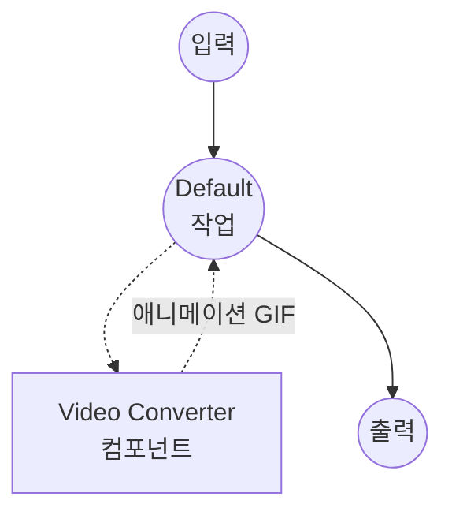
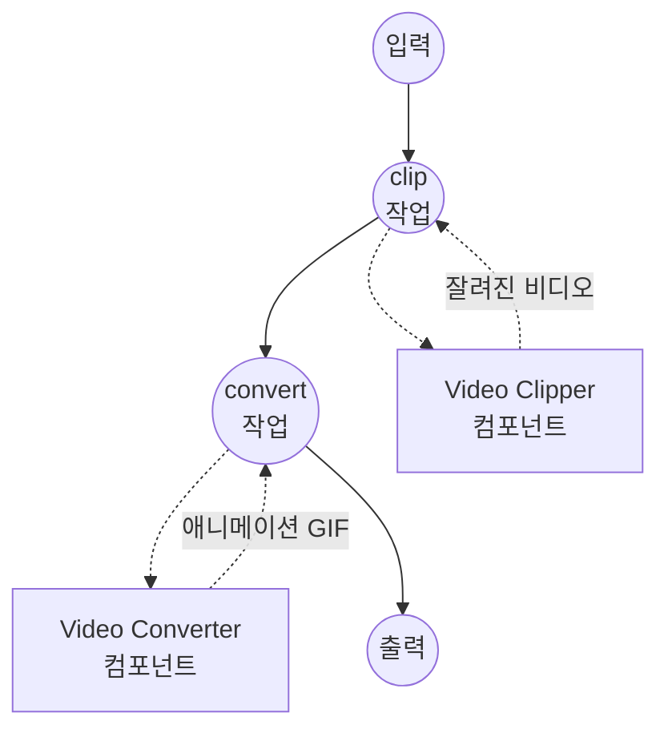

# Video to GIF 예제

이 예제는 `video-converter` 컴포넌트를 사용해 비디오 파일을 애니메이션 GIF로 변환하는 방법을 보여줍니다. 앞단에 `video-clipper`를 붙여 긴 비디오의 특정 구간만 잘라서 짧은 GIF 루프로 만드는 흐름도 함께 시연합니다.

## 개요

이 워크플로우 세트는 다음 두 가지 GIF 파이프라인을 제공합니다:

1. **Video to GIF**: 프레임 레이트와 해상도를 설정해 비디오 파일 전체를 애니메이션 GIF로 변환합니다.
2. **Trim and Convert to GIF**: 긴 비디오에서 특정 시간 구간을 먼저 잘라낸 뒤, 그 구간만 애니메이션 GIF로 변환합니다. "영상 클립을 짧은 GIF 루프로 만들고 싶다"는 전형적인 흐름입니다.

내부적으로 ffmpeg 드라이버는 각 클립에 최적화된 팔레트를 생성(`palettegen` + `paletteuse`)하므로, 기본 256색 웹 팔레트를 사용할 때보다 결과물이 눈에 띄게 깔끔합니다. GIF에는 오디오 트랙이 없으므로 오디오는 자동으로 제거됩니다.

## 준비사항

### 필수 요구사항

- model-compose가 설치되어 PATH에서 사용 가능
- [ffmpeg](https://ffmpeg.org/)가 설치되어 PATH에서 사용 가능

### 환경 구성

1. 이 예제 디렉토리로 이동:
   ```bash
   cd examples/media-processing/video-to-gif
   ```

2. ffmpeg 설치 확인:
   ```bash
   ffmpeg -version
   ```

## 실행 방법

1. **서비스 시작:**
   ```bash
   model-compose up
   ```

2. **워크플로우 실행:**

   **웹 UI 사용:**
   - Web UI 열기: http://localhost:8081
   - "Video to GIF" 또는 "Trim and Convert to GIF" 중 선택
   - 비디오를 업로드하고 fps/해상도(그리고 trim 워크플로우에서는 시작/끝 시간)를 조정
   - "Run Workflow" 버튼 클릭 후 결과 GIF 다운로드

   **API 사용:**
   ```bash
   # 비디오 전체 변환
   curl -X POST http://localhost:8080/api/workflows/convert/runs \
     -F "video=@input.mp4" \
     -F "fps=12" \
     -F "resolution=480x-1"

   # 먼저 자르고 나서 변환
   curl -X POST http://localhost:8080/api/workflows/clip-to-gif/runs \
     -F "video=@input.mp4" \
     -F "start_time=00:00:10" \
     -F "end_time=00:00:15" \
     -F "fps=15" \
     -F "resolution=640x-1"
   ```

   **CLI 사용:**
   ```bash
   model-compose run convert --input '{"video": "path/to/input.mp4", "fps": 12, "resolution": "480x-1"}'
   ```

## 컴포넌트 세부사항

### Video Clipper 컴포넌트
- **유형**: `video-clipper`
- **드라이버**: ffmpeg
- **목적**: 원본 비디오에서 지정된 시간 구간을 잘라내어 GIF 변환기로 넘깁니다.

### Video Converter 컴포넌트
- **유형**: `video-converter`
- **드라이버**: ffmpeg
- **목적**: (필요 시 잘려진) 비디오를 애니메이션 GIF로 인코딩합니다. `encoding.format`이 `gif`이면 드라이버가 팔레트 최적화 인코딩을 활성화하고 오디오 트랙을 제거합니다.

## 워크플로우 세부사항

### "Video to GIF" 워크플로우

**설명**: 비디오 파일을 애니메이션 GIF로 변환합니다.

#### 작업 흐름



#### 입력 매개변수

| 매개변수 | 유형 | 필수 | 기본값 | 설명 |
|---------|------|------|--------|------|
| `video` | video | 예 | - | 원본 비디오 파일 |
| `fps` | select | 아니오 | `12` | GIF 프레임 레이트: 8, 10, 12, 15, 20, 24 |
| `resolution` | select | 아니오 | `480x-1` | GIF 해상도; `-1`을 어느 한쪽 축에 두면 원본 비율을 유지 |

#### 출력 형식

| 필드 | 유형 | 설명 |
|-----|------|------|
| `gif` | video | 애니메이션 GIF 파일 |

### "Trim and Convert to GIF" 워크플로우

**설명**: 긴 비디오에서 시간 구간을 잘라낸 뒤, 그 구간만 애니메이션 GIF로 변환합니다.

#### 작업 흐름



#### 입력 매개변수

| 매개변수 | 유형 | 필수 | 기본값 | 설명 |
|---------|------|------|--------|------|
| `video` | video | 예 | - | 원본 비디오 파일 |
| `start_time` | duration | 아니오 | `0s` | 변환할 구간의 시작 시각 |
| `end_time` | duration | 아니오 | `5s` | 변환할 구간의 종료 시각 |
| `fps` | select | 아니오 | `12` | GIF 프레임 레이트: 8, 10, 12, 15, 20, 24 |
| `resolution` | select | 아니오 | `480x-1` | GIF 해상도; `-1`을 어느 한쪽 축에 두면 원본 비율을 유지 |

#### 출력 형식

| 필드 | 유형 | 설명 |
|-----|------|------|
| `gif` | video | 애니메이션 GIF 파일 |

## 팁

- **짧게 유지하세요.** GIF 파일 크기는 금방 커집니다. 480px 폭 / 12 fps로 5초 클립 정도가 좋은 출발점이며, 크기·fps·길이는 한 단계씩 늘려가는 편이 안전합니다.
- **해상도의 `-1`.** 한쪽 축에 `-1`(예: `480x-1`)을 넣으면 ffmpeg가 원본 비율에 맞춰 나머지 축을 자동 계산합니다. 프레임을 고정하고 싶다면 `480x360`처럼 `WIDTHxHEIGHT`를 직접 지정하세요.
- **낮은 fps라고 화질이 나빠지지 않습니다.** 10–15 fps GIF가 오히려 24 fps 이상의 GIF보다 깔끔해 보이는 경우가 많은데, 각 프레임이 최종 파일에서 팔레트를 더 여유롭게 나눠 쓰기 때문입니다.

## 문제 해결

### 일반적인 문제

1. **ffmpeg를 찾을 수 없음**: ffmpeg가 설치되어 PATH에서 사용 가능한지 확인하세요.
2. **출력 GIF가 너무 큼**: `fps`를 낮추거나 `resolution`을 줄이거나, "Trim and Convert to GIF" 워크플로우로 더 짧은 구간을 잘라보세요.
3. **색상에 밴딩이 보임**: `resolution`을 조금 더 키워보세요. 프레임이 너무 작으면 팔레트 최적화가 활용할 여지도 줄어듭니다.
