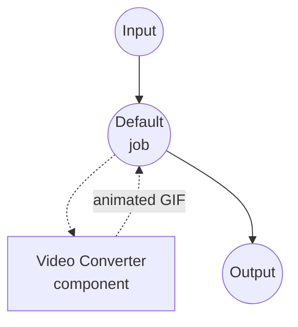
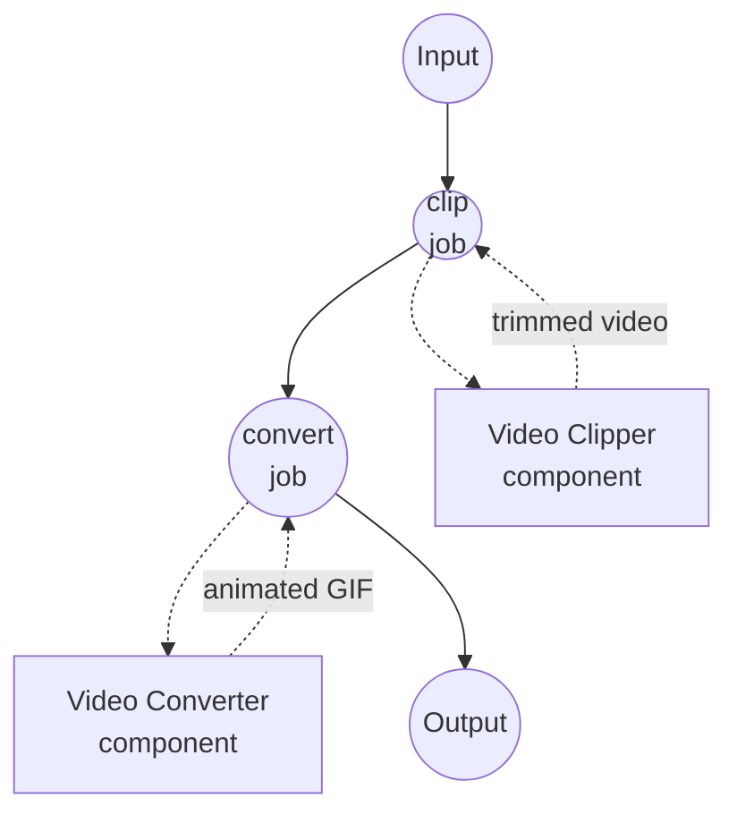

# Video to GIF Example

This example demonstrates converting a video file to an animated GIF using the `video-converter` component. It also shows how to chain `video-clipper` in front of the converter to turn a specific segment of a longer video into a short GIF loop.

## Overview

This workflow set provides two GIF pipelines:

1. **Video to GIF**: Convert an entire video file to an animated GIF with configurable frame rate and resolution.
2. **Trim and Convert to GIF**: Clip a time range out of a longer video first, then convert only that segment to an animated GIF — the typical "make me a short GIF loop from a movie clip" flow.

Behind the scenes the ffmpeg driver builds an optimized per-clip palette (`palettegen` + `paletteuse`) so the output looks noticeably better than the default 256-color web palette. Audio is dropped automatically because GIF has no audio track.

## Preparation

### Prerequisites

- model-compose installed and available in your PATH
- [ffmpeg](https://ffmpeg.org/) installed and available in your PATH

### Environment Configuration

1. Navigate to this example directory:
   ```bash
   cd examples/media-processing/video-to-gif
   ```

2. Verify ffmpeg is installed:
   ```bash
   ffmpeg -version
   ```

## How to Run

1. **Start the service:**
   ```bash
   model-compose up
   ```

2. **Run a workflow:**

   **Using Web UI:**
   - Open the Web UI: http://localhost:8081
   - Pick either "Video to GIF" or "Trim and Convert to GIF"
   - Upload a video, adjust fps/resolution (and start/end time for the trim workflow)
   - Click "Run Workflow" and download the resulting GIF

   **Using API:**
   ```bash
   # Convert the whole video
   curl -X POST http://localhost:8080/api/workflows/convert/runs \
     -F "video=@input.mp4" \
     -F "fps=12" \
     -F "resolution=480x-1"

   # Trim first, then convert
   curl -X POST http://localhost:8080/api/workflows/clip-to-gif/runs \
     -F "video=@input.mp4" \
     -F "start_time=00:00:10" \
     -F "end_time=00:00:15" \
     -F "fps=15" \
     -F "resolution=640x-1"
   ```

   **Using CLI:**
   ```bash
   model-compose run convert --input '{"video": "path/to/input.mp4", "fps": 12, "resolution": "480x-1"}'
   ```

## Component Details

### Video Clipper Component
- **Type**: `video-clipper`
- **Driver**: ffmpeg
- **Purpose**: Extract a single time range from the source video before it reaches the GIF converter.

### Video Converter Component
- **Type**: `video-converter`
- **Driver**: ffmpeg
- **Purpose**: Encode the (possibly trimmed) video to an animated GIF. When `encoding.format` is `gif`, the driver enables palette-optimized encoding and drops the audio track.

## Workflow Details

### "Video to GIF" Workflow

**Description**: Converts a video file to an animated GIF.

#### Job Flow



#### Input Parameters

| Parameter | Type | Required | Default | Description |
|-----------|------|----------|---------|-------------|
| `video` | video | Yes | - | The source video file |
| `fps` | select | No | `12` | GIF frame rate: 8, 10, 12, 15, 20, 24 |
| `resolution` | select | No | `480x-1` | GIF resolution; `-1` on either axis preserves aspect ratio |

#### Output Format

| Field | Type | Description |
|-------|------|-------------|
| `gif` | video | The animated GIF file |

### "Trim and Convert to GIF" Workflow

**Description**: Extracts a time range out of a longer video and converts only that segment to an animated GIF.

#### Job Flow



#### Input Parameters

| Parameter | Type | Required | Default | Description |
|-----------|------|----------|---------|-------------|
| `video` | video | Yes | - | The source video file |
| `start_time` | duration | No | `0s` | Start of the segment to convert |
| `end_time` | duration | No | `5s` | End of the segment to convert |
| `fps` | select | No | `12` | GIF frame rate: 8, 10, 12, 15, 20, 24 |
| `resolution` | select | No | `480x-1` | GIF resolution; `-1` on either axis preserves aspect ratio |

#### Output Format

| Field | Type | Description |
|-------|------|-------------|
| `gif` | video | The animated GIF file |

## Tips

- **Keep it short.** GIF files grow quickly. A 5-second clip at 480px wide / 12 fps is a good starting point; go up in size, fps, or duration one step at a time.
- **`-1` in resolution.** Pass `-1` on either axis (e.g. `480x-1`) to let ffmpeg pick the matching dimension while preserving the source aspect ratio. Use exact `WIDTHxHEIGHT` (e.g. `480x360`) if you need a fixed frame instead.
- **Lower fps ≠ worse-looking.** GIFs at 10–15 fps often look better than 24+ fps because each frame gets more palette room in the final file.

## Troubleshooting

### Common Issues

1. **ffmpeg Not Found**: Ensure ffmpeg is installed and available in your PATH.
2. **Output GIF Too Large**: Reduce `fps`, shrink `resolution`, or trim a shorter segment with the "Trim and Convert to GIF" workflow.
3. **Colors Look Banded**: Try a higher `resolution` — palette optimization has more room to work with when the frames aren't tiny.
