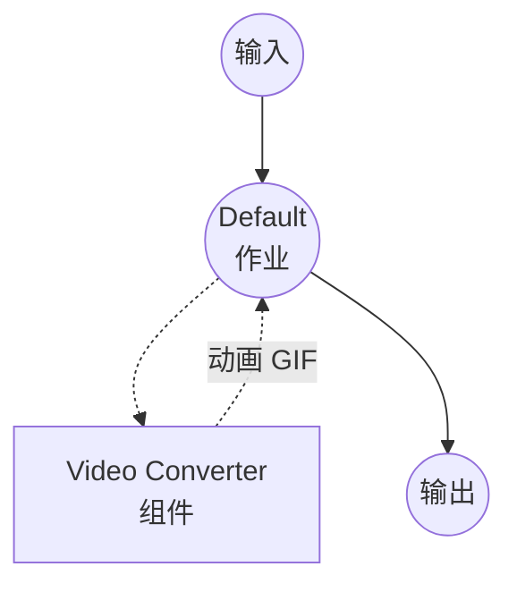
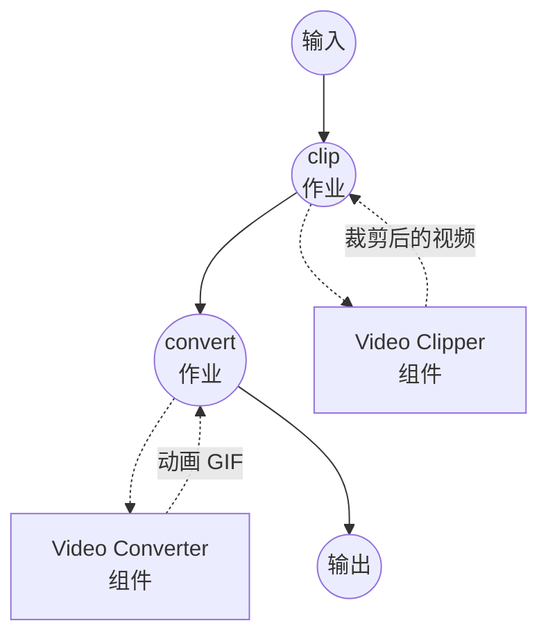

# Video to GIF 示例

此示例演示了使用 `video-converter` 组件将视频文件转换为动画 GIF 的方法。示例中还会在转换器前串接 `video-clipper`，将较长视频中的某一段裁剪出来做成短的 GIF 循环。

## 概述

此工作流集提供两条 GIF 流水线：

1. **Video to GIF**：使用可配置的帧率和分辨率，将整个视频文件转换为动画 GIF。
2. **Trim and Convert to GIF**：先从较长的视频中裁剪出一段时间区间，然后只将该区间转换为动画 GIF —— 也就是"从视频片段做一个短 GIF 循环"的典型场景。

在底层，ffmpeg 驱动会为每个片段构建优化过的调色板（`palettegen` + `paletteuse`），因此输出画质明显优于默认的 256 色 Web 调色板。由于 GIF 没有音频轨，音频会被自动丢弃。

## 准备工作

### 前置条件

- 已安装 model-compose 并在您的 PATH 中可用
- 已安装 [ffmpeg](https://ffmpeg.org/) 并在您的 PATH 中可用

### 环境配置

1. 导航到此示例目录：
   ```bash
   cd examples/media-processing/video-to-gif
   ```

2. 验证 ffmpeg 已安装：
   ```bash
   ffmpeg -version
   ```

## 运行方式

1. **启动服务：**
   ```bash
   model-compose up
   ```

2. **运行工作流：**

   **使用 Web UI：**
   - 打开 Web UI：http://localhost:8081
   - 选择 "Video to GIF" 或 "Trim and Convert to GIF"
   - 上传视频，调整 fps/分辨率（trim 工作流还需要设置起止时间）
   - 点击 "Run Workflow" 按钮并下载生成的 GIF

   **使用 API：**
   ```bash
   # 转换整个视频
   curl -X POST http://localhost:8080/api/workflows/convert/runs \
     -F "video=@input.mp4" \
     -F "fps=12" \
     -F "resolution=480x-1"

   # 先裁剪再转换
   curl -X POST http://localhost:8080/api/workflows/clip-to-gif/runs \
     -F "video=@input.mp4" \
     -F "start_time=00:00:10" \
     -F "end_time=00:00:15" \
     -F "fps=15" \
     -F "resolution=640x-1"
   ```

   **使用 CLI：**
   ```bash
   model-compose run convert --input '{"video": "path/to/input.mp4", "fps": 12, "resolution": "480x-1"}'
   ```

## 组件详情

### Video Clipper 组件
- **类型**：`video-clipper`
- **驱动**：ffmpeg
- **用途**：从源视频中截取指定时间区间，再交给 GIF 转换器。

### Video Converter 组件
- **类型**：`video-converter`
- **驱动**：ffmpeg
- **用途**：将（可能已裁剪的）视频编码为动画 GIF。当 `encoding.format` 为 `gif` 时，驱动会启用调色板优化编码并丢弃音频轨。

## 工作流详情

### "Video to GIF" 工作流

**描述**：将视频文件转换为动画 GIF。

#### 作业流程



#### 输入参数

| 参数 | 类型 | 必需 | 默认值 | 描述 |
|-----|------|-----|-------|------|
| `video` | video | 是 | - | 源视频文件 |
| `fps` | select | 否 | `12` | GIF 帧率：8、10、12、15、20、24 |
| `resolution` | select | 否 | `480x-1` | GIF 分辨率；任一轴设为 `-1` 可保持原始宽高比 |

#### 输出格式

| 字段 | 类型 | 描述 |
|-----|------|------|
| `gif` | video | 动画 GIF 文件 |

### "Trim and Convert to GIF" 工作流

**描述**：从较长视频中裁剪出一段时间区间，然后仅将该区间转换为动画 GIF。

#### 作业流程



#### 输入参数

| 参数 | 类型 | 必需 | 默认值 | 描述 |
|-----|------|-----|-------|------|
| `video` | video | 是 | - | 源视频文件 |
| `start_time` | duration | 否 | `0s` | 待转换区间的起始时间 |
| `end_time` | duration | 否 | `5s` | 待转换区间的结束时间 |
| `fps` | select | 否 | `12` | GIF 帧率：8、10、12、15、20、24 |
| `resolution` | select | 否 | `480x-1` | GIF 分辨率；任一轴设为 `-1` 可保持原始宽高比 |

#### 输出格式

| 字段 | 类型 | 描述 |
|-----|------|------|
| `gif` | video | 动画 GIF 文件 |

## 提示

- **保持简短。** GIF 文件体积增长得很快。480px 宽 / 12 fps 的 5 秒片段是一个不错的起点，尺寸、fps、时长最好一次只调一档。
- **分辨率中的 `-1`。** 任一轴使用 `-1`（例如 `480x-1`），ffmpeg 会按原始宽高比自动计算另一轴。若需要固定画幅，可直接给出 `WIDTHxHEIGHT`（例如 `480x360`）。
- **低 fps 并不等于画质差。** 10–15 fps 的 GIF 往往比 24+ fps 的 GIF 看起来更干净，因为每一帧在最终文件中可以更宽裕地使用调色板。

## 故障排除

### 常见问题

1. **找不到 ffmpeg**：确保 ffmpeg 已安装并在您的 PATH 中可用。
2. **输出 GIF 过大**：降低 `fps`、缩小 `resolution`，或用 "Trim and Convert to GIF" 工作流截取更短的片段。
3. **颜色出现条带**：尝试提高 `resolution`；帧太小会让调色板优化的可用空间变少。
