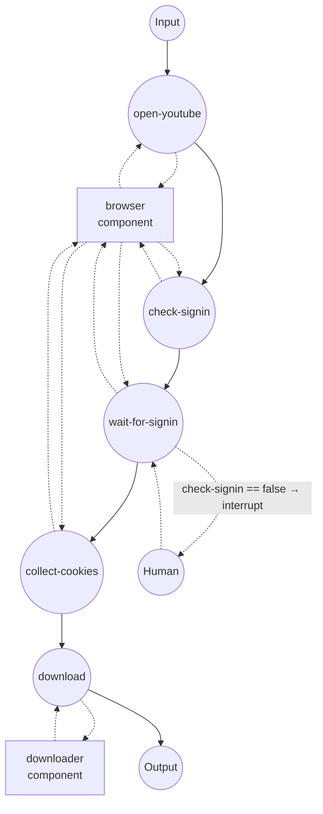

# YouTube Downloader (Authenticated)

Download a YouTube video (or its audio track) using the session cookies
of a locally-attached Chrome browser. Use this when a video is
age-gated, region-restricted, or otherwise requires a signed-in
account that yt-dlp on its own cannot access.

## Overview

Two components cooperate:

1. **`browser` (`web-browser` / `chrome`)** — attaches to a Chrome you
   launched with `--remote-debugging-port=9222`. You sign into
   YouTube once in that window; the workflow then reads back the
   cookies YouTube set for your session.
2. **`downloader` (`media-downloader` / `ytdlp`)** — receives those
   cookies as a list and hands them to yt-dlp, which downloads the
   video (or audio) using your authenticated session.

The cookie format returned by `web-browser`'s `get-cookies` is the
same shape `media-downloader` expects, so you can wire one directly
into the other without any conversion step.

## Preparation

### Prerequisites

- model-compose installed and available in your PATH
- Google Chrome (or Chromium) installed
- `yt-dlp` — installed automatically on first run via the driver's
  setup requirements
- `ffmpeg` on your PATH (required for audio extraction and for merging
  separate video/audio streams)
- A JS runtime — YouTube's current anti-bot flow (`n challenge`)
  requires yt-dlp to execute a JavaScript solver. Install `deno`
  (recommended) or another runtime yt-dlp supports:
  ```bash
  brew install deno    # macOS
  ```
  Without a JS runtime yt-dlp falls back to "images only" and the
  download fails with `Requested format is not available`.

### Launch Chrome with remote debugging

Start Chrome in a dedicated profile so it doesn't collide with your
day-to-day browser session:

**macOS**
```bash
/Applications/Google\ Chrome.app/Contents/MacOS/Google\ Chrome \
  --remote-debugging-port=9222 \
  --user-data-dir=/tmp/chrome-yt-profile
```

**Linux**
```bash
google-chrome \
  --remote-debugging-port=9222 \
  --user-data-dir=/tmp/chrome-yt-profile
```

**Windows (PowerShell)**
```powershell
& "C:\Program Files\Google\Chrome\Application\chrome.exe" `
  --remote-debugging-port=9222 `
  --user-data-dir=$env:TEMP\chrome-yt-profile
```

Leave that window open. Once you sign into YouTube in it, the session
persists across workflow runs (until you clear the profile or Google
expires the cookies).

## How to Run

1. **Start the controller:**
   ```bash
   model-compose up
   ```

2. **Run a workflow:**

   **Using API:**
   ```bash
   curl -X POST http://localhost:8080/api/workflows/runs \
     -H "Content-Type: application/json" \
     -d '{
       "workflow_id": "download-youtube-video",
       "input": {
         "url": "https://www.youtube.com/watch?v=dQw4w9WgXcQ"
       }
     }'
   ```

   **Using Web UI:**
   - Open http://localhost:8081
   - Enter the video URL and (optionally) `video_format`
   - Click Run

   **Using CLI:**
   ```bash
   model-compose run download-youtube-video \
     --input '{"url": "https://www.youtube.com/watch?v=dQw4w9WgXcQ"}'
   ```

3. **If the workflow pauses:**
   - The `check-signin` job probes the page for the account avatar. If
     it's not there (no signed-in session), `wait-for-signin`
     interrupts before it runs.
   - Switch to the Chrome window at localhost:9222, sign into YouTube,
     then click Resume in the Web UI or send a resume request via
     the API.
   - The workflow then waits for the avatar to appear before
     collecting cookies and handing off to yt-dlp.
   - When Chrome already has a valid YouTube session (typical after
     the first run), `check-signin` returns true and the interrupt is
     skipped entirely.

4. **Stop the controller:**
   ```bash
   model-compose down
   ```

## Workflow Details

### "Download a YouTube video" Workflow

**Description**: Sign into YouTube in the attached Chrome (only if the
session isn't already warm), hand the resulting session cookies to
yt-dlp, and download the requested video.

#### Job Flow



#### Input Parameters

| Parameter | Type | Required | Default | Description |
|-----------|------|----------|---------|-------------|
| `url` | string | Yes | — | YouTube video URL |
| `video_format` | string | No | `mp4` | Container for merged output (`mp4`, `webm`, `mkv`) |

#### Output Format

| Field | Type | Description |
|-------|------|-------------|
| `video` | video stream | Downloaded video file, streamed back |

The Web UI renders an inline player; the HTTP API returns the stream
with the correct content type.

## Component Details

### `browser` — web-browser (Chrome via CDP)

Attaches to Chrome over the DevTools Protocol at `localhost:9222`. No
browser is launched by model-compose — you own the browser process,
which is what lets you complete sign-in, 2FA, and any CAPTCHA
challenges manually.

Actions:

| Action | Method | Description |
|--------|--------|-------------|
| `navigate` | `navigate` | Open a URL and wait until the DOM is parsed |
| `check-signin` | `evaluate` | Poll the page for up to 5 seconds and return `true` if the account avatar is present |
| `wait-for-avatar` | `wait-for` | Wait until the YouTube avatar button becomes visible (up to 5 minutes) |
| `get-youtube-cookies` | `get-cookies` | Return cookies scoped to `youtube.com` and `accounts.google.com` |

### `downloader` — media-downloader (yt-dlp)

Runs yt-dlp with the cookies received from the browser. yt-dlp writes
them into a temporary Netscape cookie file, preserving each cookie's
domain, path, secure flag, and expiry, so authenticated requests to
`youtube.com` succeed exactly as they would from the browser.

## Notes on Cookies

The cookie objects returned by `web-browser`'s `get-cookies` — with
`name`, `value`, `domain`, `path`, `secure`, `expires`, etc. — are
what `media-downloader` accepts directly on its `cookies` field. This
is the same shape the Chrome DevTools Protocol and Playwright use, so
you can chain other cookie sources (a stored fixture, a
`set-cookies`-style seed) into the downloader in the same way.

If you don't need authentication (public videos), you can drop the
first four jobs and call `download` with an empty `cookies` field —
or just use the standalone `media-processing/media-downloader`
example.

## Troubleshooting

- **`wait-for-avatar` times out**: The Chrome window may not actually
  be at YouTube, or you're not signed in. Navigate to
  https://www.youtube.com/ in the attached window, sign in, then
  retry the workflow.
- **CDP connection refused**: Chrome wasn't launched with
  `--remote-debugging-port=9222`, or another process is using the
  port. Check with `lsof -i :9222`.
- **`Requested format is not available` / "Only images are available"**:
  yt-dlp couldn't solve YouTube's `n challenge`. Install a JS
  runtime such as `deno` (see Prerequisites) and re-run.
- **yt-dlp errors about `sign in to confirm your age`**: The cookies
  didn't cover the account. Make sure the Chrome profile is signed
  into a Google account with age verification completed.
- **Web UI player takes a long time to appear after download**: Gradio
  transcodes the file to a browser-compatible codec when the source
  is AV1 or VP9. A long 4K clip can take many minutes on CPU. If the
  wait is unacceptable, override `format_selector` on the download
  action to prefer H.264 (`vcodec^=avc1`).
