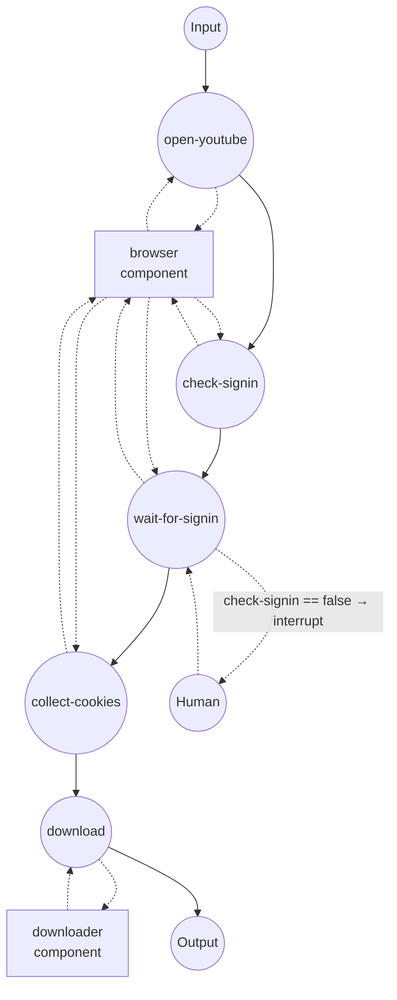

# YouTube 下载器（基于已登录会话）

使用本地运行的 Chrome 浏览器的会话 Cookie 下载 YouTube 视频。适用于
需要登录才能访问的视频，例如年龄限制、地区限制或其他 yt-dlp 单独
无法访问的内容。

## 概览

两个组件协同工作：

1. **`browser` (`web-browser` / `chrome`)** — 附加到用户以
   `--remote-debugging-port=9222` 启动的 Chrome 实例。你只需在该窗口
   中登录一次 YouTube，工作流就能读取到会话 Cookie。
2. **`downloader` (`media-downloader` / `ytdlp`)** — 直接接收 Cookie
   列表并交给 yt-dlp，用已登录的会话下载视频。

`web-browser` 的 `get-cookies` 返回的 Cookie 结构与 `media-downloader`
所期望的完全一致，因此可以直接串联，无需任何转换步骤。

## 准备

### 前置条件

- 已安装 model-compose 并加入 PATH
- 已安装 Google Chrome（或 Chromium）
- `yt-dlp` — 首次运行时通过驱动的 setup requirement 自动安装
- `ffmpeg` 位于 PATH（音频提取以及分离视频/音频流的合并都需要它）
- JS 运行时 — YouTube 当前的反爬机制（`n challenge`）要求 yt-dlp
  执行一个 JavaScript 求解器。请安装 `deno`（推荐）或 yt-dlp 支持的
  其他运行时：
  ```bash
  brew install deno    # macOS
  ```
  没有 JS 运行时时 yt-dlp 会退化为“仅图像”并以
  `Requested format is not available` 报错。

### 以远程调试模式启动 Chrome

使用独立的用户目录，避免与日常浏览器会话冲突：

**macOS**
```bash
/Applications/Google\ Chrome.app/Contents/MacOS/Google\ Chrome \
  --remote-debugging-port=9222 \
  --user-data-dir=/tmp/chrome-yt-profile
```

**Linux**
```bash
google-chrome \
  --remote-debugging-port=9222 \
  --user-data-dir=/tmp/chrome-yt-profile
```

**Windows (PowerShell)**
```powershell
& "C:\Program Files\Google\Chrome\Application\chrome.exe" `
  --remote-debugging-port=9222 `
  --user-data-dir=$env:TEMP\chrome-yt-profile
```

保持该窗口打开。一旦在其中登录 YouTube，会话就会在多次工作流运行之间
持续（直到清除该用户目录或 Google 让 Cookie 过期）。

## 运行方式

1. **启动控制器：**
   ```bash
   model-compose up
   ```

2. **运行工作流：**

   **通过 API：**
   ```bash
   curl -X POST http://localhost:8080/api/workflows/runs \
     -H "Content-Type: application/json" \
     -d '{
       "workflow_id": "download-youtube-video",
       "input": {
         "url": "https://www.youtube.com/watch?v=dQw4w9WgXcQ"
       }
     }'
   ```

   **通过 Web UI：**
   - 打开 http://localhost:8081
   - 输入视频 URL（可选：`video_format`）
   - 点击 Run

   **通过 CLI：**
   ```bash
   model-compose run download-youtube-video \
     --input '{"url": "https://www.youtube.com/watch?v=dQw4w9WgXcQ"}'
   ```

3. **当工作流暂停时：**
   - `check-signin` 任务检查页面中是否存在账户头像。如果不存在
     （未登录），`wait-for-signin` 任务会在执行前触发中断。
   - 切换到 attach 在 localhost:9222 的 Chrome 窗口，登录 YouTube，
     然后在 Web UI 点击 Resume，或通过 API 发送 resume 请求。
   - 之后工作流会等到头像出现，再收集 Cookie 并交给 yt-dlp。
   - 当 Chrome 已经有有效的 YouTube 会话时（首次运行之后通常如此），
     `check-signin` 返回 true，中断会被完全跳过。

4. **停止控制器：**
   ```bash
   model-compose down
   ```

## 工作流详情

### "Download a YouTube video" 工作流

**描述**：仅在需要时通过 attach 的 Chrome 登录 YouTube，将获得的会话
Cookie 交给 yt-dlp，下载请求的视频。

#### 任务流程



#### 输入参数

| 参数 | 类型 | 必填 | 默认值 | 说明 |
|-----------|------|----------|---------|-------------|
| `url` | string | 是 | — | YouTube 视频 URL |
| `video_format` | string | 否 | `mp4` | 合并输出的容器（`mp4`、`webm`、`mkv`） |

#### 输出格式

| 字段 | 类型 | 说明 |
|-------|------|-------------|
| `video` | video stream | 下载后的视频文件，以流形式返回 |

Web UI 会嵌入播放器直接播放；HTTP API 会以正确的 content type 返回
数据流。

## 组件详情

### `browser` — web-browser（通过 CDP 连接 Chrome）

通过 Chrome DevTools Protocol 附加到 `localhost:9222`。model-compose
不会主动启动浏览器 — 用户拥有该浏览器进程，因此可以手动完成登录、
2FA 和 CAPTCHA。

动作：

| 动作 | 方法 | 说明 |
|--------|--------|-------------|
| `navigate` | `navigate` | 打开 URL 并等待 DOM 解析完成 |
| `check-signin` | `evaluate` | 最多 5 秒轮询页面，若存在账户头像则返回 `true` |
| `wait-for-avatar` | `wait-for` | 等待 YouTube 头像按钮可见（最多 5 分钟） |
| `get-youtube-cookies` | `get-cookies` | 返回作用域为 `youtube.com` 和 `accounts.google.com` 的 Cookie |

### `downloader` — media-downloader（yt-dlp）

使用从浏览器获取的 Cookie 运行 yt-dlp。yt-dlp 会将这些 Cookie 写入
临时 Netscape 格式的 Cookie 文件，保留每条 Cookie 的 domain、path、
secure 标志和过期时间，从而让对 `youtube.com` 的已登录请求与浏览器
中完全一致地成功。

## 关于 Cookie 的说明

`web-browser` 的 `get-cookies` 返回的 Cookie 对象 — 包含 `name`、
`value`、`domain`、`path`、`secure`、`expires` 等字段 — 就是
`media-downloader` 的 `cookies` 字段所接受的形状。这与 Chrome
DevTools Protocol 和 Playwright 使用的结构一致，因此其他 Cookie 来源
（存储的固件、通过 `set-cookies` 注入的种子等）也可以用相同方式接入
downloader。

如果不需要认证（公开视频），可以删除前四个任务，并给 `download` 传入
空的 `cookies` 字段 — 或直接使用独立示例
`media-processing/media-downloader`。

## 故障排查

- **`wait-for-avatar` 超时**：附加的 Chrome 窗口可能未处于 YouTube 页面，
  或未登录。请在该窗口中打开 https://www.youtube.com/ ，登录后重新
  运行工作流。
- **CDP 连接被拒绝**：Chrome 未以 `--remote-debugging-port=9222` 启动，
  或该端口已被其他进程占用。可用 `lsof -i :9222` 检查。
- **`Requested format is not available` / "Only images are available"**：
  yt-dlp 无法解决 YouTube 的 `n challenge`。请安装如 `deno` 之类的 JS
  运行时（参见前置条件）并重试。
- **yt-dlp 报 `sign in to confirm your age`**：Cookie 未覆盖该账户。
  请确认 Chrome 用户目录中登录的 Google 账户已完成年龄验证。
- **下载完成后 Web UI 播放器很久才出现**：当源视频为 AV1 或 VP9 时，
  Gradio 会将其转码为浏览器兼容的编码。长的 4K 视频在 CPU 编码下可能
  耗时数分钟。若无法接受等待时间，可覆写 download 动作的
  `format_selector`，优先选择 H.264（`vcodec^=avc1`）。
