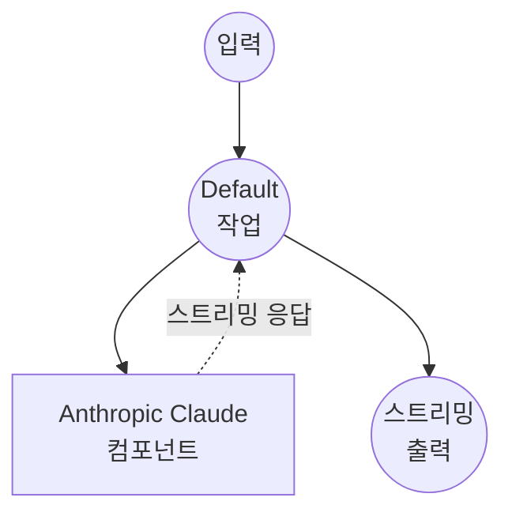

# Anthropic Chat Completions Stream 예제

이 예제는 Messages API를 통해 Anthropic의 Claude 모델을 사용하여 실시간 스트리밍 응답이 가능한 채팅 인터페이스를 만드는 방법을 보여줍니다.

## 개요

이 워크플로우는 다음과 같은 스트리밍 채팅 인터페이스를 제공합니다:

1. **스트리밍 Chat Completion**: 사용자 프롬프트를 받아 Anthropic의 Claude 모델을 사용하여 실시간 스트리밍 응답 생성
2. **Server-Sent Events**: 실시간 사용자 경험을 위한 SSE(Server-Sent Events)로 응답 전달
3. **모델 선택**: Claude Sonnet, Haiku, Opus 모델 중 선택 가능

## 준비사항

### 필수 요구사항

- model-compose가 설치되어 PATH에서 사용 가능
- Anthropic API 키

### 환경 구성

1. 이 예제 디렉토리로 이동:
   ```bash
   cd examples/model-providers/anthropic/anthropic-chat-completions-stream
   ```

2. 샘플 환경 파일 복사:
   ```bash
   cp .env.sample .env
   ```

3. `.env` 파일을 편집하여 Anthropic API 키 추가:
   ```env
   ANTHROPIC_API_KEY=your-actual-anthropic-api-key
   ```

## 실행 방법

1. **서비스 시작:**
   ```bash
   model-compose up
   ```

2. **워크플로우 실행:**

   **API 사용:**
   ```bash
   curl -X POST http://localhost:8080/api/workflows/runs \
     -H "Content-Type: application/json" \
     -d '{
       "input": {
         "prompt": "Explain machine learning in simple terms",
         "max_tokens": 1024
       }
     }'
   ```

   **웹 UI 사용:**
   - 웹 UI 열기: http://localhost:8081
   - 프롬프트 및 설정 입력
   - "Run Workflow" 버튼 클릭

   **CLI 사용:**
   ```bash
   model-compose run --input '{
     "prompt": "Explain machine learning in simple terms",
     "max_tokens": 1024
   }'
   ```

## 컴포넌트 세부사항

### Anthropic HTTP Client 컴포넌트 (기본)
- **유형**: HTTP client 컴포넌트
- **목적**: 스트리밍 chat completion을 통한 AI 기반 텍스트 생성
- **API**: Anthropic Messages API
- **엔드포인트**: `https://api.anthropic.com/v1/messages`
- **기능**:
  - `stream: true`를 사용한 실시간 스트리밍 응답
  - 선택 가능한 Claude 모델 (Sonnet, Haiku, Opus)
  - 웹 애플리케이션을 위한 Server-Sent Events 출력 형식
  - delta 콘텐츠 추출을 위한 JSON 스트림 파싱

## 워크플로우 세부사항

### "Chat with Anthropic Claude" 워크플로우 (기본)

**설명**: Anthropic의 Claude를 사용하여 스트리밍 텍스트 응답 생성

#### 작업 흐름

이 예제는 명시적인 작업 없이 단순화된 단일 컴포넌트 구성을 사용합니다.



#### 입력 매개변수

| 매개변수 | 유형 | 필수 | 기본값 | 설명 |
|---------|------|------|--------|------|
| `prompt` | text | 예 | - | AI에 전송할 사용자 메시지 |
| `model` | select | 아니오 | claude-sonnet-4-20250514 | 사용할 Claude 모델 (Sonnet, Haiku, Opus) |
| `max_tokens` | number | 아니오 | 1024 | 응답의 최대 토큰 수 |

#### 출력 형식

| 필드 | 유형 | 설명 |
|-----|------|------|
| - | text (sse-text) | Server-Sent Events 스트림으로 전달되는 AI 생성 응답 텍스트 |

## 스트리밍 기능

이 예제는 표준 chat completions와 다음과 같은 차이점을 제공합니다:

- **실시간 스트리밍**: 생성되는 대로 응답이 점진적으로 전달됨
- **SSE 형식**: 웹 브라우저 호환성을 위해 Server-Sent Events로 출력 형식화
- **Delta 처리**: `${response[].delta.text}`를 사용하여 스트리밍 JSON 청크에서 콘텐츠 추출
- **향상된 UX**: 사용자가 실시간으로 문자별로 나타나는 응답을 확인 가능

## 사용자 정의

- **모델**: 기본 모델을 변경하거나 다른 Claude 모델 버전 추가
- **스트림 형식**: 다양한 응답 처리를 위해 `stream_format` 및 출력 추출 로직 수정
- **System Prompt**: AI의 동작 및 성격을 정의하기 위한 system 매개변수 추가
- **추가 매개변수**: `temperature`, `top_p`, `top_k` 등의 다른 Anthropic 매개변수 포함
- **출력 형식**: 구조화된 스트리밍 데이터를 위해 `sse-text`를 `sse-json`으로 변경

## 고급 구성

시스템 프롬프트와 대화 기록을 스트리밍과 함께 추가하려면:

```yaml
body:
  model: claude-sonnet-4-20250514
  system: "You are a helpful assistant specialized in technical explanations."
  max_tokens: ${input.max_tokens as number | 1024}
  messages:
    - role: user
      content: ${input.prompt as text}
  stream: true
stream_format: json
output: ${response[].delta.text}
```

## 표준 Chat Completions와 비교

| 기능 | 표준 | 스트림 |
|------|------|--------|
| 응답 전달 | 전체 응답을 한 번에 | 실시간 점진적 전달 |
| 사용자 경험 | 전체 응답 대기 | 생성되는 대로 응답 확인 |
| 출력 형식 | 단일 메시지 객체 | Server-Sent Events 스트림 |
| 웹 통합 | 간단한 JSON 처리 | SSE 클라이언트 지원 필요 |
| 지연 시간 | 높은 체감 지연 시간 | 낮은 체감 지연 시간 |
