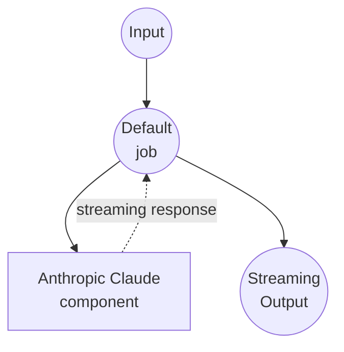

# Anthropic Chat Completions Stream Example

This example demonstrates how to create a streaming chat interface using Anthropic's Claude model through the Messages API with real-time streaming responses.

## Overview

This workflow provides a streaming chat interface that:

1. **Streaming Chat Completion**: Accepts user prompts and generates real-time streaming responses using Anthropic's Claude model
2. **Server-Sent Events**: Delivers responses as SSE (Server-Sent Events) for real-time user experience
3. **Model Selection**: Choose between Claude Sonnet, Haiku, and Opus models

## Preparation

### Prerequisites

- model-compose installed and available in your PATH
- Anthropic API key

### Environment Configuration

1. Navigate to this example directory:
   ```bash
   cd examples/model-providers/anthropic/anthropic-chat-completions-stream
   ```

2. Copy the sample environment file:
   ```bash
   cp .env.sample .env
   ```

3. Edit `.env` and add your Anthropic API key:
   ```env
   ANTHROPIC_API_KEY=your-actual-anthropic-api-key
   ```

## How to Run

1. **Start the service:**
   ```bash
   model-compose up
   ```

2. **Run the workflow:**

   **Using API:**
   ```bash
   curl -X POST http://localhost:8080/api/workflows/runs \
     -H "Content-Type: application/json" \
     -d '{
       "input": {
         "prompt": "Explain machine learning in simple terms",
         "max_tokens": 1024
       }
     }'
   ```

   **Using Web UI:**
   - Open the Web UI: http://localhost:8081
   - Enter your prompt and settings
   - Click the "Run Workflow" button

   **Using CLI:**
   ```bash
   model-compose run --input '{
     "prompt": "Explain machine learning in simple terms",
     "max_tokens": 1024
   }'
   ```

## Component Details

### Anthropic HTTP Client Component (Default)
- **Type**: HTTP client component
- **Purpose**: AI-powered text generation with streaming chat completion
- **API**: Anthropic Messages API
- **Endpoint**: `https://api.anthropic.com/v1/messages`
- **Features**:
  - Real-time streaming responses using `stream: true`
  - Selectable Claude model (Sonnet, Haiku, Opus)
  - Server-Sent Events output format for web applications
  - JSON stream parsing for delta content extraction

## Workflow Details

### "Chat with Anthropic Claude" Workflow (Default)

**Description**: Generate streaming text responses using Anthropic's Claude

#### Job Flow

This example uses a simplified single-component configuration without explicit jobs.



#### Input Parameters

| Parameter | Type | Required | Default | Description |
|-----------|------|----------|---------|-------------|
| `prompt` | text | Yes | - | The user message to send to the AI |
| `model` | select | No | claude-sonnet-4-20250514 | The Claude model to use (Sonnet, Haiku, or Opus) |
| `max_tokens` | number | No | 1024 | Maximum number of tokens in the response |

#### Output Format

| Field | Type | Description |
|-------|------|-------------|
| - | text (sse-text) | The AI-generated response text delivered as Server-Sent Events stream |

## Streaming Features

This example differs from the standard chat completions by providing:

- **Real-time Streaming**: Responses are delivered incrementally as they're generated
- **SSE Format**: Output is formatted as Server-Sent Events for web browser compatibility
- **Delta Processing**: Extracts content from streaming JSON chunks using `${response[].delta.text}`
- **Enhanced UX**: Users see responses appear character-by-character in real-time

## Customization

- **Model**: Change the default model or add other Claude model versions
- **Stream Format**: Modify `stream_format` and output extraction logic for different response processing
- **System Prompt**: Add a system parameter to define the AI's behavior and personality
- **Additional Parameters**: Include other Anthropic parameters like `temperature`, `top_p`, `top_k`, etc.
- **Output Format**: Change from `sse-text` to `sse-json` for structured streaming data

## Advanced Configuration

To add a system prompt and conversation history with streaming:

```yaml
body:
  model: claude-sonnet-4-20250514
  system: "You are a helpful assistant specialized in technical explanations."
  max_tokens: ${input.max_tokens as number | 1024}
  messages:
    - role: user
      content: ${input.prompt as text}
  stream: true
stream_format: json
output: ${response[].delta.text}
```

## Comparison with Standard Chat Completions

| Feature | Standard | Stream |
|---------|----------|--------|
| Response Delivery | Complete response at once | Real-time incremental |
| User Experience | Wait for full response | See response as it generates |
| Output Format | Single message object | Server-Sent Events stream |
| Web Integration | Simple JSON handling | Requires SSE client support |
| Latency | Higher perceived latency | Lower perceived latency |
