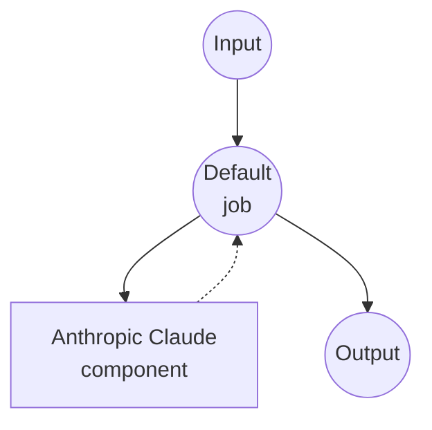

# Anthropic Chat Completions Example

This example demonstrates how to create a simple chat interface using Anthropic's Claude model through the Messages API.

## Overview

This workflow provides a straightforward chat interface that:

1. **Chat Completion**: Accepts user prompts and generates responses using Anthropic's Claude model
2. **Model Selection**: Choose between Claude Sonnet, Haiku, and Opus models
3. **Token Limit Control**: Allows customization of maximum response length

## Preparation

### Prerequisites

- model-compose installed and available in your PATH
- Anthropic API key

### Environment Configuration

1. Navigate to this example directory:
   ```bash
   cd examples/model-providers/anthropic/anthropic-chat-completions
   ```

2. Copy the sample environment file:
   ```bash
   cp .env.sample .env
   ```

3. Edit `.env` and add your Anthropic API key:
   ```env
   ANTHROPIC_API_KEY=your-actual-anthropic-api-key
   ```

## How to Run

1. **Start the service:**
   ```bash
   model-compose up
   ```

2. **Run the workflow:**

   **Using API:**
   ```bash
   curl -X POST http://localhost:8080/api/workflows/runs \
     -H "Content-Type: application/json" \
     -d '{
       "input": {
         "prompt": "Explain the importance of renewable energy",
         "max_tokens": 1024
       }
     }'
   ```

   **Using Web UI:**
   - Open the Web UI: http://localhost:8081
   - Enter your prompt and settings
   - Click the "Run Workflow" button

   **Using CLI:**
   ```bash
   model-compose run --input '{
     "prompt": "Explain the importance of renewable energy",
     "max_tokens": 1024
   }'
   ```

## Component Details

### Anthropic HTTP Client Component (Default)
- **Type**: HTTP client component
- **Purpose**: AI-powered text generation and chat completion
- **API**: Anthropic Messages API
- **Endpoint**: `https://api.anthropic.com/v1/messages`
- **Features**:
  - Selectable Claude model (Sonnet, Haiku, Opus)
  - Configurable max tokens for response length control

## Workflow Details

### "Chat with Anthropic Claude" Workflow (Default)

**Description**: Generate text responses using Anthropic's Claude

#### Job Flow

This example uses a simplified single-component configuration without explicit jobs.



#### Input Parameters

| Parameter | Type | Required | Default | Description |
|-----------|------|----------|---------|-------------|
| `prompt` | text | Yes | - | The user message to send to the AI |
| `model` | select | No | claude-sonnet-4-20250514 | The Claude model to use (Sonnet, Haiku, or Opus) |
| `max_tokens` | number | No | 1024 | Maximum number of tokens in the response |

#### Output Format

| Field | Type | Description |
|-------|------|-------------|
| `message` | text | The AI-generated response text |

## Customization

- **Model**: Change the default model or add other Claude model versions
- **System Prompt**: Add a system parameter to define the AI's behavior and personality
- **Additional Parameters**: Include other Anthropic parameters like `temperature`, `top_p`, `top_k`, etc.
- **Multiple Messages**: Extend to support conversation history by accepting an array of messages

## Advanced Configuration

To add a system prompt and conversation history:

```yaml
body:
  model: claude-sonnet-4-20250514
  system: "You are a helpful assistant specialized in technical explanations."
  max_tokens: ${input.max_tokens as number | 1024}
  messages:
    - role: user
      content: ${input.prompt as text}
```
