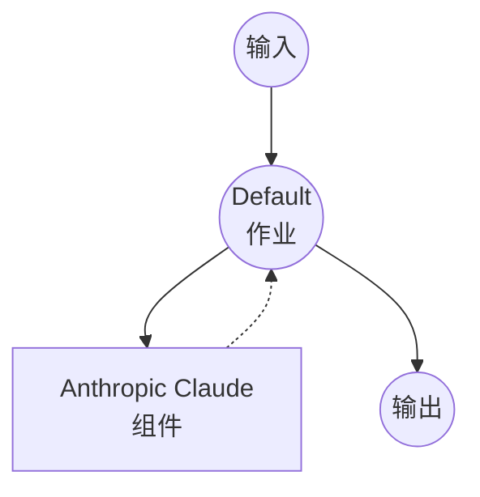

# Anthropic Chat Completions 示例

本示例演示如何使用 Anthropic 的 Claude 模型通过 Messages API 创建简单的聊天界面。

## 概述

此工作流提供了一个简单的聊天界面，具有以下功能：

1. **聊天完成**：接受用户提示并使用 Anthropic 的 Claude 模型生成响应
2. **模型选择**：可在 Claude Sonnet、Haiku 和 Opus 模型之间选择
3. **令牌限制控制**：允许自定义最大响应长度

## 准备工作

### 前置要求

- 已安装 model-compose 并在 PATH 中可用
- Anthropic API 密钥

### 环境配置

1. 导航到此示例目录：
   ```bash
   cd examples/model-providers/anthropic/anthropic-chat-completions
   ```

2. 复制示例环境文件：
   ```bash
   cp .env.sample .env
   ```

3. 编辑 `.env` 并添加你的 Anthropic API 密钥：
   ```env
   ANTHROPIC_API_KEY=your-actual-anthropic-api-key
   ```

## 如何运行

1. **启动服务：**
   ```bash
   model-compose up
   ```

2. **运行工作流：**

   **使用 API：**
   ```bash
   curl -X POST http://localhost:8080/api/workflows/runs \
     -H "Content-Type: application/json" \
     -d '{
       "input": {
         "prompt": "解释可再生能源的重要性",
         "max_tokens": 1024
       }
     }'
   ```

   **使用 Web UI：**
   - 打开 Web UI：http://localhost:8081
   - 输入你的提示和设置
   - 点击"运行工作流"按钮

   **使用 CLI：**
   ```bash
   model-compose run --input '{
     "prompt": "解释可再生能源的重要性",
     "max_tokens": 1024
   }'
   ```

## 组件详情

### Anthropic HTTP Client 组件（默认）
- **类型**：HTTP 客户端组件
- **用途**：AI 驱动的文本生成和聊天完成
- **API**：Anthropic Messages API
- **端点**：`https://api.anthropic.com/v1/messages`
- **特性**：
  - 可选择 Claude 模型（Sonnet、Haiku、Opus）
  - 可配置 max tokens 以控制响应长度

## 工作流详情

### "使用 Anthropic Claude 聊天"工作流（默认）

**描述**：使用 Anthropic 的 Claude 生成文本响应

#### 作业流程

此示例使用简化的单组件配置，无需显式作业。



#### 输入参数

| 参数 | 类型 | 必需 | 默认值 | 描述 |
|------|------|------|--------|------|
| `prompt` | text | 是 | - | 发送给 AI 的用户消息 |
| `model` | select | 否 | claude-sonnet-4-20250514 | 使用的 Claude 模型（Sonnet、Haiku 或 Opus） |
| `max_tokens` | number | 否 | 1024 | 响应的最大令牌数 |

#### 输出格式

| 字段 | 类型 | 描述 |
|------|------|------|
| `message` | text | AI 生成的响应文本 |

## 自定义

- **模型**：更改默认模型或添加其他 Claude 模型版本
- **系统提示**：添加 system 参数以定义 AI 的行为和个性
- **其他参数**：包括其他 Anthropic 参数，如 `temperature`、`top_p`、`top_k` 等
- **多条消息**：通过接受消息数组扩展以支持对话历史

## 高级配置

添加系统提示和对话历史：

```yaml
body:
  model: claude-sonnet-4-20250514
  system: "你是一个专门从事技术解释的有用助手。"
  max_tokens: ${input.max_tokens as number | 1024}
  messages:
    - role: user
      content: ${input.prompt as text}
```
