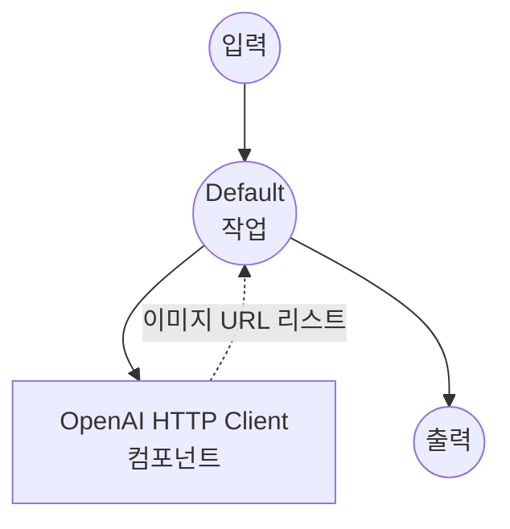
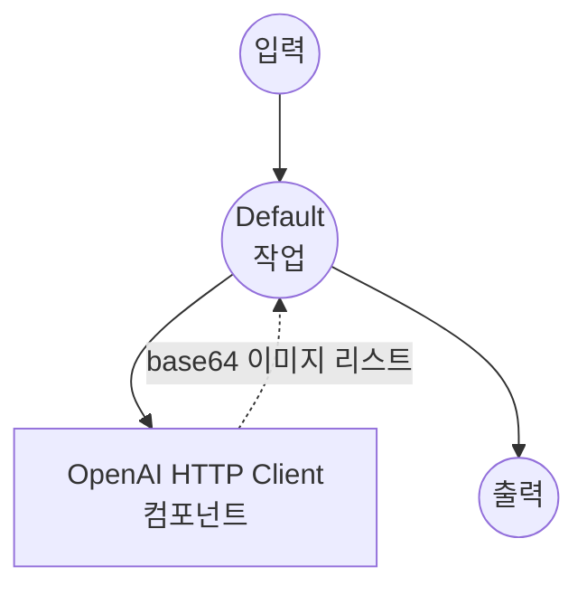

# OpenAI 다중 이미지 생성 예제

이 예제는 OpenAI의 이미지 생성 모델을 사용하여 한 번의 API 호출로 단일 텍스트 프롬프트에서 **여러 이미지**를 생성하는 방법을 보여줍니다. 생성된 이미지는 리스트로 반환되며 Web UI에서 갤러리로 렌더링됩니다.

## 개요

이 다중 워크플로우 예제는 OpenAI의 `n` 매개변수를 사용하여 요청당 여러 이미지 변형을 생성하는 방법을 보여줍니다:

1. **DALL-E Multi 워크플로우**: OpenAI의 DALL-E 2 모델을 사용해 URL 기반 출력으로 여러 이미지 생성
2. **GPT Image Multi 워크플로우**: OpenAI의 GPT image 모델을 사용해 base64로 인코딩된 출력으로 여러 이미지 생성

두 워크플로우 모두 출력을 `image[]`로 선언하며, 이는 다음을 유발합니다:
- **Web UI**: `gr.Gallery` 컴포넌트가 생성된 모든 이미지를 한 번에 렌더링
- **API**: 응답에 이미지 URL 또는 base64 문자열 배열이 포함됨

> 참고: DALL-E 3는 요청당 `n=1`만 지원하므로 DALL-E 워크플로우는 `dall-e-2`를 사용합니다. GPT image 모델(`gpt-image-1`)은 최대 `n=10`까지 지원합니다.

## 준비사항

### 필수 요구사항

- model-compose가 설치되어 PATH에서 사용 가능
- 이미지 생성 모델에 접근 가능한 OpenAI API 키

### API 접근 요구사항

**필수 OpenAI API 접근 권한:**
- Image Generation API 접근
- DALL-E 2 모델 접근
- GPT image 모델 접근 (gpt-image-1)

### 환경 구성

1. 이 예제 디렉토리로 이동:
   ```bash
   cd examples/model-providers/openai/openai-image-generations-multi
   ```

2. OpenAI API 키를 환경 변수로 설정:
   ```bash
   export OPENAI_API_KEY=your-actual-openai-api-key
   ```

   또는 `.env` 파일 생성:
   ```env
   OPENAI_API_KEY=your-actual-openai-api-key
   ```

## 실행 방법

1. **서비스 시작:**
   ```bash
   model-compose up
   ```

2. **워크플로우 실행:**

   **API 사용:**
   ```bash
   # DALL-E 2로 4개 이미지 생성 (URL 형식) - 기본 워크플로우
   curl -X POST http://localhost:8080/api/workflows/runs \
     -H "Content-Type: application/json" \
     -d '{"workflow_id": "dall-e-multi", "input": {"prompt": "A serene mountain landscape at sunset", "count": 4}}'

   # GPT Image로 4개 이미지 생성 (Base64 형식)
   curl -X POST http://localhost:8080/api/workflows/runs \
     -H "Content-Type: application/json" \
     -d '{"workflow_id": "gpt-image-1-multi", "input": {"prompt": "A futuristic city skyline", "count": 4}}'
   ```

   **Web UI 사용:**
   - Web UI 열기: http://localhost:8081
   - 탭에서 워크플로우 선택
   - 프롬프트 입력, 개수와 크기 선택
   - "Run Workflow" 버튼 클릭
   - 생성된 모든 이미지가 오른쪽 갤러리에 나타남

   **CLI 사용:**
   ```bash
   # DALL-E 2로 4개 이미지 생성
   model-compose run dall-e-multi --input '{
     "prompt": "A serene mountain landscape at sunset",
     "count": 4,
     "size": "1024x1024"
   }'

   # GPT Image로 4개 이미지 생성
   model-compose run gpt-image-1-multi --input '{
     "prompt": "A futuristic city skyline",
     "count": 4
   }'
   ```

## 컴포넌트 세부사항

### OpenAI HTTP 클라이언트 컴포넌트 (기본)
- **유형**: HTTP client 컴포넌트
- **목적**: OpenAI의 Images API와의 인터페이스
- **Base URL**: https://api.openai.com/v1
- **인증**: OpenAI API 키를 사용한 Bearer 토큰
- **액션**: `n > 1`로 DALL-E 2와 GPT image 생성 엔드포인트 모두 지원

#### 사용 가능한 액션:

**1. DALL-E Multi 액션 (dall-e-multi)**
- **엔드포인트**: `/images/generations`
- **모델**: DALL-E 2
- **출력 형식**: 생성된 이미지의 URL 배열
- **이미지 크기**: `256x256`, `512x512`, `1024x1024`
- **최대 개수**: 10

**2. GPT Image Multi 액션 (gpt-image-1-multi)**
- **엔드포인트**: `/images/generations`
- **모델**: gpt-image-1
- **출력 형식**: base64로 인코딩된 이미지 배열
- **이미지 크기**: `1024x1024`, `1024x1536`, `1536x1024`
- **최대 개수**: 10

## 워크플로우 세부사항

### 1. "Generate Multiple Images with OpenAI DALL·E" 워크플로우 (기본)

**설명**: DALL-E 2와 URL 기반 출력을 사용하여 하나의 프롬프트에서 여러 이미지 변형을 생성합니다. 여러 후보 중에서 가장 좋은 결과를 선택하려는 경우에 유용합니다.

#### 작업 흐름



#### 입력 매개변수

| 매개변수 | 유형 | 필수 | 옵션 | 기본값 | 설명 |
|---------|------|------|------|--------|------|
| `prompt` | string | 예 | - | - | 생성할 이미지에 대한 텍스트 설명 |
| `count` | integer | 아니오 | 1-10 | 4 | 한 번의 호출로 생성할 이미지 수 |
| `size` | string | 아니오 | `256x256`, `512x512`, `1024x1024` | `1024x1024` | 이미지 크기 |

#### 출력 형식

| 필드 | 유형 | 설명 |
|-----|------|------|
| `image_urls` | string[] (URL) | OpenAI가 호스팅하는 생성된 이미지의 URL 리스트 |

### 2. "Generate Multiple Images with OpenAI GPT" 워크플로우

**설명**: `gpt-image-1` 모델과 base64로 인코딩된 출력을 사용하여 하나의 프롬프트에서 여러 이미지 변형을 생성합니다. 외부 호스팅 없이 바로 임베드하는 데 적합합니다.

#### 작업 흐름



#### 입력 매개변수

| 매개변수 | 유형 | 필수 | 옵션 | 기본값 | 설명 |
|---------|------|------|------|--------|------|
| `prompt` | string | 예 | - | - | 생성할 이미지에 대한 텍스트 설명 |
| `count` | integer | 아니오 | 1-10 | 4 | 한 번의 호출로 생성할 이미지 수 |
| `size` | string | 아니오 | `1024x1024`, `1024x1536`, `1536x1024` | `1024x1024` | 이미지 크기 |

#### 출력 형식

| 필드 | 유형 | 설명 |
|-----|------|------|
| `image_data` | string[] (base64) | base64로 인코딩된 PNG 이미지 데이터 리스트 |

## `image[]` 작동 방식

출력 선언 `${output.image_urls as image[];url}`은 model-compose에 다음을 알립니다:

- **`image[]`**: 값이 단일 이미지가 아닌 이미지의 *리스트*임을 나타냄
- **`url`**: 각 리스트 항목이 이미지를 가리키는 URL 문자열임을 나타냄

런타임에 워크플로우는 `[*]` 와일드카드를 사용해 API 응답에서 모든 항목을 수집합니다:

```yaml
output:
  image_urls: ${response.data[*].url}
```

`${response.data[*].url}`은 `response.data`의 모든 요소에서 `url` 필드를 추출해 리스트를 생성합니다.

Gradio Web UI에서는 `image[]` 출력이 자동으로 `gr.Gallery`로 렌더링되어 모든 이미지가 함께 표시됩니다. HTTP API는 값을 JSON 배열로 반환합니다.

## 사용자 정의

### 이미지 개수 늘리거나 줄이기

`count` 입력을 변경하여 이미지 수를 제어합니다 (1-10):

```bash
model-compose run dall-e-multi --input '{
  "prompt": "...",
  "count": 8
}'
```

### DALL-E 3 사용 (단일 이미지만 가능)

DALL-E 3는 `n > 1`을 지원하지 않습니다. 더 높은 품질이 필요하지만 단일 이미지 생성만 하려면 [openai-image-generations](../openai-image-generations) 예제를 참조하세요.

### 개수 고정

항상 고정된 수의 이미지가 필요한 경우 액션 본문에 `n`을 하드코딩합니다:

```yaml
body:
  model: dall-e-2
  prompt: ${input.prompt}
  n: 6
  size: 1024x1024
  response_format: url
```
