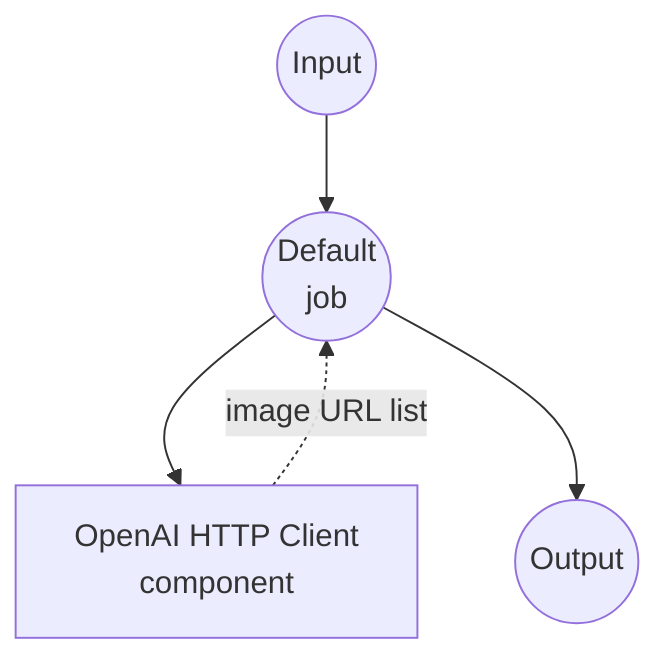
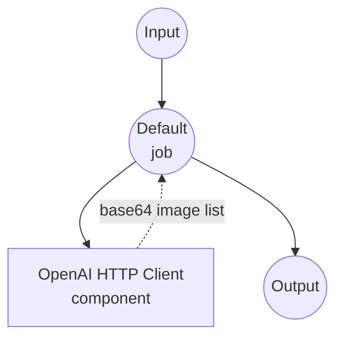

# OpenAI Multiple Image Generation Example

This example demonstrates how to generate **multiple images** from a single text prompt in one API call using OpenAI's image generation models. The generated images are returned as a list and rendered as a gallery in the Web UI.

## Overview

This multi-workflow example shows how to use OpenAI's `n` parameter to produce several image variations per request:

1. **DALL-E Multi Workflow**: Generate multiple images using OpenAI's DALL-E 2 model with URL-based output
2. **GPT Image Multi Workflow**: Generate multiple images using OpenAI's GPT image model with base64-encoded output

Both workflows declare their output as `image[]`, which causes:
- **Web UI**: a `gr.Gallery` component renders all generated images at once
- **API**: the response contains an array of image URLs or base64 strings

> Note: DALL-E 3 only supports `n=1` per request, so the DALL-E workflow uses `dall-e-2`. The GPT image model (`gpt-image-1`) supports up to `n=10`.

## Preparation

### Prerequisites

- model-compose installed and available in your PATH
- OpenAI API key with access to image generation models

### API Access Requirements

**Required OpenAI API Access:**
- Image Generation API access
- DALL-E 2 model access
- GPT image model access (gpt-image-1)

### Environment Configuration

1. Navigate to this example directory:
   ```bash
   cd examples/model-providers/openai/openai-image-generations-multi
   ```

2. Set your OpenAI API key as an environment variable:
   ```bash
   export OPENAI_API_KEY=your-actual-openai-api-key
   ```

   Or create a `.env` file:
   ```env
   OPENAI_API_KEY=your-actual-openai-api-key
   ```

## How to Run

1. **Start the service:**
   ```bash
   model-compose up
   ```

2. **Run the workflow:**

   **Using API:**
   ```bash
   # Generate 4 images with DALL-E 2 (URL format) - Default workflow
   curl -X POST http://localhost:8080/api/workflows/runs \
     -H "Content-Type: application/json" \
     -d '{"workflow_id": "dall-e-multi", "input": {"prompt": "A serene mountain landscape at sunset", "count": 4}}'

   # Generate 4 images with GPT Image (Base64 format)
   curl -X POST http://localhost:8080/api/workflows/runs \
     -H "Content-Type: application/json" \
     -d '{"workflow_id": "gpt-image-1-multi", "input": {"prompt": "A futuristic city skyline", "count": 4}}'
   ```

   **Using Web UI:**
   - Open the Web UI: http://localhost:8081
   - Select the workflow from the tab
   - Enter your prompt, choose the count and size
   - Click the "Run Workflow" button
   - All generated images appear in a gallery on the right

   **Using CLI:**
   ```bash
   # Generate 4 images with DALL-E 2
   model-compose run dall-e-multi --input '{
     "prompt": "A serene mountain landscape at sunset",
     "count": 4,
     "size": "1024x1024"
   }'

   # Generate 4 images with GPT Image
   model-compose run gpt-image-1-multi --input '{
     "prompt": "A futuristic city skyline",
     "count": 4
   }'
   ```

## Component Details

### OpenAI HTTP Client Component (Default)
- **Type**: HTTP client component
- **Purpose**: Interface with OpenAI's Images API
- **Base URL**: https://api.openai.com/v1
- **Authentication**: Bearer token using OpenAI API key
- **Actions**: Supports both DALL-E 2 and GPT image generation endpoints with `n > 1`

#### Actions Available:

**1. DALL-E Multi Action (dall-e-multi)**
- **Endpoint**: `/images/generations`
- **Model**: DALL-E 2
- **Output Format**: Array of URLs to generated images
- **Image Sizes**: `256x256`, `512x512`, `1024x1024`
- **Max Count**: 10

**2. GPT Image Multi Action (gpt-image-1-multi)**
- **Endpoint**: `/images/generations`
- **Model**: gpt-image-1
- **Output Format**: Array of base64-encoded images
- **Image Sizes**: `1024x1024`, `1024x1536`, `1536x1024`
- **Max Count**: 10

## Workflow Details

### 1. "Generate Multiple Images with OpenAI DALL·E" Workflow (Default)

**Description**: Generate multiple image variations from one prompt using DALL-E 2 with URL-based output. Useful when you want to pick the best result among several candidates.

#### Job Flow



#### Input Parameters

| Parameter | Type | Required | Options | Default | Description |
|-----------|------|----------|---------|---------|-------------|
| `prompt` | string | Yes | - | - | Text description of the image to generate |
| `count` | integer | No | 1-10 | 4 | Number of images to generate in one call |
| `size` | string | No | `256x256`, `512x512`, `1024x1024` | `1024x1024` | Image dimensions |

#### Output Format

| Field | Type | Description |
|-------|------|-------------|
| `image_urls` | string[] (URL) | List of URLs to the generated images hosted by OpenAI |

### 2. "Generate Multiple Images with OpenAI GPT" Workflow

**Description**: Generate multiple image variations from one prompt using the `gpt-image-1` model with base64-encoded output, suitable for direct embedding without external hosting.

#### Job Flow



#### Input Parameters

| Parameter | Type | Required | Options | Default | Description |
|-----------|------|----------|---------|---------|-------------|
| `prompt` | string | Yes | - | - | Text description of the image to generate |
| `count` | integer | No | 1-10 | 4 | Number of images to generate in one call |
| `size` | string | No | `1024x1024`, `1024x1536`, `1536x1024` | `1024x1024` | Image dimensions |

#### Output Format

| Field | Type | Description |
|-------|------|-------------|
| `image_data` | string[] (base64) | List of base64-encoded PNG image data |

## How `image[]` Works

The output declaration `${output.image_urls as image[];url}` tells model-compose:

- **`image[]`**: the value is a *list* of images (not a single image)
- **`url`**: each list item is a URL string pointing to the image

At runtime, the workflow uses the `[*]` wildcard to collect all items from the API response:

```yaml
output:
  image_urls: ${response.data[*].url}
```

`${response.data[*].url}` extracts the `url` field from every element in `response.data`, producing a list.

In the Gradio Web UI, an `image[]` output is automatically rendered as a `gr.Gallery` so all images appear together. The HTTP API returns the values as a JSON array.

## Customization

### Generating Fewer or More Images

Change the `count` input to control the number of images (1-10):

```bash
model-compose run dall-e-multi --input '{
  "prompt": "...",
  "count": 8
}'
```

### Using DALL-E 3 (Single Image Only)

DALL-E 3 does not support `n > 1`. To use DALL-E 3 for higher quality but single-image generation, see the [openai-image-generations](../openai-image-generations) example.

### Fixing the Count

If you always want a fixed number of images, hardcode `n` in the action body:

```yaml
body:
  model: dall-e-2
  prompt: ${input.prompt}
  n: 6
  size: 1024x1024
  response_format: url
```
