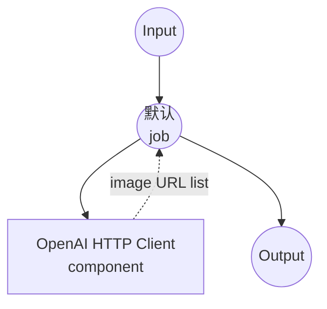
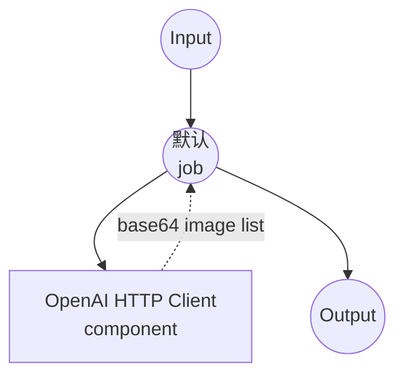

# OpenAI 多图像生成示例

本示例演示如何使用 OpenAI 的图像生成模型，通过单次 API 调用从一个文本提示生成**多张图像**。生成的图像以列表形式返回，并在 Web UI 中以图库形式渲染。

## 概述

此多工作流示例展示了如何使用 OpenAI 的 `n` 参数为每个请求生成多个图像变体：

1. **DALL-E Multi 工作流**：使用 OpenAI 的 DALL-E 2 模型生成多张图像，输出为 URL
2. **GPT Image Multi 工作流**：使用 OpenAI 的 GPT image 模型生成多张图像，输出为 base64 编码

两个工作流都将输出声明为 `image[]`，这会导致：
- **Web UI**：`gr.Gallery` 组件一次性渲染所有生成的图像
- **API**：响应中包含图像 URL 或 base64 字符串数组

> 注意：DALL-E 3 每次请求只支持 `n=1`，因此 DALL-E 工作流使用 `dall-e-2`。GPT image 模型（`gpt-image-1`）最多支持 `n=10`。

## 准备工作

### 先决条件

- 已安装 model-compose 并在 PATH 中可用
- 拥有可访问图像生成模型的 OpenAI API 密钥

### API 访问要求

**所需的 OpenAI API 访问权限：**
- Image Generation API 访问
- DALL-E 2 模型访问
- GPT image 模型访问（gpt-image-1）

### 环境配置

1. 导航到此示例目录：
   ```bash
   cd examples/model-providers/openai/openai-image-generations-multi
   ```

2. 将您的 OpenAI API 密钥设置为环境变量：
   ```bash
   export OPENAI_API_KEY=your-actual-openai-api-key
   ```

   或创建 `.env` 文件：
   ```env
   OPENAI_API_KEY=your-actual-openai-api-key
   ```

## 如何运行

1. **启动服务：**
   ```bash
   model-compose up
   ```

2. **运行工作流：**

   **使用 API：**
   ```bash
   # 使用 DALL-E 2 生成 4 张图像（URL 格式）- 默认工作流
   curl -X POST http://localhost:8080/api/workflows/runs \
     -H "Content-Type: application/json" \
     -d '{"workflow_id": "dall-e-multi", "input": {"prompt": "A serene mountain landscape at sunset", "count": 4}}'

   # 使用 GPT Image 生成 4 张图像（Base64 格式）
   curl -X POST http://localhost:8080/api/workflows/runs \
     -H "Content-Type: application/json" \
     -d '{"workflow_id": "gpt-image-1-multi", "input": {"prompt": "A futuristic city skyline", "count": 4}}'
   ```

   **使用 Web UI：**
   - 打开 Web UI：http://localhost:8081
   - 从选项卡中选择工作流
   - 输入提示词，选择数量和尺寸
   - 点击"Run Workflow"按钮
   - 所有生成的图像出现在右侧的图库中

   **使用 CLI：**
   ```bash
   # 使用 DALL-E 2 生成 4 张图像
   model-compose run dall-e-multi --input '{
     "prompt": "A serene mountain landscape at sunset",
     "count": 4,
     "size": "1024x1024"
   }'

   # 使用 GPT Image 生成 4 张图像
   model-compose run gpt-image-1-multi --input '{
     "prompt": "A futuristic city skyline",
     "count": 4
   }'
   ```

## 组件详情

### OpenAI HTTP 客户端组件（默认）
- **类型**：HTTP client 组件
- **用途**：与 OpenAI 的 Images API 交互
- **Base URL**：https://api.openai.com/v1
- **认证**：使用 OpenAI API 密钥的 Bearer 令牌
- **操作**：支持 `n > 1` 的 DALL-E 2 和 GPT image 生成端点

#### 可用操作：

**1. DALL-E Multi 操作 (dall-e-multi)**
- **端点**：`/images/generations`
- **模型**：DALL-E 2
- **输出格式**：生成图像的 URL 数组
- **图像尺寸**：`256x256`、`512x512`、`1024x1024`
- **最大数量**：10

**2. GPT Image Multi 操作 (gpt-image-1-multi)**
- **端点**：`/images/generations`
- **模型**：gpt-image-1
- **输出格式**：base64 编码图像数组
- **图像尺寸**：`1024x1024`、`1024x1536`、`1536x1024`
- **最大数量**：10

## 工作流详情

### 1. "Generate Multiple Images with OpenAI DALL·E" 工作流（默认）

**描述**：使用 DALL-E 2 和 URL 格式输出，从单个提示生成多个图像变体。适用于希望从多个候选中挑选最佳结果的场景。

#### 作业流程



#### 输入参数

| 参数 | 类型 | 必需 | 选项 | 默认值 | 描述 |
|-----|------|------|------|--------|------|
| `prompt` | string | 是 | - | - | 要生成的图像的文本描述 |
| `count` | integer | 否 | 1-10 | 4 | 单次调用生成的图像数量 |
| `size` | string | 否 | `256x256`、`512x512`、`1024x1024` | `1024x1024` | 图像尺寸 |

#### 输出格式

| 字段 | 类型 | 描述 |
|-----|------|------|
| `image_urls` | string[] (URL) | OpenAI 托管的生成图像 URL 列表 |

### 2. "Generate Multiple Images with OpenAI GPT" 工作流

**描述**：使用 `gpt-image-1` 模型和 base64 编码输出，从单个提示生成多个图像变体，适合无需外部托管的直接嵌入。

#### 作业流程



#### 输入参数

| 参数 | 类型 | 必需 | 选项 | 默认值 | 描述 |
|-----|------|------|------|--------|------|
| `prompt` | string | 是 | - | - | 要生成的图像的文本描述 |
| `count` | integer | 否 | 1-10 | 4 | 单次调用生成的图像数量 |
| `size` | string | 否 | `1024x1024`、`1024x1536`、`1536x1024` | `1024x1024` | 图像尺寸 |

#### 输出格式

| 字段 | 类型 | 描述 |
|-----|------|------|
| `image_data` | string[] (base64) | base64 编码的 PNG 图像数据列表 |

## `image[]` 的工作原理

输出声明 `${output.image_urls as image[];url}` 告知 model-compose：

- **`image[]`**：该值是图像的*列表*（不是单个图像）
- **`url`**：每个列表项是指向图像的 URL 字符串

在运行时，工作流使用 `[*]` 通配符从 API 响应中收集所有项：

```yaml
output:
  image_urls: ${response.data[*].url}
```

`${response.data[*].url}` 从 `response.data` 的每个元素中提取 `url` 字段，生成一个列表。

在 Gradio Web UI 中，`image[]` 输出会自动渲染为 `gr.Gallery`，使所有图像一起出现。HTTP API 将值作为 JSON 数组返回。

## 自定义

### 生成更多或更少的图像

修改 `count` 输入以控制图像数量（1-10）：

```bash
model-compose run dall-e-multi --input '{
  "prompt": "...",
  "count": 8
}'
```

### 使用 DALL-E 3（仅单张图像）

DALL-E 3 不支持 `n > 1`。如需使用 DALL-E 3 生成更高质量的单张图像，请参见 [openai-image-generations](../openai-image-generations) 示例。

### 固定数量

如果始终需要固定数量的图像，可在操作正文中硬编码 `n`：

```yaml
body:
  model: dall-e-2
  prompt: ${input.prompt}
  n: 6
  size: 1024x1024
  response_format: url
```
